# AI Research Framework

An evidence-centred, auditable operating system for research (AIRL-OS).

Its central thesis: **agents produce, machines verify, humans decide** — and
those three roles are kept structurally separate.

This repository holds the target architecture, the execution discipline, and the
components that actually work today. **A plan is not evidence of
implementation**; the table below separates the two.

| Area | Status | Location |
|---|---|---|
| Literature bridge V0 | ✅ **Working**, locally accepted | `src/airl_bridge/` |
| Zotero → Obsidian projection | ✅ Working, read-only at the Zotero boundary | `src/airl_bridge/obsidian.py` |
| Hermes MCP access | ✅ Working, five read-only tools | `src/airl_bridge/mcp_server.py` |
| Shared contract core | ⚠️ `TECH_COMPLETE` — no production consumer | `src/airl_framework/` |
| Skill registry (49 skills, two families) | ✅ Format-conformant · ⚠️ wired for Claude Code only · 📐 behaviour **not yet tested** | `skills/` |
| Obsidian information architecture | ✅ V0 ready | `vault_baseline/` |
| Target architecture and skill layer | 📐 Designed, awaiting decision | `docs/architecture/` |
| Commissioning programme — **baseline v1.0** | ⬜ Planned, not started; 141 packages, 46 scenarios | `planning/commissioning/` |
| Interim evidence policy (WP-000) | 📐 Written — unblocks the storage half of C1 | `planning/commissioning/01_GOVERNANCE/` |

## Layout

```
src/          Bridge component and the shared contract core
tests/        Test suite
skills/       49 skills — HOW agents work; engineering + scientific + shared
planning/     WP-000, WP-001..140, ACC-01..46 (hash-sealed canonical plan, baseline v1.0)
docs/         Architecture, review and operations documents
schemas/      Shared contract schemas
delivery/     Per-package evidence packages
deploy/       systemd unit files
scripts/      Acceptance, smoke, skill-validation and mirror-generation scripts
vault_baseline/  Versioned copy of the Obsidian vault
```

## Where to start

| Question | Document |
|---|---|
| **What is this system?** — explained and diagrammed | [`docs/architecture/AIRL_OS_ARCHITECTURE.md`](docs/architecture/AIRL_OS_ARCHITECTURE.md) |
| What actually exists today? | [`docs/review/2026-08-22_remediation_verification.md`](docs/review/2026-08-22_remediation_verification.md) — current state against the frozen audit |
| **What** should be added to the target architecture? | [`docs/architecture/AIRL_OS_IDEAL_STRUCTURE.md`](docs/architecture/AIRL_OS_IDEAL_STRUCTURE.md) |
| **How** should agents work? | [`docs/architecture/AIRL_OS_SKILL_LAYER.md`](docs/architecture/AIRL_OS_SKILL_LAYER.md) · [`skills/README.md`](skills/README.md) |
| **Who** performs each role — human, model or code? | [`docs/architecture/AIRL_OS_ROLE_MODEL_ASSIGNMENT.md`](docs/architecture/AIRL_OS_ROLE_MODEL_ASSIGNMENT.md) |
| What is **adopted** rather than invented? | [`docs/architecture/AIRL_OS_EXTERNAL_STANDARDS.md`](docs/architecture/AIRL_OS_EXTERNAL_STANDARDS.md) |
| Architecture of the working vertical slice | [`docs/ARCHITECTURE_V0.md`](docs/ARCHITECTURE_V0.md) |
| Day-to-day operation | [`docs/OPERATIONS.md`](docs/OPERATIONS.md) |
| The full programme plan | [`planning/commissioning/README.md`](planning/commissioning/README.md) |

---

# Architecture

Full reference with every diagram: [`docs/architecture/AIRL_OS_ARCHITECTURE.md`](docs/architecture/AIRL_OS_ARCHITECTURE.md).
What follows is the shape of the system in one page.

## 1. Why this is not an assistant

A normal AI research assistant is a pipeline from a question to an answer, and
whatever comes out is trusted because a capable model produced it:

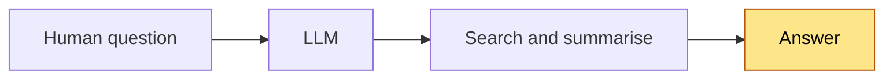

AIRL-OS starts from the opposite assumption: **a fluent, confident, well-cited,
entirely wrong result is the normal failure mode of a capable model**, and no
amount of model capability detects it from the inside. So model output is a
*hypothesis* that must survive mechanical verification, independent review and a
human decision before it becomes a claim.

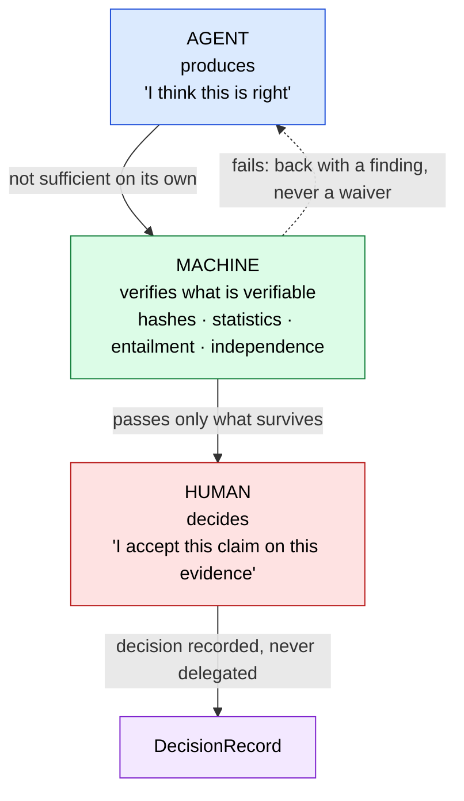

The failure mode being designed out is the ordinary multi-agent pattern —
*agent A produces, agent B reads it, agent B says "looks good", accepted*. Two
models from the same family share training lineage and therefore share errors;
agreement between them is correlation, not confirmation.

**The assignment rule that follows from this:**

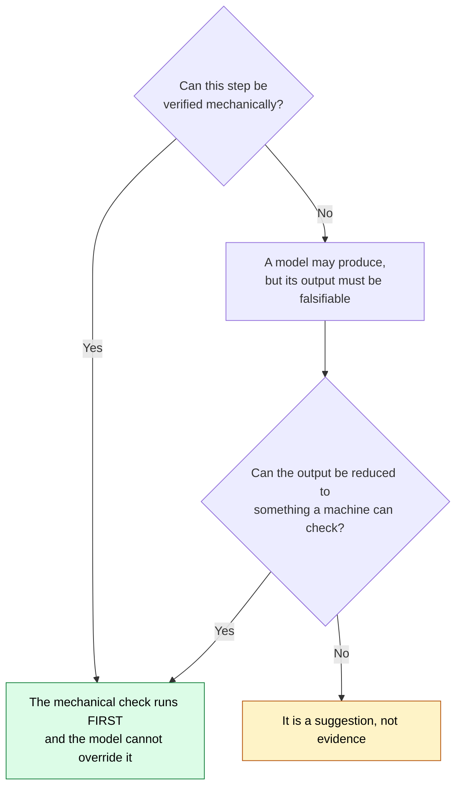

## 2. The evidence chain

Nothing becomes knowledge by being asserted. It becomes knowledge by surviving a
chain in which **every link is addressable**:

```mermaid
flowchart LR
    S["Source<br/>the paper"] --> SR["SourceRepresentation<br/>parsed, hashed"]
    SR --> ES["EvidenceSpan<br/>the exact sentence"]
    ES --> C["ClaimVersion<br/>what we assert"]
    C --> R["ExperimentRun<br/>what we ran"]
    R --> RV["Review<br/>who challenged it"]
    RV --> RP["Reproduction<br/>does it hold again"]
    RP --> D["DecisionRecord<br/>a human accepted it"]
    D --> P["Publication"]
    P --> MO["Monitoring<br/>does it still hold"]
    MO -.->|"supersede · revise · retract"| C
    style ES fill:#dcfce7,stroke:#15803d,color:#000
    style D fill:#fee2e2,stroke:#b91c1c,color:#000
    style MO fill:#e0e7ff,stroke:#4338ca,color:#000
```

Two properties matter more than the chain itself. It is **traversable in both
directions** — from a published sentence to the source span, and from a retracted
source to every claim that depended on it. And **the loop closes**: a claim is
never permanently true, and `VERIFIED` is explicitly not an irreversible state.

## 3. The G0–G10 research lifecycle

The spine of the system. Each gate has a frozen output that does not change
without a recorded supersession.

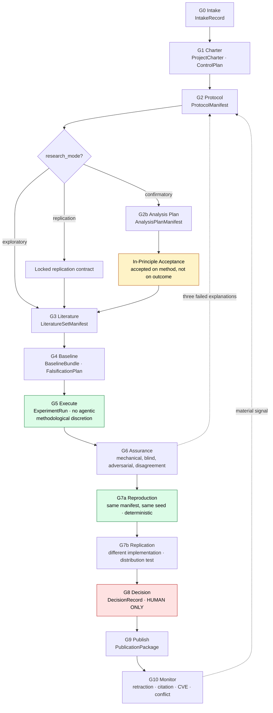

| Gate | The failure it exists to prevent |
|---|---|
| **G0** | Redoing work that already exists; unowned work |
| **G1** | A model inventing its own research objective |
| **G2** | Changing the method after seeing the result |
| **G2b** | Choosing the analysis that gives the nicest answer |
| **G3** | An evidence base that cannot be re-derived |
| **G4** | Only asking how to confirm, never how to refute |
| **G5** | Model bias entering the measurement itself |
| **G6** | "Looks good" counted as independent review |
| **G7a** | A result nobody can obtain twice |
| **G7b** | Confusing "same numbers" with "same conclusion" |
| **G8** | A model deciding what the laboratory believes |
| **G9** | A sentence claiming more than its evidence supports |
| **G10** | Treating a published claim as permanently true |

**In-principle acceptance** sits in the flow for one reason: without a
commitment made *before* the result exists, publication bias survives every
other control — the protocol is frozen, the result comes back negative, and the
human simply declines to publish.

It is **conditional, not universal**: required for `confirmatory` work, a locked
replication contract for `replication`, and not required for `exploratory` work —
which in exchange may never label its claims confirmatory. Forcing Registered
Report ceremony onto exploration would only teach people to mislabel confirmatory
work as exploratory. The classification is fail-closed: absent or ambiguous, it
resolves to `confirmatory`.

**"No model at G5"** means no *agentic methodological discretion* during a frozen
execution. The subject of the experiment may itself be a model — a frozen model
under test, a preregistered inference pipeline. What is forbidden is an agent
changing a threshold or a stopping point mid-run because the result looks wrong.
The model may be the instrument; it may not be the methodologist.

**Inside G6**, the heaviest gate:

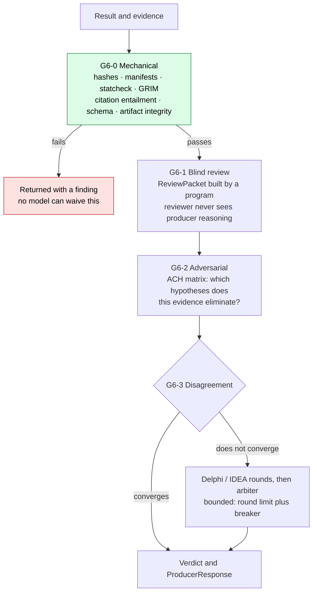

The `ReviewPacket` is built by a **deterministic program, not a prompt** — only
then can "what exactly did the reviewer see?" be answered afterwards. The
adversarial reviewer is scored on **the quality of its refutation**, not on
approval speed.

## 4. The planes

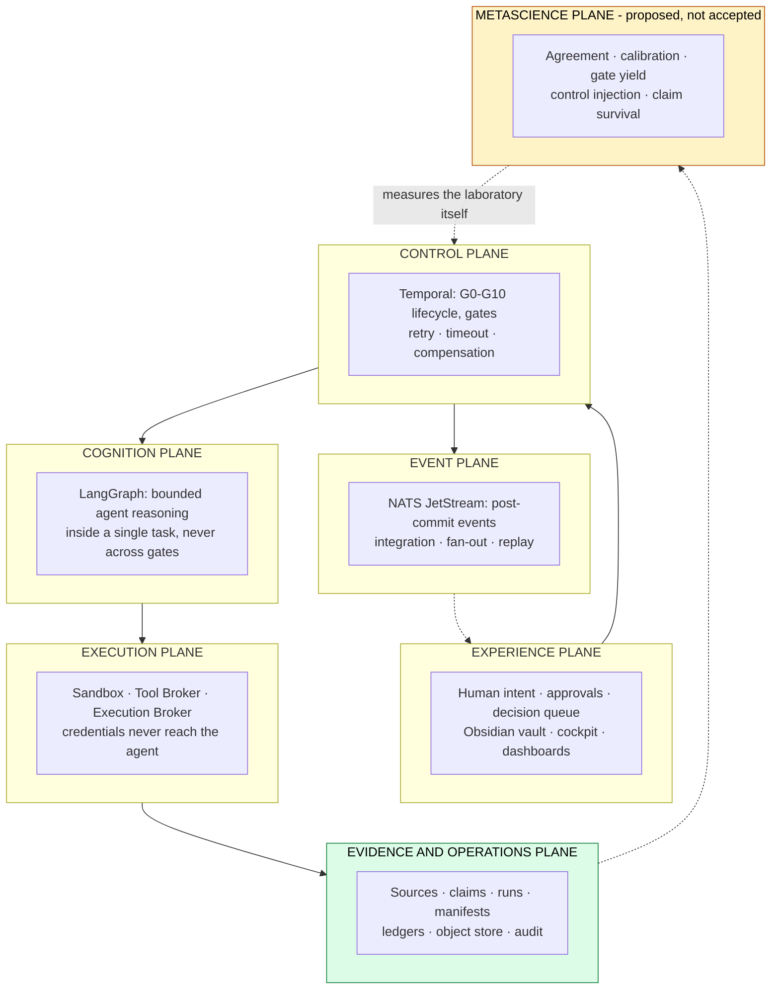

**Temporal is the process authority; LangGraph is not.** A research project lives
for months and must survive process restarts, model changes and human absence —
an agent graph is the wrong place to keep that state. Conversely, Temporal is the
wrong place to reason. **NATS carries events, not authority**: if the entire
stream were deleted, gate state would still be recoverable from Temporal.

## 5. The skill layer — two families, one shared core

A `RoleContract` says **who** an agent is — purpose, tools, data classes, budget.
Every one of those is a *boundary*; none of them says **which procedure to
follow**. Skills close that gap.

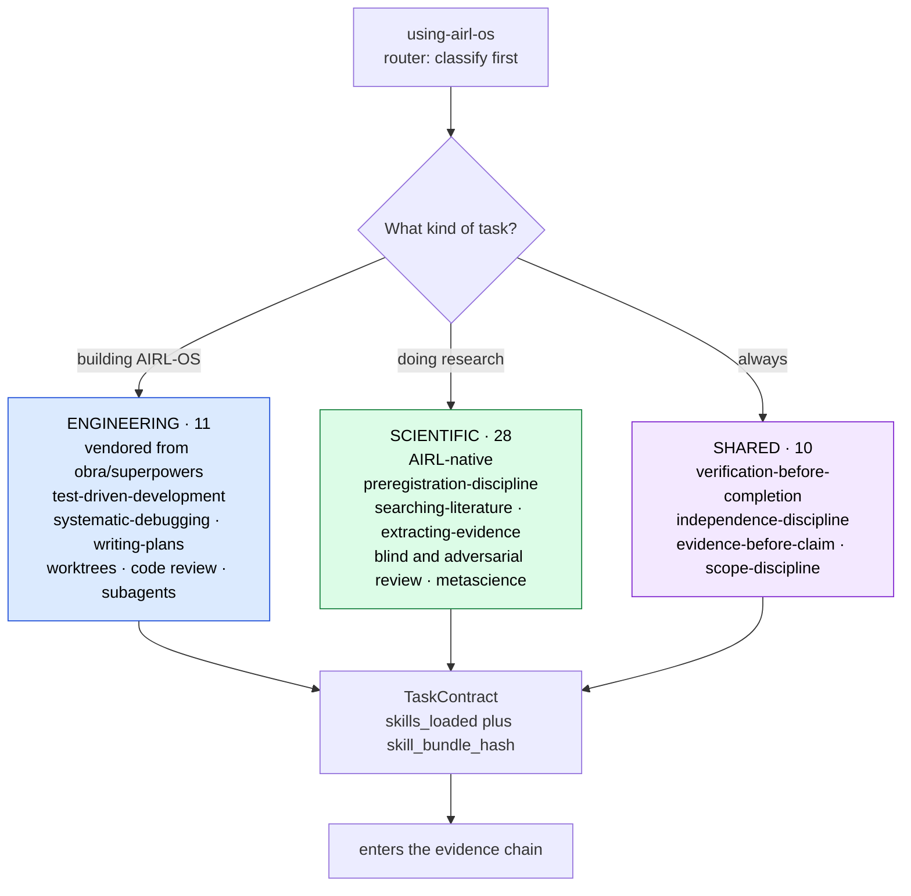

> **Research adaptations extend their engineering counterparts; they never
> replace them.** AIRL-OS is simultaneously a laboratory and a software platform,
> and it needs both disciplines at once.

| Software engineering | Scientific research | The shared rule |
|---|---|---|
| Test before code | Preregistration before result | You do not get to pick the criterion after seeing the outcome |
| Bug root-cause tracing | Anomaly root-cause tracing | Three failed explanations means the architecture is wrong, not the fix |
| Fresh-context implementer | Fresh-context analyst | Whoever produced it cannot be the one who checks it |
| Reviewer sees the diff, not the reasoning | Reviewer sees the packet, not the trace | Information asymmetry is what makes review independent |
| Verification before "done" | Verification before "claimed" | Memory is not evidence |

Skills conform to the [Agent Skills open standard](https://agentskills.io),
which Claude Code, Codex, OpenCode, Cursor, Copilot, Gemini CLI and Hermes Agent
all implement — so the registry is **format-compatible** with each of them.
**A skill that does not load governs nothing**, so conformance is checked
mechanically by `scripts/validate_skills.py`.

> Format compatibility is not behavioural compatibility. Whether a harness loads
> the right skill at the right moment, and keeps it across context compaction, is
> what ACC-42, ACC-44 and ACC-45 establish under WP-048 — and that is **not**
> established today. Only the Claude Code path is wired, via `.claude/skills`.

## 6. How evidence is signed

Acceptance requires a signed `EvidenceManifest` in an immutable store — and that
store is WP-026, far downstream, which deadlocked the entire programme
(finding **C1**). The deadlock existed only because the store was assumed to be
ours to build. It is not:

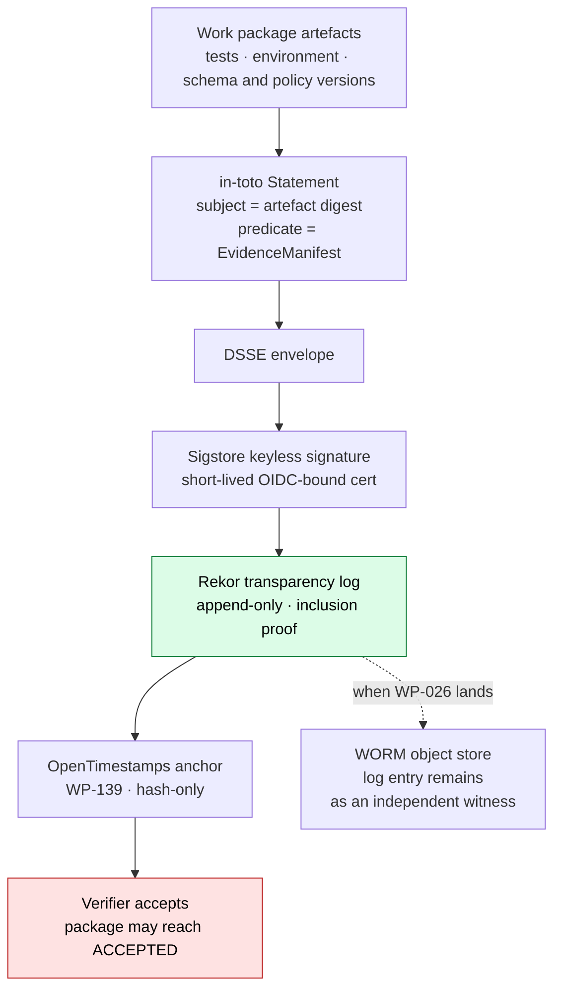

**Immutability is delegated, not deferred.** Rekor is a tamper-evident
transparency record **for signed metadata**, not an artifact store — WP-026 is
deferred behind it, not cancelled. And this resolves the *storage* half of C1
only: finding **C2**, who may act as an independent verifier in a one-person
operation, is a decision no standard makes. What the architecture now supplies is
its *shape* — independence expressed as `RoleBinding` separation constraints
rather than headcount, so one person holding several roles can be modelled
honestly. See
[`AIRL_OS_EXTERNAL_STANDARDS.md`](docs/architecture/AIRL_OS_EXTERNAL_STANDARDS.md).

## 7. Target versus reality

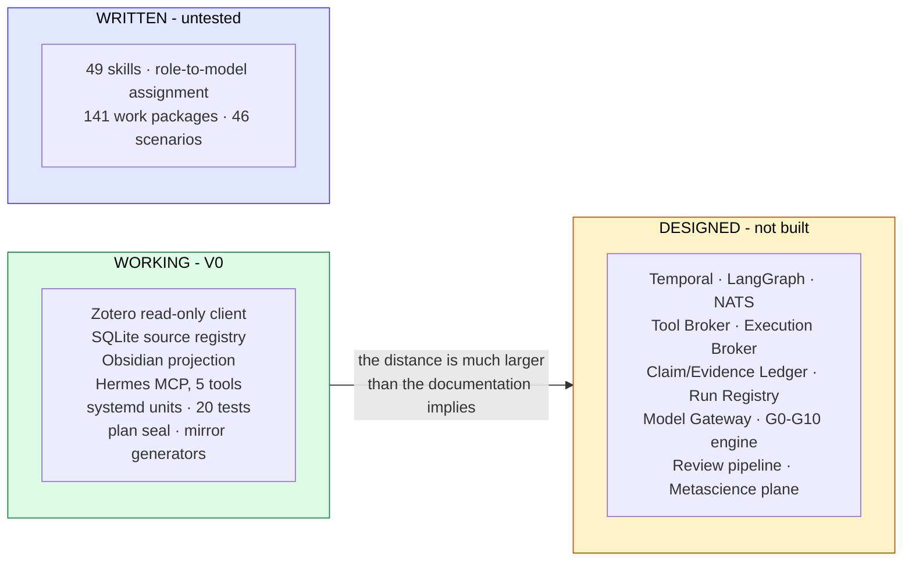

**The blockers, in order:** **C1** storage half resolved on paper, WP-000 not yet
executed · **C2** open, a decision not code · **H1** Zotero ingest capped at 100
records — fix M9 first or pagination turns a masked truncation into active data
loss · **H2** no deletion reconciliation · **H3** the read-only boundary has no
behavioural test · **H4** the contract core has no consumers · **H5** no CI.

---

## The working vertical slice: Literature Bridge V0

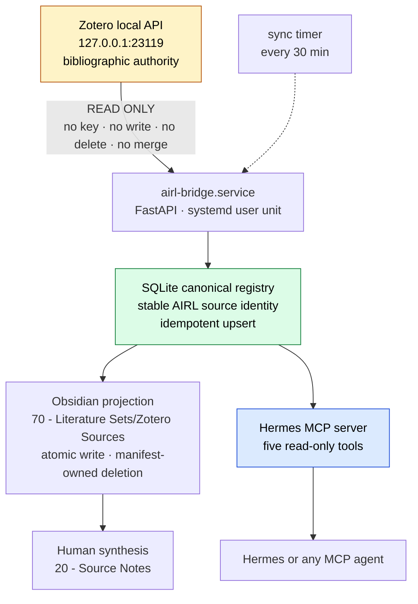

**Generated and human-authored content cannot collide.** The bridge deletes only
files recorded in its own projection manifest, so a markdown file a human drops
into the generated folder is not "stale" — it is simply not the bridge's.

The service listens on `127.0.0.1` only. It holds no Zotero API key, and the
codebase contains no Zotero write operation.

### Install

```bash
cd /home/otonom/Desktop/FH/AI_RESEARCH_FRAMEWORK
uv sync --extra dev
cp .env.example .env      # then fill in your own paths
```

### Enable the Zotero Local API

1. Start Zotero
2. **Settings → Advanced → General**
3. Enable **Allow other applications on this computer to communicate with Zotero**
4. Keep port `23119` local — do not forward or expose it

```bash
uv run airl-bridge doctor
```

### Run

```bash
uv run airl-bridge serve

systemctl --user status airl-bridge.service
systemctl --user status airl-bridge-sync.timer
journalctl --user -u airl-bridge.service -n 50
```

A user timer runs the same local synchronisation every 30 minutes.

Local endpoints: [`/health`](http://127.0.0.1:8765/health) ·
[`/ready`](http://127.0.0.1:8765/ready) · [`/docs`](http://127.0.0.1:8765/docs)

### First synchronisation

```bash
curl -X POST 'http://127.0.0.1:8765/v1/sync?limit=100'
curl 'http://127.0.0.1:8765/v1/sources?limit=10'

# or without starting the server
uv run airl-bridge sync --limit 100
```

Repeated synchronisation is idempotent for the same Zotero library and item key.
Zotero-derived files live under the automatically managed `Zotero Sources`
branch and are regenerated from the canonical registry. Human synthesis stays in
`20 - Source Notes`; curated sets stay at the root of `70 - Literature Sets`.

> ⚠️ **Known limitation:** ingest is hard-capped at 100 records; there is no
> pagination and no `since=` incremental sync. Once the library exceeds 100
> sources, synchronisation silently becomes partial. See finding **H1** in the
> audit report.

### Verify

```bash
uv run pytest                          # 20 tests
uv run python scripts/mcp_smoke.py     # asserts the five-tool boundary; exits 1 on failure
uv run python scripts/acceptance_v0.py # data-independent structural acceptance
python3 scripts/validate_skills.py     # Agent Skills format + AIRL metadata contract
(cd planning/commissioning && sha256sum -c 00_PROGRAM/SHA256SUMS.txt)
```

All five run by hand. **There is no CI** — see finding **H5**, and
[`docs/OPERATIONS.md`](docs/OPERATIONS.md) for the full verification bundle.

## Hermes MCP access

Hermes starts the `airl-bridge-mcp` server over stdio and sees exactly five
read-only tools: status, source search, source detail, category counts, and
possible-duplicate reporting. No synchronisation, write, delete or Zotero
mutation tool is exposed. The Hermes configuration pins an explicit five-tool
include list; MCP prompt and resource capabilities are disabled.

## Status semantics

`WORKING` means a component has been verified locally.
`ACCEPTED` means an independent verifier accepted its evidence package.

**No work package is currently `ACCEPTED`.** That is not an oversight — the
mechanisms required to reach that state (signed evidence manifests, an immutable
store, an independent verifier) do not yet exist. See finding **C1** in the audit
report.

[**WP-000**](planning/commissioning/01_GOVERNANCE/WP-000_interim_evidence_policy.md)
now removes the *storage* half of that blocker by expressing the
`EvidenceManifest` as a signed in-toto attestation in a public transparency log,
rather than waiting for WP-026. The *independence* half — finding **C2**, who may
verify in a one-person operation — remains open, and no standard resolves it.

## Verification

```
20/20 tests pass · plan seal 202/202 OK · service and timer active
MCP smoke: 5 read-only tools, exits 1 when the Bridge is down
Acceptance: 11 structural checks pass, data-independent
Skills: 49/49 conform to the Agent Skills format and the AIRL metadata contract
Mirror drift: 0 (203 plan files, 59 skill/doc files)
Obsidian baseline and vault identical
```

Every check above is reproducible from a clean checkout with the Bridge running.
None of them runs automatically.
