# AI Research Framework

An evidence-centred, auditable operating system for research (AIRL-OS).

Its central thesis: **agents produce, machines verify, humans decide** — and
those three roles are kept structurally separate.

**In one paragraph.** A capable model's characteristic failure is not
incompetence but plausibility: fluent, well-cited, confident output that is
wrong, and that no amount of further model capability detects from the inside.
AIRL-OS answers that by treating model output as a hypothesis which must survive
mechanical verification, independent review and a human decision before it
becomes a claim — with every claim traceable back to an exact source span and
forward to a signed attestation. This repository holds the target architecture
for that system, the execution discipline agents work under, and the one vertical
slice that actually runs today.

**The evidence-chain idea is not original to this project.** Google Research
published *Science One / ScientistOne* around the same principle —
**Chain-of-Evidence** — and, unlike this repository, measured it on 75 generated
papers. What differs here is scope: Science One asks whether an autonomous system
can produce verifiable papers; AIRL-OS asks under what governance a claim may be
believed at all, including its own. That is a broader question, harder to
demonstrate, and today **answered only on paper**. The comparison, and where
those systems are simply ahead, is in
[`AIRL_OS_RELATED_SYSTEMS.md`](docs/architecture/AIRL_OS_RELATED_SYSTEMS.md).

**A plan is not evidence of implementation**; the table below separates the two,
and every document here is written under [`docs/DOCUMENT_STANDARD.md`](docs/DOCUMENT_STANDARD.md),
whose central rule is that distance from working software is stated rather than
implied.

| Area | Status | Location |
|---|---|---|
| Literature bridge V0 | ✅ **Working**, locally accepted | `src/airl_bridge/` |
| Zotero → Obsidian projection | ✅ Working, read-only at the Zotero boundary | `src/airl_bridge/obsidian.py` |
| Hermes MCP access | ✅ Working, five read-only tools | `src/airl_bridge/mcp_server.py` |
| Shared contract core | ⚠️ `TECH_COMPLETE` — no production consumer | `src/airl_framework/` |
| Skill registry (52 skills, two families) | ✅ Format-conformant · ⚠️ wired for Claude Code only · 📐 behaviour **not yet tested** | `skills/` |
| Obsidian information architecture | ✅ V0 ready | `vault_baseline/` |
| Target architecture and skill layer | 📐 Designed, awaiting decision | `docs/architecture/` |
| Commissioning programme — **baseline v1.0.1** | ⬜ Planned, not started; 141 package documents, 51 scenarios | `planning/commissioning/` |
| Interim evidence policy (WP-000) | ✅ `TECH_COMPLETE` — tooling implemented, specimen issued and verified | `scripts/evidence_manifest.py` · `delivery/WP-000/` |
| Verification on push (BVC-01) | 📐 Decided and written, **not yet active** — needs a workflow-scoped token | `deploy/bvc-01-verify.yml` |
| Document production (authoring + figures + reporting) | 📐 Skill and reference modules written; resolution checks run · **no renderer installed** | `skills/authoring-research-documents/` |
| Reference verification (CoE Audit check 1) | ✅ **Working and measured** — 81.8% of the registry corroborated | `scripts/verify_references.py` |
| Source monitoring (first slice of G10) | ✅ **Working** — positive control fires; 18 of 33 sources carry no DOI | `scripts/monitor_sources.py` |

## Layout

```
src/          Bridge component and the shared contract core
tests/        Test suite
skills/       52 skills — HOW agents work; engineering + scientific + shared
planning/     WP-000, WP-001..140, ACC-01..51 (hash-sealed canonical plan, baseline v1.0.1)
docs/         Architecture, review and operations documents
schemas/      Shared contract schemas
delivery/     Per-package evidence packages — signed manifests and anchors
deploy/       systemd unit files
scripts/      Acceptance, smoke, skill-validation, figure and mirror generation
docs/figures/ Publication figures — generated, never hand-edited
vault_baseline/  Versioned copy of the Obsidian vault
```

## Where to start

| Question | Document |
|---|---|
| **What is this system?** — explained and diagrammed | [`docs/architecture/AIRL_OS_ARCHITECTURE.md`](docs/architecture/AIRL_OS_ARCHITECTURE.md) |
| What actually exists today? | [`docs/review/2026-08-22_remediation_verification.md`](docs/review/2026-08-22_remediation_verification.md) — current state against the frozen audit |
| **What** should be added to the target architecture? | [`docs/architecture/AIRL_OS_IDEAL_STRUCTURE.md`](docs/architecture/AIRL_OS_IDEAL_STRUCTURE.md) |
| **How** should agents work? | [`docs/architecture/AIRL_OS_SKILL_LAYER.md`](docs/architecture/AIRL_OS_SKILL_LAYER.md) · [`skills/README.md`](skills/README.md) |
| **Who** performs each role — human, model or code? | [Roles](#6-roles--who-is-accountable-for-what) below · [`AIRL_OS_ROLES.md`](docs/architecture/AIRL_OS_ROLES.md) — definitions and authority flows · [`AIRL_OS_ROLE_MODEL_ASSIGNMENT.md`](docs/architecture/AIRL_OS_ROLE_MODEL_ASSIGNMENT.md) — which model |
| How are the figures produced? | [`docs/figures/README.md`](docs/figures/README.md) — inventory and design specification |
| How are these documents written? | [`docs/DOCUMENT_STANDARD.md`](docs/DOCUMENT_STANDARD.md) — structure, status vocabulary, honesty rules |
| What has been decided, and why? | [`ADR-001`](docs/architecture/ADR-001_solo_operator_independence.md) independence · [`ADR-002`](docs/architecture/ADR-002_bootstrap_verification_control.md) verification control · [`ADR-003`](docs/architecture/ADR-003_trusted_control_and_policy.md) trusted control and policy |
| Licensing and attribution | [`NOTICE`](NOTICE) |
| What is **adopted** rather than invented? | [`docs/architecture/AIRL_OS_EXTERNAL_STANDARDS.md`](docs/architecture/AIRL_OS_EXTERNAL_STANDARDS.md) |
| How does this compare to Science One, PaperQA2, AI Scientist? | [`docs/architecture/AIRL_OS_RELATED_SYSTEMS.md`](docs/architecture/AIRL_OS_RELATED_SYSTEMS.md) |
| Which mature components does it build on? | [`docs/architecture/AIRL_OS_COMPONENT_REUSE.md`](docs/architecture/AIRL_OS_COMPONENT_REUSE.md) |
| **What has actually been measured?** | [`delivery/measurements/`](delivery/measurements/) — one real result so far |
| Architecture of the working vertical slice | [`docs/ARCHITECTURE_V0.md`](docs/ARCHITECTURE_V0.md) |
| Day-to-day operation | [`docs/OPERATIONS.md`](docs/OPERATIONS.md) |
| The full programme plan | [`planning/commissioning/README.md`](planning/commissioning/README.md) |

---

# Architecture

Full reference with every diagram: [`docs/architecture/AIRL_OS_ARCHITECTURE.md`](docs/architecture/AIRL_OS_ARCHITECTURE.md).
What follows is the shape of the system in one page.

## 1. Why this is not an assistant

A normal AI research assistant is a pipeline from a question to an answer, and
whatever comes out is trusted because a capable model produced it:

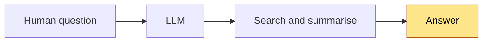

AIRL-OS starts from the opposite assumption: **a fluent, confident, well-cited,
entirely wrong result is the normal failure mode of a capable model**, and no
amount of model capability detects it from the inside. So model output is a
*hypothesis* that must survive mechanical verification, independent review and a
human decision before it becomes a claim.

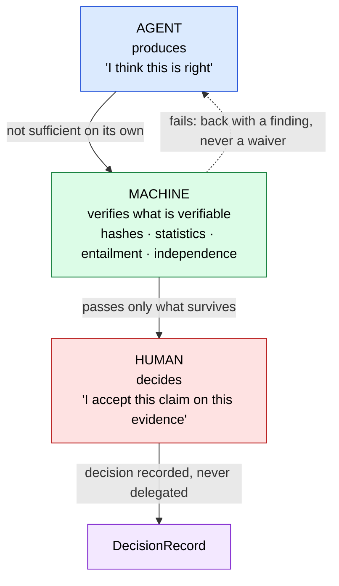

The failure mode being designed out is the ordinary multi-agent pattern —
*agent A produces, agent B reads it, agent B says "looks good", accepted*. Two
models from the same family share training lineage and therefore share errors;
agreement between them is correlation, not confirmation.

**The assignment rule that follows from this:**

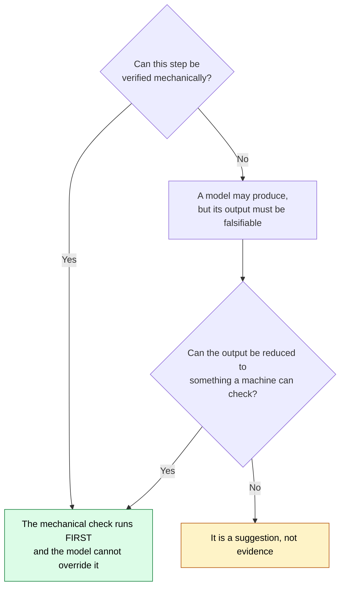

## 2. The evidence chain

Nothing becomes knowledge by being asserted. It becomes knowledge by surviving a
chain in which **every link is addressable**:


*Figure 2 — The chain, its revision loop, and the attestation that makes a link
admissible. Solid nodes are implemented and verified locally; hollow dashed nodes
are designed and not built — nine of the ten.*

```mermaid
flowchart LR
    S["Source<br/>the paper"] --> SR["SourceRepresentation<br/>parsed, hashed"]
    SR --> ES["EvidenceSpan<br/>the exact sentence"]
    ES --> C["ClaimVersion<br/>what we assert"]
    C --> R["ExperimentRun<br/>what we ran"]
    R --> RV["Review<br/>who challenged it"]
    RV --> RP["Reproduction<br/>does it hold again"]
    RP --> D["DecisionRecord<br/>a human accepted it"]
    D --> P["Publication"]
    P --> MO["Monitoring<br/>does it still hold"]
    MO -.->|"supersede · revise · retract"| C
    style ES fill:#dcfce7,stroke:#15803d,color:#000
    style D fill:#fee2e2,stroke:#b91c1c,color:#000
    style MO fill:#e0e7ff,stroke:#4338ca,color:#000
```

Two properties matter more than the chain itself. It is **traversable in both
directions** — from a published sentence to the source span, and from a retracted
source to every claim that depended on it. And **the loop closes**: a claim is
never permanently true, and `VERIFIED` is explicitly not an irreversible state.

## 3. The G0–G10 research lifecycle

The spine of the system. Each gate has a frozen output that does not change
without a recorded supersession.


*Figure 1 — Reading down is time; reading across is who may act. At every gate
the mechanical check runs first and cannot be overridden, a model may produce but
never decide, and a human holds authority. The hatched cells at G5 and G7a are
the design, not an omission. Generated by `scripts/fig_lifecycle.py`.*

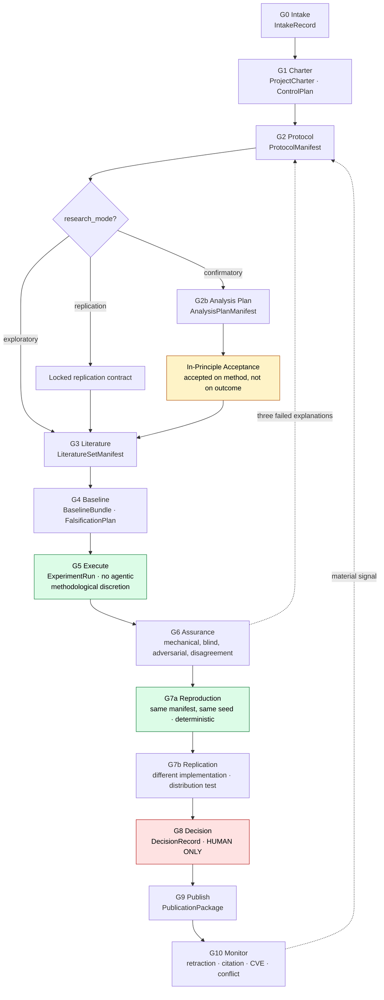

| Gate | The failure it exists to prevent |
|---|---|
| **G0** | Redoing work that already exists; unowned work |
| **G1** | A model inventing its own research objective |
| **G2** | Changing the method after seeing the result |
| **G2b** | Choosing the analysis that gives the nicest answer |
| **G3** | An evidence base that cannot be re-derived |
| **G4** | Only asking how to confirm, never how to refute |
| **G5** | Model bias entering the measurement itself |
| **G6** | "Looks good" counted as independent review |
| **G7a** | A result nobody can obtain twice |
| **G7b** | Confusing "same numbers" with "same conclusion" |
| **G8** | A model deciding what the laboratory believes |
| **G9** | A sentence claiming more than its evidence supports |
| **G10** | Treating a published claim as permanently true |

**In-principle acceptance** sits in the flow for one reason: without a
commitment made *before* the result exists, publication bias survives every
other control — the protocol is frozen, the result comes back negative, and the
human simply declines to publish.

It is **conditional, not universal**: required for `confirmatory` work, a locked
replication contract for `replication`, and not required for `exploratory` work —
which in exchange may never label its claims confirmatory. Forcing Registered
Report ceremony onto exploration would only teach people to mislabel confirmatory
work as exploratory. The classification is fail-closed: absent or ambiguous, it
resolves to `confirmatory`.

**"No model at G5"** means no *agentic methodological discretion* during a frozen
execution. The subject of the experiment may itself be a model — a frozen model
under test, a preregistered inference pipeline. What is forbidden is an agent
changing a threshold or a stopping point mid-run because the result looks wrong.
The model may be the instrument; it may not be the methodologist.

**Inside G6**, the heaviest gate:

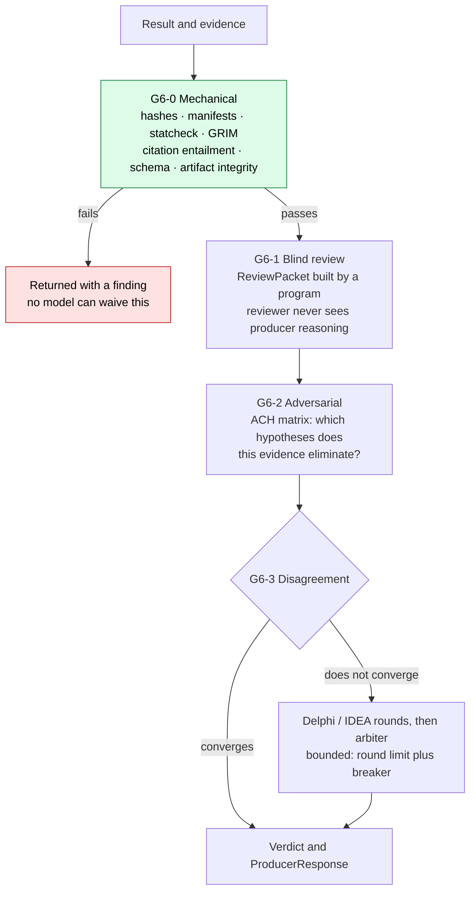

The `ReviewPacket` is built by a **deterministic program, not a prompt** — only
then can "what exactly did the reviewer see?" be answered afterwards. The
adversarial reviewer is scored on **the quality of its refutation**, not on
approval speed.

## 4. The planes

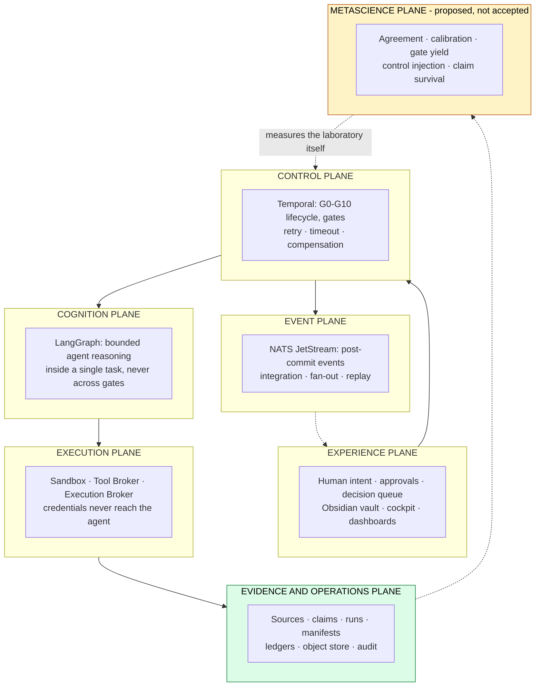

**Temporal is the process authority; LangGraph is not.** A research project lives
for months and must survive process restarts, model changes and human absence —
an agent graph is the wrong place to keep that state. Conversely, Temporal is the
wrong place to reason. **NATS carries events, not authority**: if the entire
stream were deleted, gate state would still be recoverable from Temporal.

## 5. The skill layer — two families, one shared core

A `RoleContract` says **who** an agent is — purpose, tools, data classes, budget.
Every one of those is a *boundary*; none of them says **which procedure to
follow**. Skills close that gap.

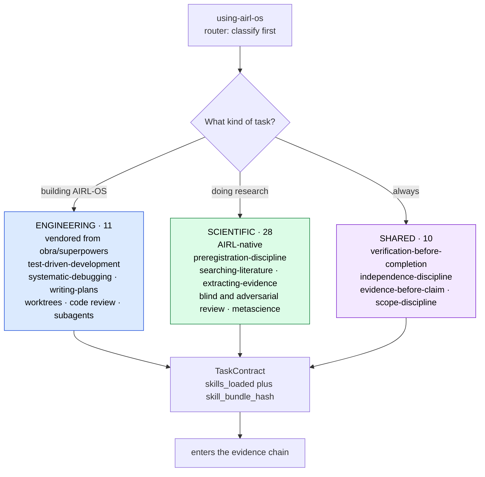

> **Research adaptations extend their engineering counterparts; they never
> replace them.** AIRL-OS is simultaneously a laboratory and a software platform,
> and it needs both disciplines at once.

| Software engineering | Scientific research | The shared rule |
|---|---|---|
| Test before code | Preregistration before result | You do not get to pick the criterion after seeing the outcome |
| Bug root-cause tracing | Anomaly root-cause tracing | Three failed explanations means the architecture is wrong, not the fix |
| Fresh-context implementer | Fresh-context analyst | Whoever produced it cannot be the one who checks it |
| Reviewer sees the diff, not the reasoning | Reviewer sees the packet, not the trace | Information asymmetry is what makes review independent |
| Verification before "done" | Verification before "claimed" | Memory is not evidence |

Skills conform to the [Agent Skills open standard](https://agentskills.io),
which Claude Code, Codex, OpenCode, Cursor, Copilot, Gemini CLI and Hermes Agent
all implement — so the registry is **format-compatible** with each of them.
**A skill that does not load governs nothing**, so conformance is checked
mechanically by `scripts/validate_skills.py`.

> Format compatibility is not behavioural compatibility. Whether a harness loads
> the right skill at the right moment, and keeps it across context compaction, is
> what ACC-42, ACC-44 and ACC-45 establish under WP-048 — and that is **not**
> established today. Only the Claude Code path is wired, via `.claude/skills`.

## 6. Roles — who is accountable for what

Fourteen **durable functions**. Not fourteen people: a role is a function, and
one person may legally hold several of them.


*Figure 3 — Authority tiers with the actor composition of each role (**X**
mechanical, **M** model, **H** human), and the constraint resolution that decides
whether one operator may hold two roles at once. Full definitions — mandate,
what each role decides, and what it may never do — are in
[`docs/architecture/AIRL_OS_ROLES.md`](docs/architecture/AIRL_OS_ROLES.md).*

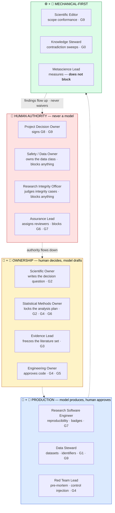

| Role | Actor | Can block | The one thing it must never delegate |
|---|---|---|---|
| Project Decision Owner | 👤 | G8, G9 | Deciding what the laboratory believes |
| Safety / Data Owner | 👤 | all | The data-class decision |
| Research Integrity Officer | 👤 + ⚙️ | all | The judgement on an integrity case |
| Assurance Lead | 👤 + ⚙️ | G6, G7 | Who reviews whom |
| Scientific Owner | 👤 + 🤖 draft | G2 | Writing the decision question |
| Statistical Methods Owner | 👤 + 🤖 | G2, G4, G6 | Locking the analysis plan |
| Evidence Lead | 👤 + 🤖 | G3 | The freeze decision |
| Engineering Owner | 🤖 + 👤 approval | G4, G5 | Approving what ships |
| Research Software Engineer | 🤖 + 👤 approval | G7 | Assigning the reproducibility badge |
| Data Steward | 🤖 + 👤 approval | G1, G9 | Publishing an identifier |
| Scientific Editor | ⚙️ + 🤖 | G9 | — scope conformance is mechanical |
| Red Team Lead | 🤖 + 👤 | G4 | — |
| Knowledge Steward | ⚙️ + 🤖 | G0 | — |
| Metascience Lead | 👤 + ⚙️ | **nothing** | Measuring without gatekeeping |

**Metascience Lead blocks nothing on purpose.** A function that both measures the
laboratory and can veto its work stops measuring honestly.

### How a gate actually resolves

Every gate runs the same three-stage resolution, and the order is the whole
design:

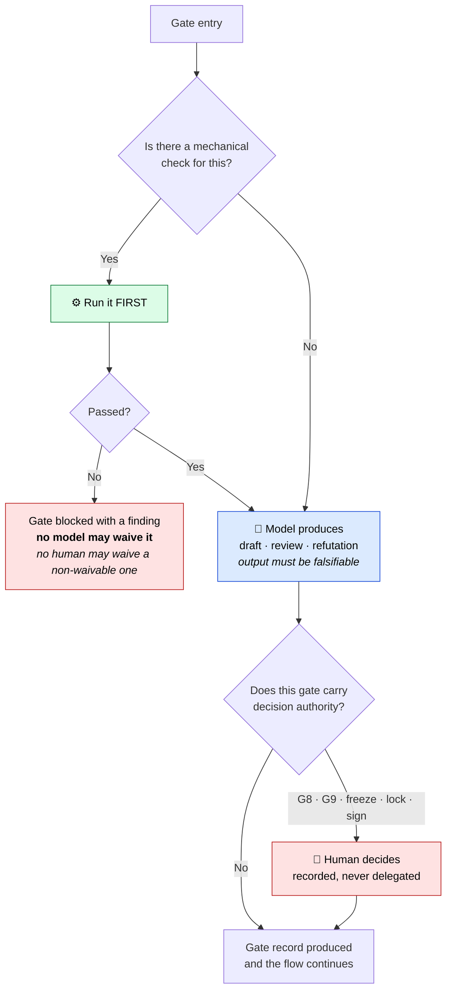

Applied gate by gate, that produces:

| Gate | ⚙️ Mechanical | 🤖 Model | 👤 Human |
|---|---|---|---|
| **G0** intake | duplicate search | triage | greenlight |
| **G1** charter | risk → assurance policy engine | charter draft | **writes the decision question** |
| **G2** protocol | template + placeholder sweep | protocol draft · pre-mortem · different-family review | Scientific + Statistical Owner **sign** |
| **G2b** analysis plan | — | plan draft · power analysis | Statistical Methods Owner **locks** |
| **G3** literature | GROBID · DOI · dedup · hashing | query plan · screening | Evidence Lead **freezes** |
| **G4** baseline | the baseline run | compute plan · pre-mortem | budget approval |
| **G5** execute | **the experiment itself** | **none** — unless the model is the subject | — |
| **G6-0** mechanical | statcheck · GRIM · entailment · hashes | **none** | — |
| **G6-1** blind | `ReviewPacketBuilder`, a program | N reviewers, different family | — |
| **G6-2** adversarial | the ACH matrix | adversarial refutation | — |
| **G7a** reproduce | same manifest, same seed | **none** | — |
| **G7b** replicate | distribution test | — | RSE assigns the badge |
| **G8** decide | package completeness | **recommendation only** | **DECIDES — human only, under quota** |
| **G9** publish | **scope conformance** · RO-Crate · hashes | text draft | Decision Owner + Editor |
| **G10** monitor | Crossref · Retraction Watch · CVE | signal triage | decides on a material signal |

The empty model cells at **G5**, **G6-0** and **G7a** are the point, not an
omission: those are the layers that stay free of model bias.

### A role is a function, not a person

This is what makes the catalogue survivable in a one-person laboratory. Roles
are **bound**, and independence is expressed as separation constraints rather
than headcount:

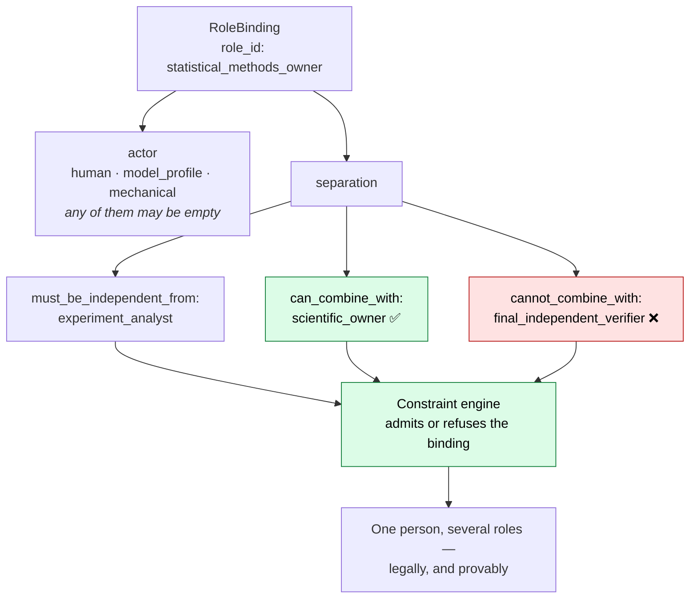

The question stops being *"where do I find 73 owners and 114 verifiers?"* and
becomes *"which combinations am I willing to declare independent, and which must
stay mechanical or external?"*

> **This is the shape of an answer to finding C2, not the answer.** Which
> combinations count as independent in a one-person operation is still an open
> decision, and until it is made no work package can reach `ACCEPTED`.

### Independence is measured, not asserted

Reviewer independence has a quota that scales with the assurance class:

| Assurance | Producer effort | Reviewer effort | Adversarial | Reviewer quota | Model policy |
|---|---|---|---|---|---|
| **R1** | `medium` | `high` | — | 1, any family | hosted OK |
| **R2** | `high` | `high` | `xhigh` | 2, **different provider family** | hosted + full I/O logging |
| **R3** | `xhigh` | `xhigh` | `max` | 3, **different family** | **local open-weight mandatory** |

R3 requires a local model because a hosted model has no pinnable snapshot, and
without one G7a reproduction is structurally impossible. That is a constraint,
not a preference.

And the family rule is itself only a **proxy**: what is permanent is the measured
pairwise error correlation ρ between reviewer profiles. When the calibration set
exists, the measurement replaces the rule. A laboratory that never measures its
own independence assumption is repeating an assumption and calling it
verification.

## 7. How a document is produced

A document is a **projection of verified state**, not a generative act. The
pipeline runs evidence → claims → structure → prose → figures → QA → render, and
a renderer exiting zero decides nothing.

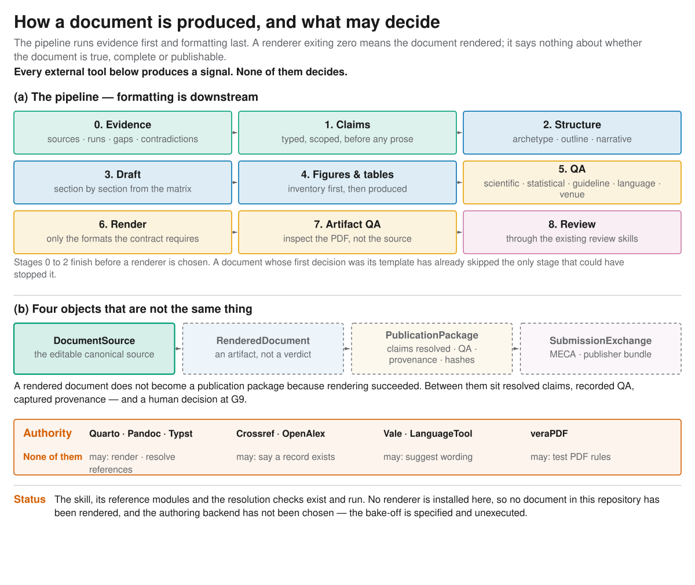

*Figure 5 — Formatting is downstream: stages 0–2 finish before a renderer is
chosen. The four packaging objects are distinct, and only the first exists here.
Every external tool in the authority band produces a signal; none of them
decides. Written up in [`authoring-research-documents`](skills/authoring-research-documents/SKILL.md).*

## 8. What this builds, and what it stands on

Almost every layer of the target system is a component someone else maintains
and tests. What this project owns is the control layer.

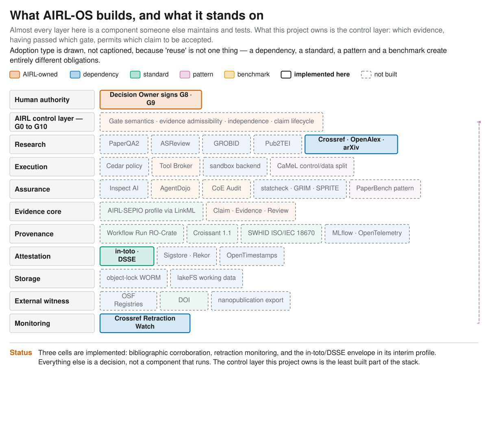

*Figure 4 — Adoption type is drawn rather than captioned, because "reuse" is not
one thing: a dependency, a standard, a pattern and a benchmark create entirely
different obligations. Solid borders mark the three cells that are implemented;
everything dashed is a decision, not a running component. Details and rationale
in [`AIRL_OS_COMPONENT_REUSE.md`](docs/architecture/AIRL_OS_COMPONENT_REUSE.md).*

> **AIRL-OS should not invent its own PDF parser, screening engine, policy
> language, sandbox, experiment tracker or scholarly identifier.** Its
> contribution is the layer above them: which evidence, having passed which
> gate, permits which claim to be accepted.

## 9. How evidence is signed

Acceptance requires a signed `EvidenceManifest` in an immutable store — and that
store is WP-026, far downstream, which deadlocked the entire programme
(finding **C1**). The deadlock existed only because the store was assumed to be
ours to build. It is not:

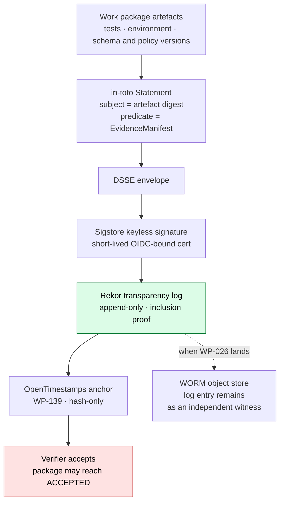

**Immutability is delegated, not deferred.** Rekor is a tamper-evident
transparency record **for signed metadata**, not an artifact store — WP-026 is
deferred behind it, not cancelled. And this resolves the *storage* half of C1
only: finding **C2**, who may act as an independent verifier in a one-person
operation, is a decision no standard makes. What the architecture now supplies is
its *shape* — independence expressed as `RoleBinding` separation constraints
rather than headcount, so one person holding several roles can be modelled
honestly. See
[`AIRL_OS_EXTERNAL_STANDARDS.md`](docs/architecture/AIRL_OS_EXTERNAL_STANDARDS.md).

## 10. Target versus reality


**The blockers, in order:** **C1** storage half resolved on paper, WP-000 not yet
executed · **C2** open, a decision not code · **H1** Zotero ingest capped at 100
records — fix M9 first or pagination turns a masked truncation into active data
loss · **H2** no deletion reconciliation · **H3** the read-only boundary has no
behavioural test · **H4** the contract core has no consumers · **H5** no CI.

---

## The working vertical slice: Literature Bridge V0

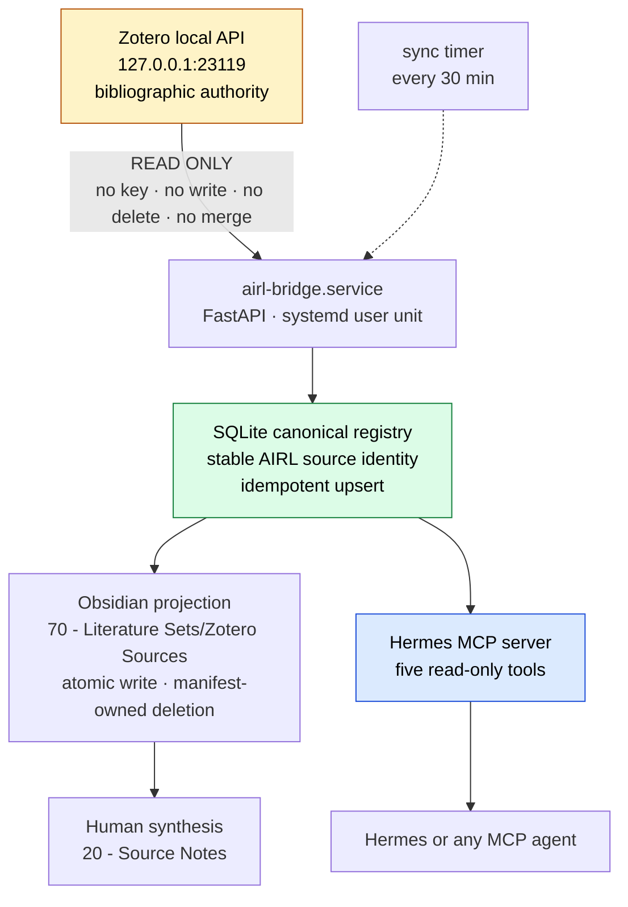

**Generated and human-authored content cannot collide.** The bridge deletes only
files recorded in its own projection manifest, so a markdown file a human drops
into the generated folder is not "stale" — it is simply not the bridge's.

The service listens on `127.0.0.1` only. It holds no Zotero API key, and the
codebase contains no Zotero write operation.

### Install

```bash
cd /home/otonom/Desktop/FH/AI_RESEARCH_FRAMEWORK
uv sync --extra dev
cp .env.example .env      # then fill in your own paths
```

### Enable the Zotero Local API

1. Start Zotero
2. **Settings → Advanced → General**
3. Enable **Allow other applications on this computer to communicate with Zotero**
4. Keep port `23119` local — do not forward or expose it

```bash
uv run airl-bridge doctor
```

### Run

```bash
uv run airl-bridge serve

systemctl --user status airl-bridge.service
systemctl --user status airl-bridge-sync.timer
journalctl --user -u airl-bridge.service -n 50
```

A user timer runs the same local synchronisation every 30 minutes.

Local endpoints: [`/health`](http://127.0.0.1:8765/health) ·
[`/ready`](http://127.0.0.1:8765/ready) · [`/docs`](http://127.0.0.1:8765/docs)

### First synchronisation

```bash
curl -X POST 'http://127.0.0.1:8765/v1/sync?limit=100'
curl 'http://127.0.0.1:8765/v1/sources?limit=10'

# or without starting the server
uv run airl-bridge sync --limit 100
```

Repeated synchronisation is idempotent for the same Zotero library and item key.
Zotero-derived files live under the automatically managed `Zotero Sources`
branch and are regenerated from the canonical registry. Human synthesis stays in
`20 - Source Notes`; curated sets stay at the root of `70 - Literature Sets`.

> ⚠️ **Known limitation:** ingest is hard-capped at 100 records; there is no
> pagination and no `since=` incremental sync. Once the library exceeds 100
> sources, synchronisation silently becomes partial. See finding **H1** in the
> audit report.

### Verify

```bash
uv run pytest                          # 25 tests
uv run python scripts/mcp_smoke.py     # asserts the five-tool boundary; exits 1 on failure
uv run python scripts/acceptance_v0.py # data-independent structural acceptance
python3 scripts/validate_skills.py     # Agent Skills format + AIRL metadata contract
python3 scripts/make_figures.py --check # figures match generators, text fits its box
python3 scripts/validate_commissioning_plan.py  # the plan is internally consistent
python3 scripts/check_doc_consistency.py        # documents agree with the repository
python3 scripts/check_stale_claims.py          # no prose the repository has outgrown
uv run python scripts/write_status.py          # regenerate docs/STATUS.md
uv run python scripts/evidence_manifest.py verify \
    --manifest delivery/WP-000/evidence.dsse.json --tamper-demo
uv run python scripts/verify_references.py   # needs network; not part of BVC-01
uv run python scripts/monitor_sources.py     # G10 sweep; fails if its control stays silent
uv run python scripts/check_document.py delivery/specimen/airl-measurement-report.qmd
python3 scripts/check_reporting_registry.py  # adopted components remain auditable
(cd planning/commissioning && sha256sum -c 00_PROGRAM/SHA256SUMS.txt)
```

They run by hand today. The first six are **written** as a push-triggered
control — [`BVC-01`](deploy/bvc-01-verify.yml), a temporary measure under
[`ADR-002`](docs/architecture/ADR-002_bootstrap_verification_control.md) with a
named expiry and WP-024 as its retirement package — but it is **staged, not
active**: activating it needs a token with GitHub's `workflow` scope, and the
activation command is in ADR-002 §6.

**Neither the staged control nor its activation closes finding H5.** H5 is the absence of a CI *platform* — schema
validation, policy bundles, security scanning, provenance attestation,
integration testing — and that is WP-024, which hard-depends on three unbuilt
packages. What BVC-01 closes is narrower and worth naming precisely: the gap
between *the checks exist* and *the checks ran*. The Bridge-dependent checks and
the vault mirror checks stay manual, and their absence is recorded in the
workflow rather than hidden.

## Hermes MCP access

Hermes starts the `airl-bridge-mcp` server over stdio and sees exactly five
read-only tools: status, source search, source detail, category counts, and
possible-duplicate reporting. No synchronisation, write, delete or Zotero
mutation tool is exposed. The Hermes configuration pins an explicit five-tool
include list; MCP prompt and resource capabilities are disabled.

## Licensing and what this repository is for

This repository is **public to read and proprietary to use** — see
[`NOTICE`](NOTICE). That is a deliberate position and worth stating plainly,
because a framework arguing for open standards, reproducibility and external
verification while keeping its own implementation closed invites a fair
question.

The answer is that the two are different things. **The architecture is meant to
be read, argued with and reused as a reference**; the implementation is one
person's research infrastructure, not a product seeking adopters. Nothing here
asks anyone to depend on it, and if this ever becomes something a community is
expected to build on, the licence has to change first — a proprietary framework
cannot credibly ask for the interoperability it preaches.

Vendored third-party content keeps its own licence: the eleven engineering
skills are MIT from `obra/superpowers`, pinned by commit and attributed in
`NOTICE`.

## Status semantics

`WORKING` means a component has been verified locally.
`ACCEPTED` means an independent verifier accepted its evidence package.

**No work package is currently `ACCEPTED`.** That is not an oversight — the
mechanisms required to reach that state (signed evidence manifests, an immutable
store, an independent verifier) do not yet exist. See finding **C1** in the audit
report.

[**WP-000**](planning/commissioning/01_GOVERNANCE/WP-000_interim_evidence_policy.md)
removes the *storage* half of that blocker: the `EvidenceManifest` is a signed
in-toto attestation, issued and verified by `scripts/evidence_manifest.py`, and
tamper detection is exercised by tests rather than asserted. The implemented
profile is `airl-interim-v0.1` — local key, **no transparency log** — and each
manifest carries its own `limitations` list so it cannot be read as more than it
is.

The *independence* half — finding **C2** — is now **decided** in
[`ADR-001`](docs/architecture/ADR-001_solo_operator_independence.md): R1 solo;
R2 solo only under a declared partial-independence profile; **R3 `BLOCKED`
unless an external verifier is named.** So packages have an acceptance path, and
the laboratory does not claim independence it does not have.

## Verification

```
25/25 tests pass · plan seal 207/207 OK · plan semantics OK · service and timer active
WP-000 attestation: signature OK, 3 subject digests OK, tamper rejected
MCP smoke: 5 read-only tools, exits 1 when the Bridge is down
Acceptance: 11 structural checks pass, data-independent
Skills: 52/52 conform to the Agent Skills format and the AIRL metadata contract
Documents: declared counts match the repository; no decision record contradicts itself
References: 27/33 registry sources corroborated against Crossref, OpenAlex and arXiv
Monitoring: G10 sweep clean over 15 DOI-bearing sources; positive control fired
Figures: 5/5 match their generators; 0 text overflows out of their boxes
Mirror drift: 0 (208 plan files, 67 skill/doc/figure files)
Obsidian baseline and vault identical
```

Every check above is reproducible from a clean checkout with the Bridge running.
None of them runs automatically.
