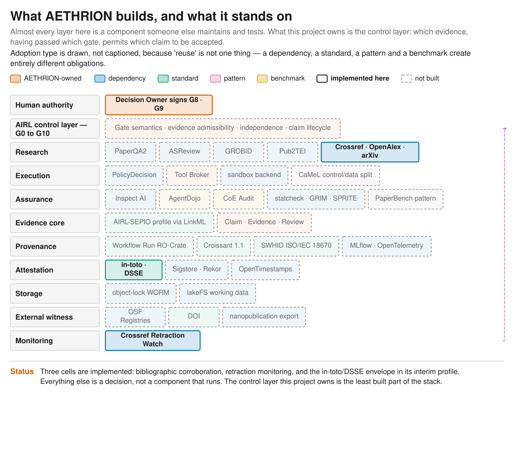

# Purpose {#sec-purpose}

This specimen exists to exercise the authoring pipeline end to end on real data.
It reports two measurements produced by this repository about itself, and it is
deliberately narrow: it makes no claim about research quality, only about
whether registry records resolve in public bibliographic infrastructure.

# Method {#sec-method}

Every source in the registry was resolved against Crossref, then OpenAlex, then
arXiv, by DOI where present and by title otherwise. A record counts as
corroborated when a returned title matches the local title above a fixed
threshold $\tau$:

$$
\mathrm{sim}(a,b) = \frac{|T_a \cap T_b|}{\max(|T_a|,|T_b|)} \ge \tau = 0.82
$$ {#eq-similarity}

@eq-similarity is deliberately simple: it decides *reporting*, not truth, and a
borderline case is meant to reach a human rather than be silently classified.

A separate sweep queried Crossref for `update-to` and `updated-by` relations,
which carry Retraction Watch data. Every run includes a known-retracted DOI as a
positive control; the run fails if the control does not fire.

# Results {#sec-results}

: Corroboration of the 33 registered sources. {#tbl-corroboration}

| Authorities                  | Corroborated | Unresolved | Rate   |
|------------------------------|-------------:|-----------:|-------:|
| Crossref + OpenAlex          |        25/33 |          8 | 75.8 % |
| Crossref + OpenAlex + arXiv  |    **27/33** |          6 | **81.8 %** |

@tbl-corroboration shows that adding one authority moved the rate by six points.
Every entry unresolved by the first two authorities was a preprint carrying no
DOI, which a DOI-registration authority structurally cannot see.

The monitoring sweep covered the 15 sources carrying a DOI and raised no material
signal. Its positive control fired, so the absence of signals is a measurement
rather than an absence of measurement. The remaining 18 sources carry no DOI and
were invisible to the sweep.

The layered structure these checks sit in is shown in @fig-stack.

{#fig-stack fig-alt="Layered diagram of the AETHRION target stack, showing which layers are adopted components and which three cells are implemented."}

# Limitations {#sec-limitations}

Corroboration measures **existence in public authorities**, not support: an
unresolved DOI-less item is unindexed, not fabricated. The published
Chain-of-Evidence audit measured hallucinated references in *generated*
bibliographies [@scientistone2026]; this registry is human-curated, so the
numbers are not comparable and are not presented as such.

The monitoring sweep is blind to 18 of 33 sources, and no claim-impact analysis
exists, because no claim ledger exists yet.

# Related work {#sec-related}

Reference verification as an integrity check follows the Chain-of-Evidence audit
[@scientistone2026]. Screening automation, where it is later adopted, follows
ASReview [@asreview2021]. The untrusted-content boundary that governs how source
text reaches a model follows the control/data separation of CaMeL [@camel2025].

# Appendix: reproduction {#sec-appendix}

```bash
uv run python scripts/verify_references.py --report delivery/measurements/reference_verification.json
uv run python scripts/monitor_sources.py   --report delivery/measurements/source_monitoring.json
```
