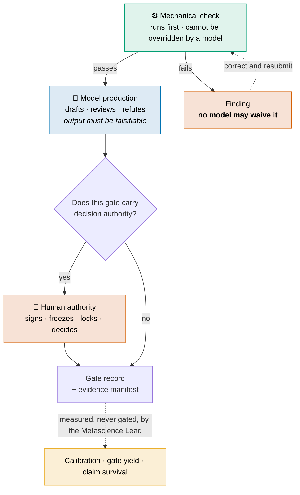

# AETHRION — Role Definitions and Authority Flows

| Field | Value |
|---|---|
| Document type | Architecture reference — the role layer |
| Scope | What each durable function is, what it decides, what it may never do, and how roles combine |
| Sibling documents | `AETHRION_ARCHITECTURE.md` §6 · `AETHRION_ROLE_MODEL_ASSIGNMENT.md` (which model executes what) · `AETHRION_IDEAL_STRUCTURE.md` A1–A8 (why each role was added) |
| Binding packages | WP-003 (role catalogue and RACI), WP-007 (independence profile), **WP-013** (`RoleBinding` schema), WP-047 (compiler enforcement) |
| Date | 2026-08-22 |
| Status | Reference — describes the target role layer. **No role is bound in running software today.** |

**In one paragraph.** Fourteen durable functions carry the laboratory's accountabilities, and each is defined here by its mandate, what it decides, what it may never do, what it produces, when it escalates, and which other roles it may be held with. The organising rule is that a role is a function rather than a person: independence is expressed as separation constraints on a `RoleBinding`, not as headcount, which is what makes a fourteen-role catalogue describable in a one-person operation — and what turns finding C2 from an impossibility into an undecided question.


*Figure 1 — Fourteen durable functions ordered by the authority they hold, and
the constraint resolution that lets one operator hold several of them. Actor
composition is shown per role: **X** mechanical, **M** model, **H** human; an
empty slot means that actor class does not participate.*

---

## 1. The rule that makes this catalogue usable

> **A role is a function, not a person.**

Read as an org chart, this catalogue demands fourteen people and is therefore
impossible for the operation that actually exists. Read correctly, it is a list
of **accountabilities that must each be discharged by some actor** — human,
model, deterministic code, or a combination — and the only hard question is
which of them may be discharged by the *same* actor.

That question is answered by a `RoleBinding`, not by hiring:

```yaml
RoleBinding:
  role_id: statistical_methods_owner
  role_type: governance_function
  actor:
    human: <identity>          # any of these may be empty
    model_profile: <profile>
    mechanical: <service>
  separation:
    must_be_independent_from: [experiment_analyst]
    can_combine_with:         [scientific_owner]
    cannot_combine_with:      [final_independent_verifier]
```

**Three consequences follow, and they are the whole reason this document
exists:**

1. **Independence becomes checkable.** "Is this review independent?" is answered
   by evaluating constraints against the binding, not by asserting it in prose.
2. **A one-person laboratory becomes describable.** It is not "73 owners short";
   it is one operator holding a set of bindings, some of which the constraint
   engine will refuse.
3. **The refusals are the honest part.** Some combinations *cannot* be admitted.
   Where that leaves a gate unsatisfiable, the correct outcome is `BLOCKED`, not
   a quietly relaxed rule.

> **This does not resolve finding C2.** Which combinations count as independent
> in a one-person operation is an undecided question, and until it is decided no
> work package can reach `ACCEPTED`. What this document supplies is the *form*
> the answer must take.

---

## 2. Authority tiers

Roles are grouped by the kind of authority they hold, because that is what
determines whether a model may execute them at all.

| Tier | Rule | Roles |
|---|---|---|
| **I — Human authority** | The actor **may never be a model**, in any configuration | Project Decision Owner · Safety/Data Owner · Research Integrity Officer · Assurance Lead |
| **II — Ownership** | The human decides; a model may draft, propose and analyse | Scientific Owner · Statistical Methods Owner · Evidence Lead · Engineering Owner |
| **III — Production** | A model produces; a human approves before the artifact binds | Research Software Engineer · Data Steward · Red Team Lead |
| **IV — Mechanical-first** | A deterministic check precedes any judgement; the model assists | Scientific Editor · Knowledge Steward · Metascience Lead |

---

## 3. Role definitions

Each entry states the same six things. The **"may never"** line is the load
bearing one: it is what survives when the role is under pressure.

### 3.1 Project Decision Owner · Tier I

| | |
|---|---|
| **Mandate** | Holds the laboratory's belief. Converts an evidence package into an accepted or rejected claim |
| **Decides** | G8 acceptance · G9 publication authorisation |
| **May never** | Delegate a decision to a model; accept a package whose mechanical checks did not pass; decide outside the attention quota |
| **Produces** | `DecisionRecord` |
| **Escalates when** | Evidence is materially incomplete, or a non-waivable blocker remains open |
| **Combination** | Cannot combine with any role that produced the artifact under decision |

The quota is part of the role, not an inconvenience: an operator who decides
faster than they can read is producing signatures, not decisions.

### 3.2 Safety / Data Owner · Tier I

| | |
|---|---|
| **Mandate** | Owns the data classification and every consequence that follows from it — routing, retention, egress ceiling, model eligibility |
| **Decides** | The `DataClass` of any artifact; whether a data path is permitted at all |
| **May never** | Let a model set or raise a data class; permit D2+ content into a public transparency predicate |
| **Produces** | Data classification records; channel ceilings |
| **Escalates when** | A requested route would exceed the class ceiling |
| **Combination** | May combine with Research Integrity Officer; **not** with any producing role in the same project |

### 3.3 Research Integrity Officer · Tier I

| | |
|---|---|
| **Mandate** | Judges suspected fabrication, falsification, undisclosed conflict, or evidence tampering |
| **Decides** | Whether a `ForensicFlag` becomes an `IntegrityCase`, and its disposition |
| **May never** | Be the actor whose work is under examination; treat a mechanical flag as a finding of misconduct |
| **Produces** | `IntegrityCase`, disposition record |
| **Escalates when** | The case implicates the Decision Owner or the operator themselves — then an external party is required |
| **Combination** | Cannot combine with any role in the project under examination |

**The triage step is mandatory.** statcheck, GRIM, GRIMMER, SPRITE and Benford
open flags, never cases. A laboratory that promotes flags directly to
accusations manufactures them at the rate of its own false positive rate.

### 3.4 Assurance Lead · Tier I

| | |
|---|---|
| **Mandate** | Owns the independence of review: who reviews what, under which quota, at which assurance class |
| **Decides** | Reviewer assignment; whether an `IndependenceProfile` is satisfied |
| **May never** | Assign a producer as its own reviewer; accept a review whose packet was assembled by prompt rather than by program |
| **Produces** | Assignment decisions; `IndependenceProfile` evaluations |
| **Escalates when** | No admissible independent reviewer exists — the gate goes `BLOCKED` rather than proceeding |
| **Combination** | Cannot combine with producer roles in the same project |

### 3.5 Scientific Owner · Tier II

| | |
|---|---|
| **Mandate** | Owns the research question and the scope of what may be claimed |
| **Decides** | The decision question at G1; protocol sign-off at G2 |
| **May never** | Let a model originate the research objective; widen scope after results exist |
| **Produces** | `ProjectCharter` contribution; protocol sign-off |
| **Escalates when** | Results suggest the question was mis-specified — that is a `ProtocolChallenge`, not a silent edit |
| **Combination** | May combine with Statistical Methods Owner; **not** with the final independent verifier |

### 3.6 Statistical Methods Owner · Tier II

| | |
|---|---|
| **Mandate** | Owns how a result will be judged, fixed **before** the result exists |
| **Decides** | Locks the `AnalysisPlanManifest` at G2b; approves any analysis change and its consequence |
| **May never** | Approve a post-hoc analysis change that keeps a `confirmatory` label; permit a multiverse without a pre-committed `AnalysisUniverseManifest` |
| **Produces** | `AnalysisPlanManifest`, exploratory/confirmatory labelling |
| **Escalates when** | The locked plan turns out to be inapplicable — the work becomes exploratory, and says so |
| **Combination** | May combine with Scientific Owner; **not** with the analyst who executes the plan |

This is the role that most directly prevents the failure the whole preregistration
discipline exists for: choosing the criterion after seeing the outcome.

### 3.7 Evidence Lead · Tier II

| | |
|---|---|
| **Mandate** | Owns the evidence base: what is in the literature set and why it can be re-derived |
| **Decides** | The G3 freeze |
| **May never** | Freeze a set whose search strategy and stopping rule were not declared in advance |
| **Produces** | `LiteratureSetManifest` with PRISMA-S search reporting |
| **Escalates when** | The declared stopping rule cannot be satisfied |
| **Combination** | May combine with Knowledge Steward |

### 3.8 Engineering Owner · Tier II

| | |
|---|---|
| **Mandate** | Owns the software and the execution environment that produce results |
| **Decides** | What ships; when an environment is frozen for reproduction |
| **May never** | Approve code that has no failing-test history where the engineering discipline applies; alter a frozen environment without a recorded supersession |
| **Produces** | Environment manifests; release candidates |
| **Escalates when** | A reproduction fails for environmental reasons |
| **Combination** | Cannot combine with the reproducer for the same claim |

### 3.9 Research Software Engineer · Tier III

| | |
|---|---|
| **Mandate** | Makes results reproducible by someone else, later, without the producer's help |
| **Decides** | The reproducibility badge at G7b |
| **May never** | Award a badge from a reproduction that reused the producer's environment |
| **Produces** | Reproduction packages, RO-Crate / Workflow Run Crate records |
| **Escalates when** | A result reproduces only in the original environment |
| **Combination** | Cannot combine with Engineering Owner for the same claim |

### 3.10 Data Steward · Tier III

| | |
|---|---|
| **Mandate** | Owns dataset description, licensing and persistent identifiers |
| **Decides** | What is published as data and under which identifier |
| **May never** | Mint an external persistent identifier without explicit human approval — it is irreversible |
| **Produces** | Dataset descriptions, identifier records |
| **Escalates when** | A dataset's class forbids the intended distribution |
| **Combination** | May combine with Research Software Engineer |

### 3.11 Red Team Lead · Tier III

| | |
|---|---|
| **Mandate** | Attacks the work before reality does: pre-mortem, hidden controls, falsification design |
| **Decides** | Which controls are injected and when they are revealed |
| **May never** | Let production agents reach the control bank; reveal a control before its measurement window closes |
| **Produces** | Pre-mortem records, control injection results |
| **Escalates when** | Injected controls show the laboratory is producing false positives |
| **Combination** | Cannot combine with any role that would learn the control assignment |

### 3.12 Scientific Editor · Tier IV

| | |
|---|---|
| **Mandate** | Guards the distance between what the evidence supports and what the prose claims |
| **Decides** | G9 scope conformance |
| **May never** | Approve a sentence that resolves to no `ClaimVersion`, or whose scope exceeds the claim's `scope_qualification` |
| **Produces** | Scope conformance reports |
| **Escalates when** | A publication requires a claim the evidence does not carry |
| **Combination** | May combine with Knowledge Steward |

Scope conformance is **mechanical first**: every publication sentence must
resolve to a claim, and claim scope bounds sentence scope. The role adjudicates
what the check cannot.

### 3.13 Knowledge Steward · Tier IV

| | |
|---|---|
| **Mandate** | Institutional memory. Prevents the laboratory from re-running what it already knows |
| **Decides** | Whether a new question duplicates or contradicts existing accepted claims |
| **May never** | Silently suppress a duplicate — a duplicate is surfaced, not blocked |
| **Produces** | Contradiction sweeps, duplication reports, upstream-drift impact reports |
| **Escalates when** | A new accepted claim contradicts a standing one |
| **Combination** | Broadly combinable; holds no veto |

### 3.14 Metascience Lead · Tier IV

| | |
|---|---|
| **Mandate** | Measures the laboratory itself: agreement, calibration, gate yield, control outcomes, attention, claim survival |
| **Decides** | **Nothing.** Publishes measurements |
| **May never** | Acquire a veto, or let a measurement be revised because it is unflattering |
| **Produces** | Calibration reports, independence measurements, gate yield, claim survival |
| **Escalates when** | A measurement shows a control is not working — it reports; others act |
| **Combination** | Must **not** combine with any role whose performance it measures |

**Blocking nothing is the design.** A function that both measures the laboratory
and can veto its work acquires an interest in the numbers.

---

## 4. How authority flows



**Findings flow upward; waivers do not flow downward.** A mechanical failure
returns work to be corrected. It is never converted into permission by anyone —
including the Decision Owner, for the subset marked non-waivable.

---

## 5. Combination matrix — the rules that make a small operation legal

`✅` may be held by the same actor · `⚠️` only outside the same project ·
`❌` never, in any configuration.

| Held with → | Decision Owner | Scientific Owner | Stat. Methods Owner | Evidence Lead | Engineering Owner | Assurance Lead | Final verifier |
|---|:---:|:---:|:---:|:---:|:---:|:---:|:---:|
| **Decision Owner** | — | ⚠️ | ⚠️ | ⚠️ | ⚠️ | ❌ | ❌ |
| **Scientific Owner** | ⚠️ | — | ✅ | ✅ | ⚠️ | ❌ | ❌ |
| **Stat. Methods Owner** | ⚠️ | ✅ | — | ✅ | ⚠️ | ❌ | ❌ |
| **Evidence Lead** | ⚠️ | ✅ | ✅ | — | ✅ | ❌ | ❌ |
| **Engineering Owner** | ⚠️ | ⚠️ | ⚠️ | ✅ | — | ❌ | ❌ |
| **Assurance Lead** | ❌ | ❌ | ❌ | ❌ | ❌ | — | ⚠️ |
| **Metascience Lead** | ❌ | ❌ | ❌ | ❌ | ❌ | ❌ | ❌ |

> **Wording, not just structure.** Where one operator holds both sides of a
> separation, the result is **internally separated verification**, never
> *independent verification* — see `ADR-001` §6.2. The two must never appear
> interchangeably in a manifest or a publication.

The last two rows are the ones that bite in a one-person operation: **the
Assurance Lead and the Metascience Lead cannot be the producer**, which is
exactly the corner where finding **C2** lives. The available resolutions are to
supply that function mechanically, to bring in an external party, or to accept
that the affected assurance class stays unreachable — and choosing between them
is the open decision.

---

## 6. What is true today

| | |
|---|---|
| Roles defined | 14, in this document |
| Roles **bound** in software | **0** — `RoleBinding` is specified in WP-013 and built nowhere |
| Constraint engine | Not implemented |
| Independence measured | No — the different-family rule is still a proxy for an unmeasured error correlation |
| Consequence | Every statement in §3 is a design commitment, not an operating control |
