# AIRL-OS — Architecture Reference

| Field | Value |
|---|---|
| Document type | Architecture reference — the single explanatory entry point |
| Audience | A human or a model arriving with no prior context |
| Sibling documents | `AIRL_OS_ROLES.md` (role definitions and authority flows) · `AIRL_OS_IDEAL_STRUCTURE.md` (proposed additions) · `AIRL_OS_SKILL_LAYER.md` (how agents work) · `AIRL_OS_ROLE_MODEL_ASSIGNMENT.md` (who executes what) · `AIRL_OS_EXTERNAL_STANDARDS.md` (what is adopted rather than invented) |
| Date | 2026-08-22 |
| Status | Describes the **target architecture** and, in §10, exactly how much of it exists |

> **Read §10 before believing §§2–9.** This document describes a design. One
> vertical slice of it runs. The distance between the two is the most important
> fact about this repository, and it is stated in one place so that no section
> above can be mistaken for a status report.

---

## 1. What AIRL-OS is

A normal AI research assistant is a pipeline from a question to an answer:

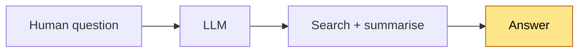
```mermaid
flowchart LR
    U["Human question"] --> L["LLM"] --> S["Search + summarise"] --> A["Answer"]
    style A fill:#fde68a,stroke:#b45309,color:#000
```

Whatever comes out is trusted because a capable model produced it. AIRL-OS
starts from the opposite assumption: **a fluent, confident, well-cited, entirely
wrong result is the normal failure mode of a capable model**, and no amount of
model capability detects it from the inside.

So AIRL-OS is not an assistant. It is a **laboratory**: a system in which model
output is a *hypothesis* that must survive mechanical verification, independent
review, and a human decision before it is allowed to become a claim — and where
every claim stays traceable to the exact sentence in the exact source it came
from, and stays revisable after publication.

> **AIRL-OS is an evidence-centred research operating system in which AI agents
> perform bounded research tasks, deterministic systems verify what can be
> verified mechanically, independent assurance challenges the results, humans
> retain scientific decision authority, and every material claim remains
> traceable from source and experiment to publication and subsequent revision.**

---

## 2. The one principle everything else follows from

> **Agents produce · machines verify · humans decide.**

These three roles are never allowed to blur into one another.

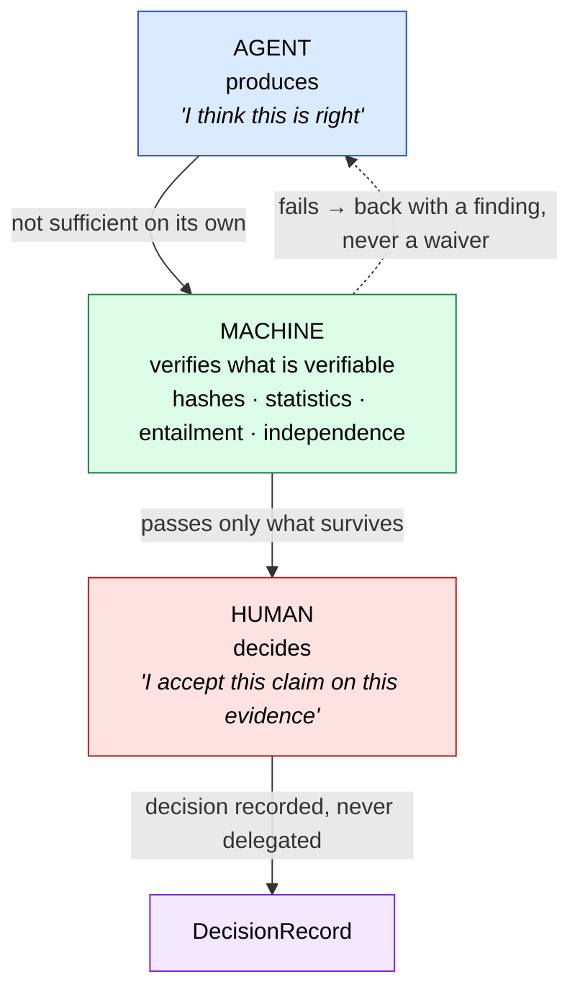
```mermaid
flowchart TD
    A["AGENT<br/>produces<br/><i>'I think this is right'</i>"]
    M["MACHINE<br/>verifies what is verifiable<br/>hashes · statistics · entailment · independence"]
    H["HUMAN<br/>decides<br/><i>'I accept this claim on this evidence'</i>"]

    A -->|"not sufficient on its own"| M
    M -->|"passes only what survives"| H
    H -->|"decision recorded, never delegated"| R["DecisionRecord"]

    M -.->|"fails → back with a finding, never a waiver"| A

    style A fill:#dbeafe,stroke:#1d4ed8,color:#000
    style M fill:#dcfce7,stroke:#15803d,color:#000
    style H fill:#fee2e2,stroke:#b91c1c,color:#000
    style R fill:#f3e8ff,stroke:#7e22ce,color:#000
```

The failure mode this defends against is the ordinary multi-agent pattern:

```
Agent A produces  →  Agent B reads it  →  Agent B says "looks good"  →  accepted
```

AIRL-OS does not count that as verification. Two models from the same family
share training lineage and therefore share errors; agreement between them is
correlation, not confirmation. This is why **independence must be measured**
(§7.3) rather than asserted.

### 2.1 The assignment principle — verification asymmetry

For every step there is exactly one question:

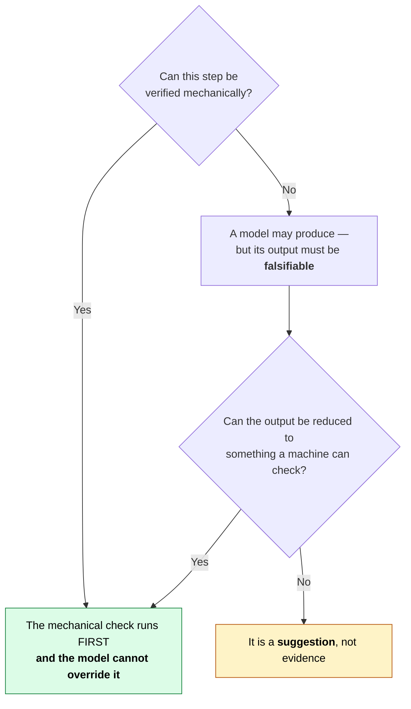
```mermaid
flowchart TD
    Q{"Can this step be<br/>verified mechanically?"}
    Q -->|Yes| M["The mechanical check runs FIRST<br/><b>and the model cannot override it</b>"]
    Q -->|No| P["A model may produce —<br/>but its output must be <b>falsifiable</b>"]
    P --> F{"Can the output be reduced to<br/>something a machine can check?"}
    F -->|No| S["It is a <b>suggestion</b>, not evidence"]
    F -->|Yes| M

    style M fill:#dcfce7,stroke:#15803d,color:#000
    style S fill:#fef3c7,stroke:#b45309,color:#000
```

**A model is a hypothesis generator, not a verifier.**

---

## 3. The evidence chain

Nothing becomes knowledge by being asserted. It becomes knowledge by surviving a
chain in which **every link is addressable**:

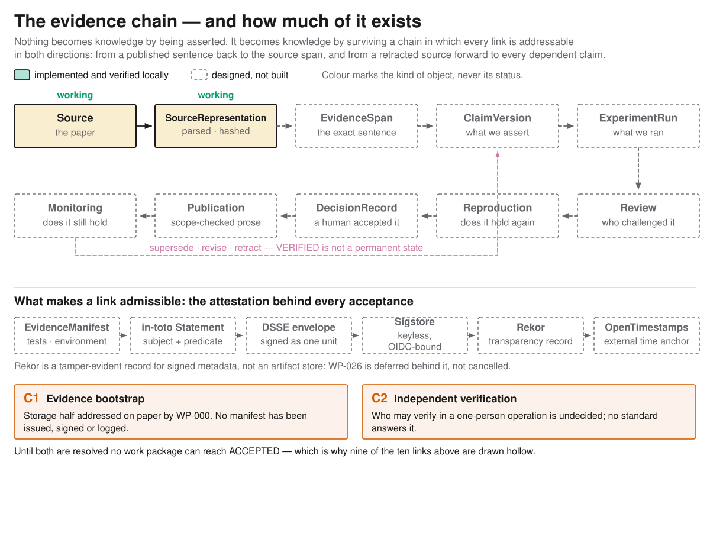

*Figure 2 — The chain, its revision loop, and the attestation that makes a link
admissible. Solid nodes are implemented; hollow dashed nodes are designed and not
built. Nine of the ten links are hollow.*


```mermaid
flowchart LR
    S["Source<br/><i>the paper</i>"] --> SR["SourceRepresentation<br/><i>parsed, hashed</i>"]
    SR --> ES["EvidenceSpan<br/><i>the exact sentence</i>"]
    ES --> C["ClaimVersion<br/><i>what we assert</i>"]
    C --> R["ExperimentRun<br/><i>what we ran</i>"]
    R --> RV["Review<br/><i>who challenged it</i>"]
    RV --> RP["Reproduction<br/><i>does it hold again</i>"]
    RP --> D["DecisionRecord<br/><i>a human accepted it</i>"]
    D --> P["Publication"]
    P --> MO["Monitoring<br/><i>does it still hold</i>"]
    MO -.->|"supersede / revise / retract"| C

    style ES fill:#dcfce7,stroke:#15803d,color:#000
    style D fill:#fee2e2,stroke:#b91c1c,color:#000
    style MO fill:#e0e7ff,stroke:#4338ca,color:#000
```

Two properties matter more than the chain itself:

1. **It is traversable in both directions.** From a published sentence you can
   reach the source span; from a retracted source you can reach every claim that
   depended on it. This is what makes G10 possible at all.
2. **The loop closes.** A claim is never permanently true. Monitoring feeds back
   into the claim, and `VERIFIED` is explicitly *not* an irreversible state.

---

## 4. The plane architecture

Six planes, plus a seventh that has been proposed but not accepted:

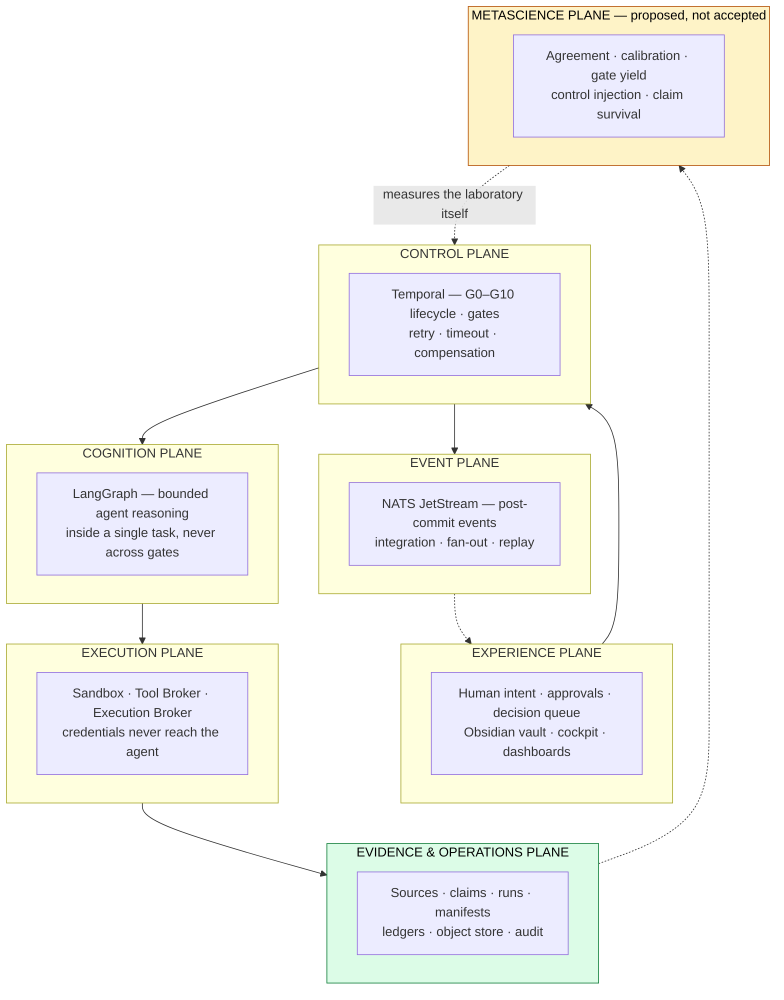
```mermaid
flowchart TD
    subgraph EXP["EXPERIENCE PLANE"]
        E1["Human intent · approvals · decision queue<br/>Obsidian vault · cockpit · dashboards"]
    end
    subgraph CTL["CONTROL PLANE"]
        C1["Temporal — G0–G10 lifecycle · gates<br/>retry · timeout · compensation"]
    end
    subgraph EVT["EVENT PLANE"]
        V1["NATS JetStream — post-commit events<br/>integration · fan-out · replay"]
    end
    subgraph COG["COGNITION PLANE"]
        G1["LangGraph — bounded agent reasoning<br/>inside a single task, never across gates"]
    end
    subgraph EXE["EXECUTION PLANE"]
        X1["Sandbox · Tool Broker · Execution Broker<br/>credentials never reach the agent"]
    end
    subgraph EVD["EVIDENCE & OPERATIONS PLANE"]
        D1["Sources · claims · runs · manifests<br/>ledgers · object store · audit"]
    end
    subgraph MET["METASCIENCE PLANE — proposed, not accepted"]
        M1["Agreement · calibration · gate yield<br/>control injection · claim survival"]
    end

    EXP --> CTL --> COG --> EXE --> EVD
    CTL --> EVT
    EVT -.-> EXP
    EVD -.-> MET
    MET -.->|"measures the laboratory itself"| CTL

    style MET fill:#fef3c7,stroke:#b45309,color:#000
    style EVD fill:#dcfce7,stroke:#15803d,color:#000
```

Cross-cutting through all of them: **policy, security, identity, model routing,
assurance**.

> **These are logical planes, not deployment units.** Seven planes do not imply
> seven services, seven databases or seven clusters. The Metascience plane may
> begin as a handful of scheduled queries over the evidence store; the Cognition
> plane may be a library inside a worker. The planes fix *ownership and
> direction of authority* — what may decide what — and deployment topology is
> chosen separately, per component, against real operational need.

### 4.1 Two separations that carry the design

**Temporal is the process authority. LangGraph is not.**

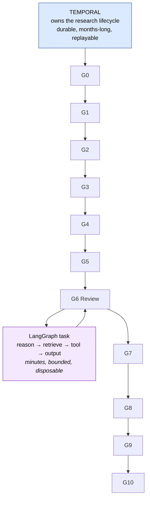
```mermaid
flowchart TD
    T["TEMPORAL<br/>owns the research lifecycle<br/>durable, months-long, replayable"]
    T --> G0["G0"] --> G1["G1"] --> G2["G2"] --> G3["G3"] --> G4["G4"] --> G5["G5"]
    G5 --> G6["G6 Review"]
    G6 --> LG["LangGraph task<br/>reason → retrieve → tool → output<br/><i>minutes, bounded, disposable</i>"]
    LG --> G6
    G6 --> G7["G7"] --> G8["G8"] --> G9["G9"] --> G10["G10"]

    style T fill:#dbeafe,stroke:#1d4ed8,color:#000
    style LG fill:#f3e8ff,stroke:#7e22ce,color:#000
```

A research project lives for months and must survive process restarts, model
changes and human absence. An agent graph is the wrong place to keep that state.
Conversely, Temporal is the wrong place to do reasoning. **LangGraph is not a
workflow engine; Temporal is not a reasoning engine.**

**NATS carries events. It does not carry authority.**

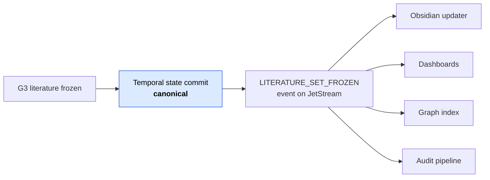
```mermaid
flowchart LR
    G3["G3 literature frozen"] --> TC["Temporal state commit<br/><b>canonical</b>"]
    TC --> EV["LITERATURE_SET_FROZEN<br/>event on JetStream"]
    EV --> O1["Obsidian updater"]
    EV --> O2["Dashboards"]
    EV --> O3["Graph index"]
    EV --> O4["Audit pipeline"]

    style TC fill:#dbeafe,stroke:#1d4ed8,color:#000
```

If the entire event stream were deleted, gate state would still be recoverable
from Temporal. A consumer may miss an event; it may never *decide* anything.

---

## 5. The G0–G10 research lifecycle

The spine of the system. Each gate has a frozen output — an artefact that, once
produced, does not change without a recorded supersession.

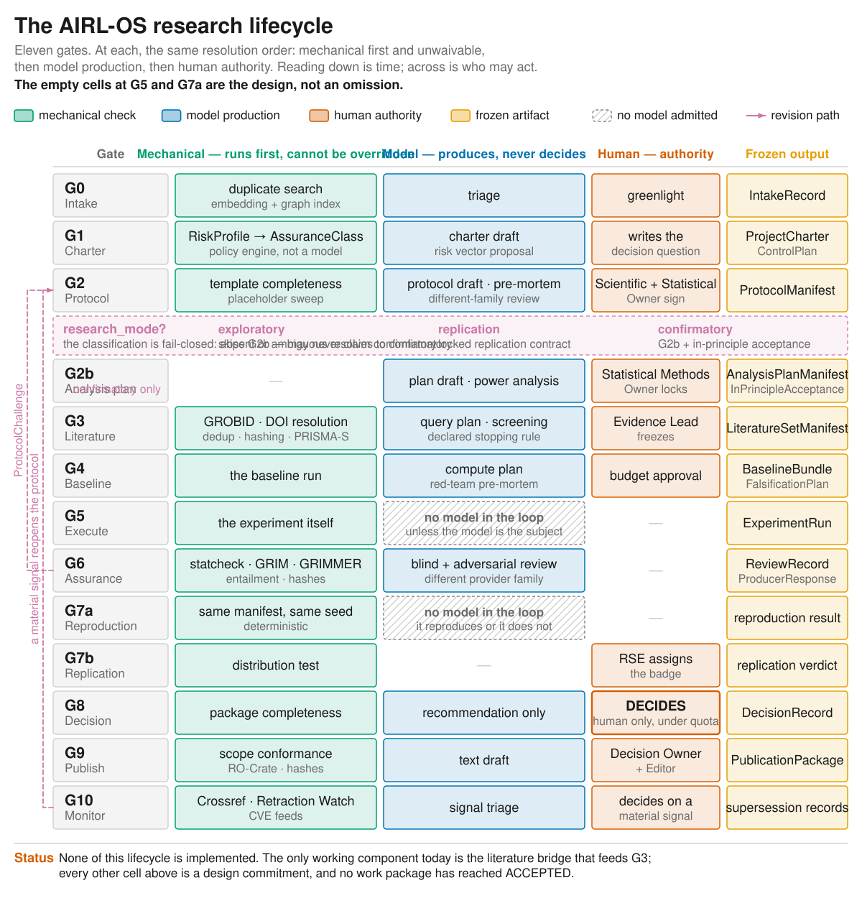

*Figure 1 — Eleven gates on the vertical axis, three actor classes on the
horizontal. Reading down is time; reading across is who may act. The hatched
cells at G5 and G7a are the design, not an omission. Generated by
`scripts/fig_lifecycle.py`; see `docs/figures/README.md` for the specification.*

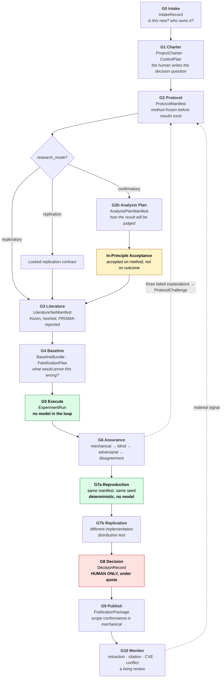
```mermaid
flowchart TD
    G0["<b>G0 Intake</b><br/>IntakeRecord<br/><i>is this new? who owns it?</i>"]
    G1["<b>G1 Charter</b><br/>ProjectCharter · ControlPlan<br/><i>the human writes the decision question</i>"]
    G2["<b>G2 Protocol</b><br/>ProtocolManifest<br/><i>method frozen before results exist</i>"]
    G2B["<b>G2b Analysis Plan</b><br/>AnalysisPlanManifest<br/><i>how the result will be judged</i>"]
    IPA["<b>In-Principle Acceptance</b><br/><i>accepted on method, not on outcome</i>"]
    G3["<b>G3 Literature</b><br/>LiteratureSetManifest<br/><i>frozen, hashed, PRISMA-reported</i>"]
    G4["<b>G4 Baseline</b><br/>BaselineBundle · FalsificationPlan<br/><i>what would prove this wrong?</i>"]
    G5["<b>G5 Execute</b><br/>ExperimentRun<br/><b>no model in the loop</b>"]
    G6["<b>G6 Assurance</b><br/>mechanical → blind → adversarial → disagreement"]
    G7A["<b>G7a Reproduction</b><br/>same manifest, same seed<br/><b>deterministic, no model</b>"]
    G7B["<b>G7b Replication</b><br/>different implementation<br/><i>distribution test</i>"]
    G8["<b>G8 Decision</b><br/>DecisionRecord<br/><b>HUMAN ONLY, under quota</b>"]
    G9["<b>G9 Publish</b><br/>PublicationPackage<br/><i>scope conformance is mechanical</i>"]
    G10["<b>G10 Monitor</b><br/>retraction · citation · CVE · conflict<br/><i>a living review</i>"]

    G0 --> G1 --> G2 --> MODE{"research_mode?"}
    MODE -->|exploratory| G3
    MODE -->|replication| RC["Locked replication contract"] --> G3
    MODE -->|confirmatory| G2B --> IPA --> G3
    G3 --> G4 --> G5 --> G6
    G6 --> G7A --> G7B --> G8 --> G9 --> G10
    G10 -.->|"material signal"| G2
    G6 -.->|"three failed explanations → ProtocolChallenge"| G2

    style G5 fill:#dcfce7,stroke:#15803d,color:#000
    style G7A fill:#dcfce7,stroke:#15803d,color:#000
    style G8 fill:#fee2e2,stroke:#b91c1c,color:#000
    style IPA fill:#fef3c7,stroke:#b45309,color:#000
```

### 5.1 What each gate is defending against

| Gate | Frozen output | The failure it exists to prevent |
|---|---|---|
| **G0** Intake | `IntakeRecord` | Redoing work that already exists; unowned work |
| **G1** Charter | `ProjectCharter`, `ControlPlan` | A model inventing its own research objective |
| **G2** Protocol | `ProtocolManifest` | Changing the method after seeing the result |
| **G2b** Analysis Plan | `AnalysisPlanManifest` | Choosing the analysis that gives the nicest answer |
| **G3** Literature | `LiteratureSetManifest` | An evidence base that cannot be re-derived |
| **G4** Baseline | `BaselineBundle`, `FalsificationPlan` | Only asking how to confirm, never how to refute |
| **G5** Execute | `ExperimentRun` | Model bias entering the measurement itself |
| **G6** Assurance | `ReviewRecord` | "Looks good" counted as independent review |
| **G7a** Reproduction | reproduction result | A result nobody can obtain twice |
| **G7b** Replication | distribution comparison | Confusing "same numbers" with "same conclusion" |
| **G8** Decision | `DecisionRecord` | A model deciding what the laboratory believes |
| **G9** Publish | `PublicationPackage` | A sentence claiming more than its evidence supports |
| **G10** Monitor | supersession records | Treating a published claim as permanently true |

> **G2b and in-principle acceptance are conditional, not universal.** Forcing
> Registered Report ceremony onto exploratory work produces bureaucracy without
> epistemic gain, and pushes people to mislabel confirmatory work as exploratory
> to escape it — the opposite of the intent. The router sits immediately after
> G2:
>
> | `research_mode` | Analysis plan | In-principle acceptance |
> |---|---|---|
> | `exploratory` | recommended | **not required** — but the claim may never be labelled confirmatory |
> | `replication` | required | a locked replication contract, naming the target claim and the agreement criterion |
> | `confirmatory` | **required and locked** | **required** |
>
> The classification itself is fail-closed: absent or ambiguous, it resolves to
> `confirmatory`, which is the heaviest path.

### 5.2 In-principle acceptance — why it is in the flow

Without it, publication bias survives every other control:

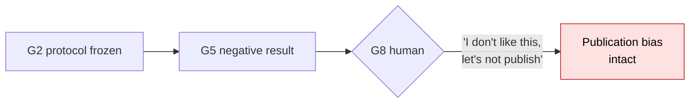
```mermaid
flowchart LR
    A["G2 protocol frozen"] --> B["G5 negative result"] --> C{"G8 human"}
    C -->|"'I don't like this,<br/>let's not publish'"| D["Publication bias<br/>intact"]
    style D fill:#fee2e2,stroke:#b91c1c,color:#000
```

The fix is a commitment made **before** the result exists: *if the protocol is
executed as written, the outcome is accepted regardless of its direction.* This
is Registered Reports discipline, and it is the point where AIRL-OS stops being
a research assistant and becomes a scientific instrument.

### 5.3 G6 in detail — the heaviest gate

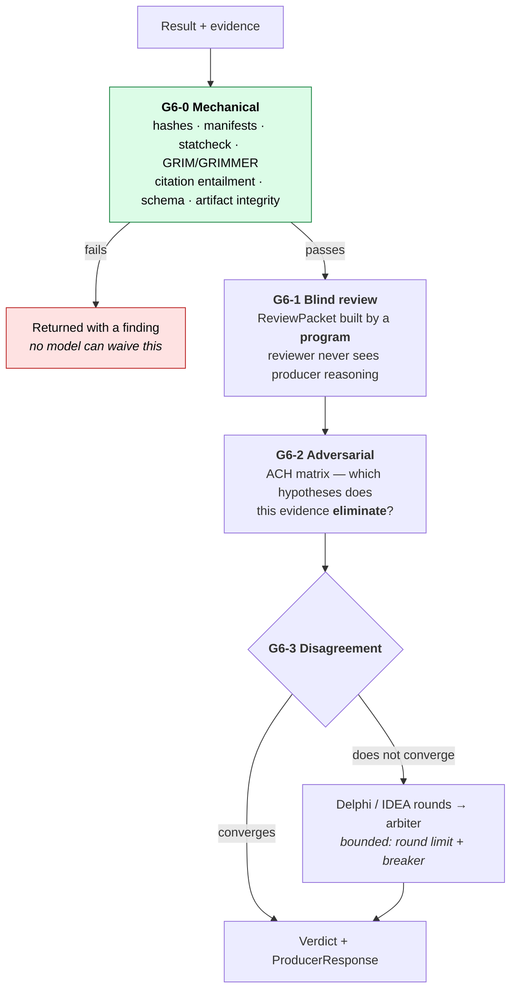
```mermaid
flowchart TD
    IN["Result + evidence"] --> M["<b>G6-0 Mechanical</b><br/>hashes · manifests · statcheck · GRIM/GRIMMER<br/>citation entailment · schema · artifact integrity"]
    M -->|"fails"| BACK["Returned with a finding<br/><i>no model can waive this</i>"]
    M -->|"passes"| B["<b>G6-1 Blind review</b><br/>ReviewPacket built by a <b>program</b><br/>reviewer never sees producer reasoning"]
    B --> A["<b>G6-2 Adversarial</b><br/>ACH matrix — which hypotheses does<br/>this evidence <b>eliminate</b>?"]
    A --> D{"<b>G6-3 Disagreement</b>"}
    D -->|"converges"| OUT["Verdict + ProducerResponse"]
    D -->|"does not converge"| AR["Delphi / IDEA rounds → arbiter<br/><i>bounded: round limit + breaker</i>"]
    AR --> OUT

    style M fill:#dcfce7,stroke:#15803d,color:#000
    style BACK fill:#fee2e2,stroke:#b91c1c,color:#000
```

Three details carry most of the weight:

- **The `ReviewPacket` is built by a deterministic program, not a prompt.** Only
  then can "what exactly did the reviewer see?" be answered afterwards.
- **The adversarial reviewer is scored on the quality of its refutation**, not on
  approval speed. A reviewer rewarded for agreeing is a rubber stamp with a
  model behind it.
- **Disagreement is bounded.** Rounds are counted, a breaker exists, and open
  findings cannot disappear silently — they are closed by a `ProducerResponse`
  carrying `ACCEPTED` / `DISPUTED` / `CLARIFICATION_NEEDED`.

---

## 6. Who executes what

Two questions live here and they are different: **which durable function is
accountable** (the role catalogue) and **which kind of actor executes a given
step** (mechanical, model or human). The full tables live in
`AIRL_OS_ROLE_MODEL_ASSIGNMENT.md`; this section gives the shape of both.

### 6.0 The fourteen durable functions

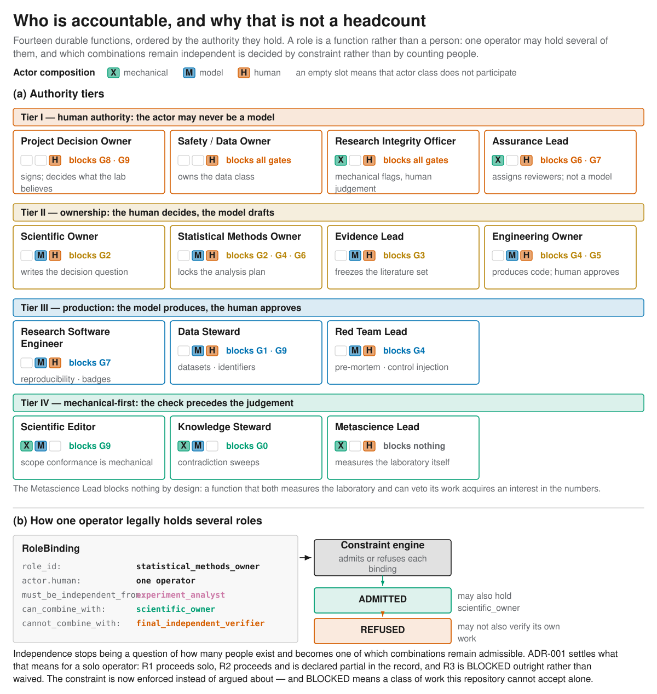

*Figure 3 — Authority tiers, actor composition per role, and the constraint
resolution that lets one operator hold several roles. Full definitions, including
what each role may never do, are in [`AIRL_OS_ROLES.md`](AIRL_OS_ROLES.md).*

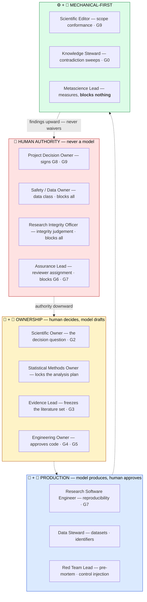
```mermaid
flowchart TD
    subgraph AUTH["👤 HUMAN AUTHORITY — never a model"]
        A1["Project Decision Owner — signs G8 · G9"]
        A2["Safety / Data Owner — data class · blocks all"]
        A3["Research Integrity Officer — integrity judgement · blocks all"]
        A4["Assurance Lead — reviewer assignment · blocks G6 · G7"]
    end
    subgraph OWN["👤 + 🤖 OWNERSHIP — human decides, model drafts"]
        B1["Scientific Owner — the decision question · G2"]
        B2["Statistical Methods Owner — locks the analysis plan"]
        B3["Evidence Lead — freezes the literature set · G3"]
        B4["Engineering Owner — approves code · G4 · G5"]
    end
    subgraph PROD["🤖 + 👤 PRODUCTION — model produces, human approves"]
        C1["Research Software Engineer — reproducibility · G7"]
        C2["Data Steward — datasets · identifiers"]
        C3["Red Team Lead — pre-mortem · control injection"]
    end
    subgraph MECHR["⚙️ + 🤖 MECHANICAL-FIRST"]
        D1["Scientific Editor — scope conformance · G9"]
        D2["Knowledge Steward — contradiction sweeps · G0"]
        D3["Metascience Lead — measures, <b>blocks nothing</b>"]
    end
    AUTH -.->|"authority downward"| OWN -.-> PROD -.-> MECHR
    MECHR -.->|"findings upward — never waivers"| AUTH

    style AUTH fill:#fee2e2,stroke:#b91c1c,color:#000
    style OWN fill:#fef3c7,stroke:#b45309,color:#000
    style PROD fill:#dbeafe,stroke:#1d4ed8,color:#000
    style MECHR fill:#dcfce7,stroke:#15803d,color:#000
```

**The Metascience Lead blocks nothing by design.** A function that both measures
the laboratory and can veto its work stops measuring honestly — it acquires an
interest in the numbers.

### 6.0.1 How any gate resolves

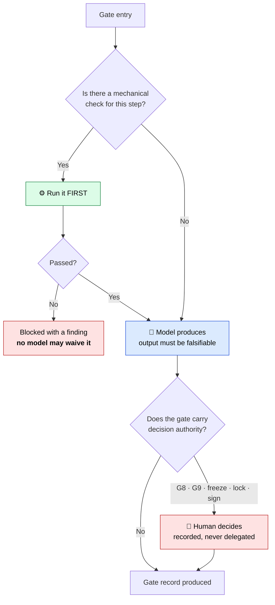
```mermaid
flowchart TD
    IN["Gate entry"] --> MECHQ{"Is there a mechanical<br/>check for this step?"}
    MECHQ -->|Yes| RUN["⚙️ Run it FIRST"]
    RUN --> PASS{"Passed?"}
    PASS -->|No| BLOCK["Blocked with a finding<br/><b>no model may waive it</b>"]
    PASS -->|Yes| MODELN
    MECHQ -->|No| MODELN["🤖 Model produces<br/>output must be falsifiable"]
    MODELN --> AUTHQ{"Does the gate carry<br/>decision authority?"}
    AUTHQ -->|"G8 · G9 · freeze · lock · sign"| HUMANN["👤 Human decides<br/>recorded, never delegated"]
    AUTHQ -->|No| REC["Gate record produced"]
    HUMANN --> REC

    style RUN fill:#dcfce7,stroke:#15803d,color:#000
    style BLOCK fill:#fee2e2,stroke:#b91c1c,color:#000
    style MODELN fill:#dbeafe,stroke:#1d4ed8,color:#000
    style HUMANN fill:#fee2e2,stroke:#b91c1c,color:#000
```

### 6.0.2 Actor classes

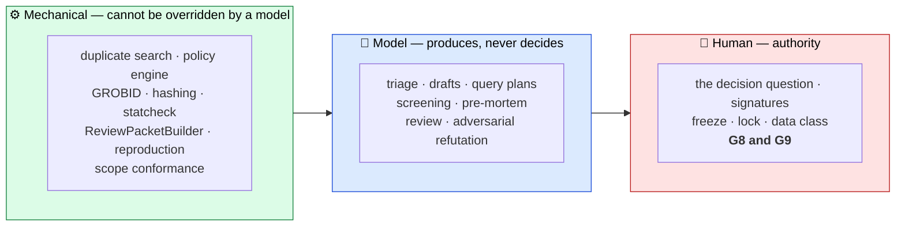
```mermaid
flowchart LR
    subgraph MECH["⚙️ Mechanical — cannot be overridden by a model"]
        ME["duplicate search · policy engine<br/>GROBID · hashing · statcheck<br/>ReviewPacketBuilder · reproduction<br/>scope conformance"]
    end
    subgraph MODEL["🤖 Model — produces, never decides"]
        MO["triage · drafts · query plans<br/>screening · pre-mortem<br/>review · adversarial refutation"]
    end
    subgraph HUMAN["👤 Human — authority"]
        HU["the decision question · signatures<br/>freeze · lock · data class<br/><b>G8 and G9</b>"]
    end
    MECH --> MODEL --> HUMAN

    style MECH fill:#dcfce7,stroke:#15803d,color:#000
    style MODEL fill:#dbeafe,stroke:#1d4ed8,color:#000
    style HUMAN fill:#fee2e2,stroke:#b91c1c,color:#000
```

### 6.1 A role is a function, not a person

The role catalogue names fourteen durable functions. It does **not** require
fourteen people, and reading it that way is what makes the organisation look
impossible in a small operation.

```yaml
RoleBinding:
  role_id: statistical_methods_owner
  role_type: governance_function
  actor:
    human: <identity>          # any of these may be empty
    model_profile: <profile>
    mechanical: <service>
  separation:
    must_be_independent_from: [experiment_analyst]
    can_combine_with:         [scientific_owner]
    cannot_combine_with:      [final_independent_verifier]
```

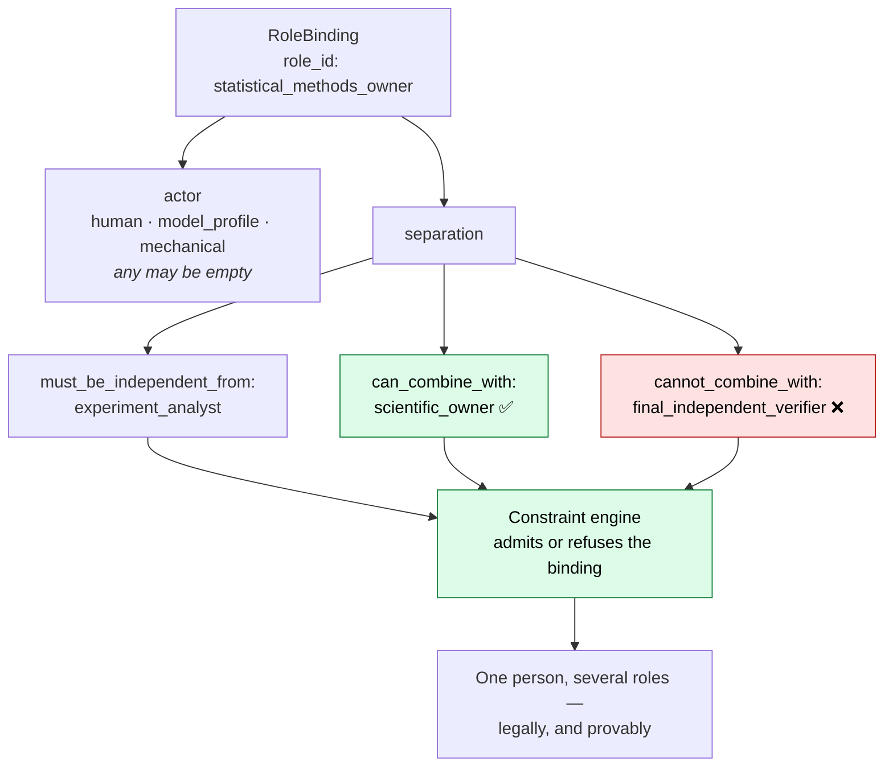
```mermaid
flowchart TD
    R["RoleBinding<br/>role_id: statistical_methods_owner"]
    R --> ACT["actor<br/>human · model_profile · mechanical<br/><i>any may be empty</i>"]
    R --> SEP["separation"]
    SEP --> S1["must_be_independent_from:<br/>experiment_analyst"]
    SEP --> S2["can_combine_with:<br/>scientific_owner ✅"]
    SEP --> S3["cannot_combine_with:<br/>final_independent_verifier ❌"]
    S1 --> ENG["Constraint engine<br/>admits or refuses the binding"]
    S2 --> ENG
    S3 --> ENG
    ENG --> OK["One person, several roles —<br/>legally, and provably"]

    style ENG fill:#dcfce7,stroke:#15803d,color:#000
    style S2 fill:#dcfce7,stroke:#15803d,color:#000
    style S3 fill:#fee2e2,stroke:#b91c1c,color:#000
```

Independence is then expressed as **separation constraints**, not headcount: one
person may legally hold several roles, and the constraint engine states exactly
which combinations destroy independence and which do not. The binding is
enforced at compile time by WP-013 and WP-047, not asserted in prose.

> This does not resolve finding **C2** — who may act as the final independent
> verifier when there is one person — but it gives that decision a form. The
> question stops being "where do I find 73 owners?" and becomes "which
> combinations am I willing to declare independent, and which must remain
> mechanical or external?"

**Three invariants that are not negotiable:**

1. **No agentic methodological discretion during a frozen G5 execution.** The
   subject of an experiment may perfectly well *be* a model — a frozen model
   under test, a preregistered inference pipeline, an RL policy. What is
   forbidden is a research agent changing a threshold, a metric, a stopping
   point or a sample mid-run because the result looks wrong. The model may be
   the instrument; it may not be the methodologist.
2. **The same at G7a**, and more strictly: reproduction runs the frozen manifest
   and reports what happened. It reproduces or it does not.
3. **At G8 a model produces a recommendation, never a decision.**

Effort and reviewer count are bound to the assurance class:

| Assurance | Producer effort | Reviewer effort | Adversarial | Reviewer quota | Model policy |
|---|---|---|---|---|---|
| **R1** | `medium` | `high` | — | 1, any family | hosted OK |
| **R2** | `high` | `high` | `xhigh` | 2, **different family** | hosted + full I/O logging |
| **R3** | `xhigh` | `xhigh` | `max` | 3, **different family** | **local open-weight mandatory** |

R3 requires a local model because a hosted model has no pinnable snapshot, and
without one, G7a is structurally impossible. That is a constraint, not a
preference.

---

## 7. The skill layer — how an agent knows *how* to work

A `RoleContract` says **who** an agent is: its purpose, its allowed tools, its
data classes, its budget, its success criteria. Every one of those is a
*boundary*. None of them says **which procedure to follow**. That gap was
previously filled by the prompt — an unversioned, untested, unauditable layer.

Skills close it, and they come in **two families with one shared core**:

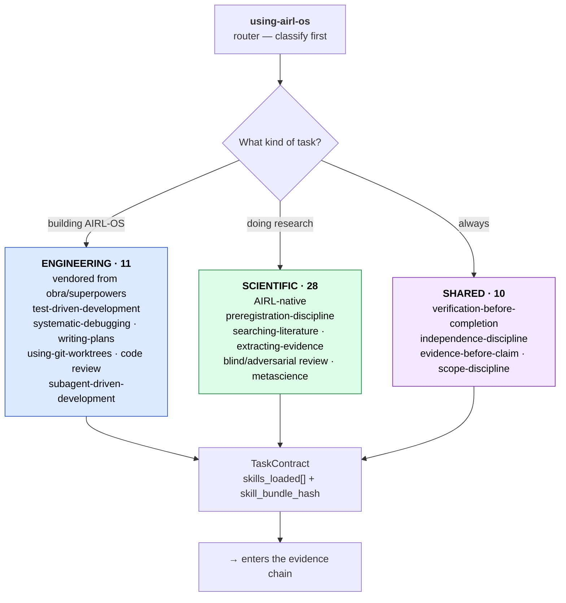
```mermaid
flowchart TD
    R["<b>using-airl-os</b><br/>router — classify first"]
    R --> Q{"What kind of task?"}

    Q -->|"building AIRL-OS"| ENG["<b>ENGINEERING · 11</b><br/>vendored from obra/superpowers<br/>test-driven-development<br/>systematic-debugging · writing-plans<br/>using-git-worktrees · code review<br/>subagent-driven-development"]
    Q -->|"doing research"| SCI["<b>SCIENTIFIC · 28</b><br/>AIRL-native<br/>preregistration-discipline<br/>searching-literature · extracting-evidence<br/>blind/adversarial review · metascience"]
    Q -->|"always"| SH["<b>SHARED · 10</b><br/>verification-before-completion<br/>independence-discipline<br/>evidence-before-claim · scope-discipline"]

    ENG --> TC["TaskContract<br/>skills_loaded[] + skill_bundle_hash"]
    SCI --> TC
    SH --> TC
    TC --> EV["→ enters the evidence chain"]

    style ENG fill:#dbeafe,stroke:#1d4ed8,color:#000
    style SCI fill:#dcfce7,stroke:#15803d,color:#000
    style SH fill:#f3e8ff,stroke:#7e22ce,color:#000
```

> **Research adaptations extend their engineering counterparts; they never
> replace them.** `preregistration-discipline` is what test-driven development
> becomes when the artefact is a claim rather than a function — but building the
> Claim Ledger is still test-driven-development work. AIRL-OS is simultaneously a
> laboratory and a software platform, and it needs both disciplines at once.

The mapping is a translation of the same epistemic rule into two domains:

| Software engineering | Scientific research | The shared rule |
|---|---|---|
| Test before code | Preregistration before result | You do not get to decide the criterion after seeing the outcome |
| Bug root-cause tracing | Anomaly root-cause tracing | Three failed explanations means the architecture is wrong, not the fix |
| Fresh-context implementer | Fresh-context analyst | Whoever produced it cannot be the one who checks it |
| Reviewer sees the diff, not the reasoning | Reviewer sees the packet, not the trace | Information asymmetry is what makes review independent |
| Verification before "done" | Verification before "claimed" | Memory is not evidence |

### 7.1 Two classification axes, not one

```
research_mode:   exploratory | replication | confirmatory     ← what the claim may assert
execution_path:  spike       | bounded     | architectural     ← how heavy the execution is
```

They are orthogonal: a confirmatory study can be a bounded task, and an
exploratory one can force an architectural change. Both are classified, and
**when in doubt the heavier value is taken on each axis** — the fall-through
default is fail-closed, never the lightest path.

### 7.2 The format is the bootstrap

Skills conform to the **Agent Skills open standard** (`agentskills.io`), which
Claude Code, Codex, OpenCode, Cursor, Copilot, Gemini CLI and Hermes Agent all
implement. A skill that does not load governs nothing, so conformance is checked
mechanically by `scripts/validate_skills.py`, and provenance
(`airl.derived_from`, `airl.upstream_commit`) is checked with it.

> **Format compatibility is not behavioural compatibility.** Conformance makes
> the registry *loadable* by those harnesses. Whether a given harness loads the
> right skill at the right moment — and keeps it across compaction — is
> established by the acceptance suite in WP-048 (ACC-42, ACC-44, ACC-45), and it
> is **not** established today. Only the Claude Code path is wired
> (`.claude/skills`), and even there no behavioural test has been run.

### 7.3 Independence is measured, not assumed

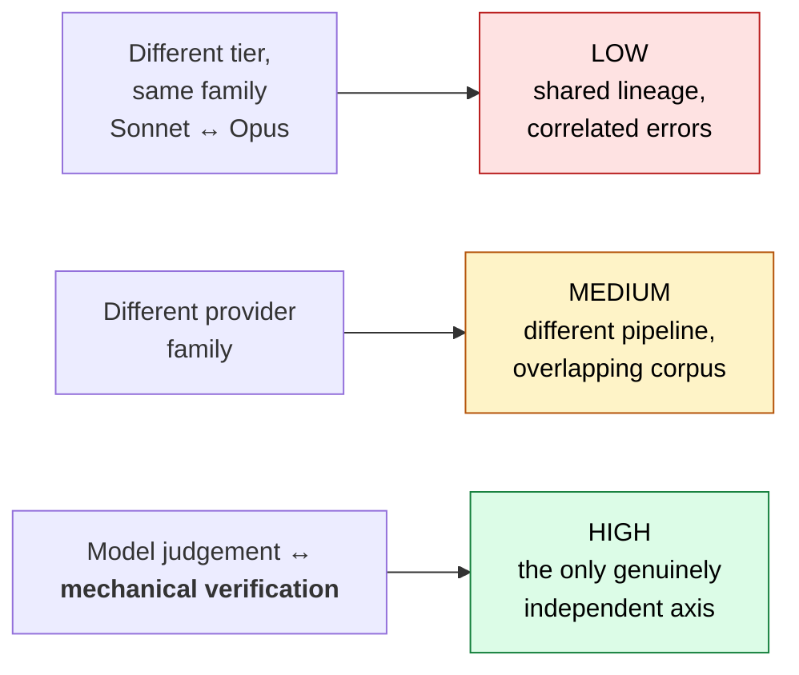
```mermaid
flowchart LR
    A["Different tier,<br/>same family<br/>Sonnet ↔ Opus"] --> L["LOW<br/>shared lineage,<br/>correlated errors"]
    B["Different provider<br/>family"] --> M["MEDIUM<br/>different pipeline,<br/>overlapping corpus"]
    C["Model judgement ↔<br/><b>mechanical verification</b>"] --> H["HIGH<br/>the only genuinely<br/>independent axis"]

    style L fill:#fee2e2,stroke:#b91c1c,color:#000
    style M fill:#fef3c7,stroke:#b45309,color:#000
    style H fill:#dcfce7,stroke:#15803d,color:#000
```

The family rule — *at R2/R3 the reviewer must come from a different provider
family* — is a **proxy**. What is permanent is the measured pairwise error
correlation ρ; when the calibration set exists, the measurement replaces the
proxy. A laboratory that never measures its own independence assumption is
producing the repetition of an assumption and calling it verification.

---

## 8. How evidence is signed — and how that unlocks the programme

Every Definition of Done requires a signed `EvidenceManifest` in an immutable
store. The store was scheduled far downstream, which produced a deadlock: nothing
could be accepted until it existed, and it could not be built without accepting
something first.

The resolution is to **delegate immutability to standards that already exist**
rather than to build it first:

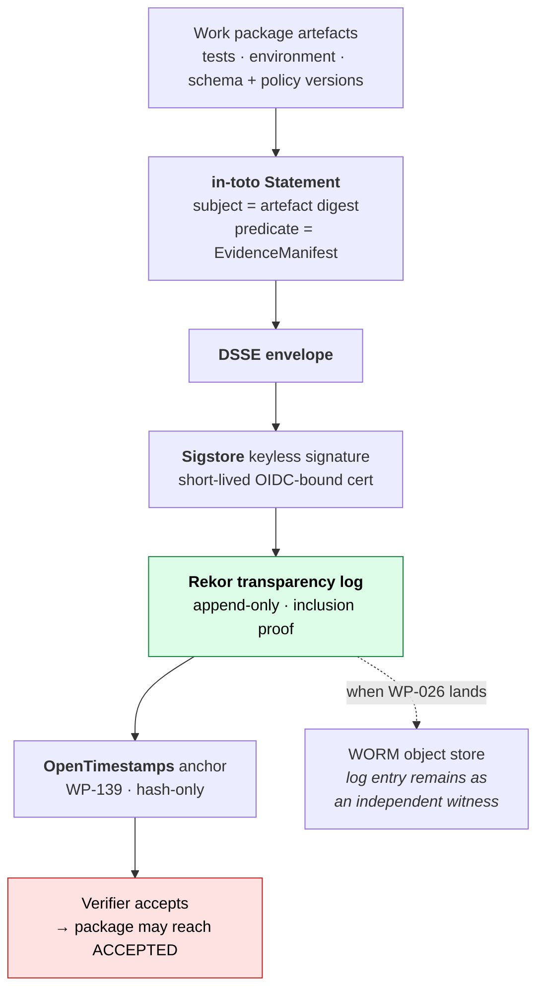
```mermaid
flowchart TD
    A["Work package artefacts<br/>tests · environment · schema + policy versions"] --> B["<b>in-toto Statement</b><br/>subject = artefact digest<br/>predicate = EvidenceManifest"]
    B --> C["<b>DSSE envelope</b>"]
    C --> D["<b>Sigstore</b> keyless signature<br/>short-lived OIDC-bound cert"]
    D --> E["<b>Rekor transparency log</b><br/>append-only · inclusion proof"]
    E --> F["<b>OpenTimestamps</b> anchor<br/>WP-139 · hash-only"]
    F --> G["Verifier accepts<br/>→ package may reach ACCEPTED"]
    E -.->|"when WP-026 lands"| H["WORM object store<br/><i>log entry remains as<br/>an independent witness</i>"]

    style E fill:#dcfce7,stroke:#15803d,color:#000
    style G fill:#fee2e2,stroke:#b91c1c,color:#000
```

> **Rekor is a tamper-evident transparency record for signed metadata — not an
> artifact store.** It holds the attestation and its inclusion proof. The
> artifacts themselves, the Sigstore bundle, the certificate chain and the
> verification material still need durable storage, which is what WP-026
> eventually provides. **WP-000 defers WP-026; it does not cancel it.**

The same machinery signs model weights: `sigstore/model-transparency` and the
OpenSSF Model Signing spec give the R3 requirement — a hashed, signed local
open-weight model — an off-the-shelf implementation.

> **What this does not solve.** Immutability was only half of the blocker. The
> other half is *who the independent verifier is* in a one-person operation. No
> standard answers that; it is a scope decision that remains open. See
> `AIRL_OS_EXTERNAL_STANDARDS.md` §3.2.

---

## 9. What actually runs today — Literature Bridge V0

One vertical slice exists and works: **Zotero → canonical registry → Obsidian →
agent**, read-only end to end.

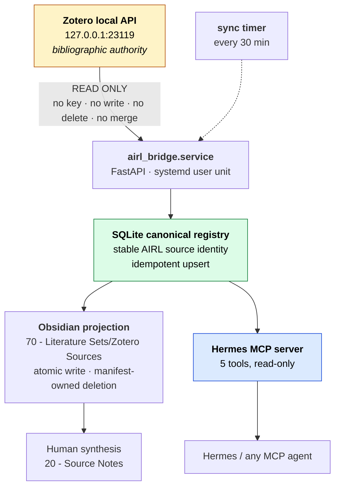
```mermaid
flowchart TD
    Z["<b>Zotero local API</b><br/>127.0.0.1:23119<br/><i>bibliographic authority</i>"]
    Z -->|"READ ONLY<br/>no key · no write · no delete · no merge"| SV["<b>airl_bridge.service</b><br/>FastAPI · systemd user unit"]
    SV --> DB["<b>SQLite canonical registry</b><br/>stable AIRL source identity<br/>idempotent upsert"]
    DB --> OB["<b>Obsidian projection</b><br/>70 - Literature Sets/Zotero Sources<br/>atomic write · manifest-owned deletion"]
    DB --> MCP["<b>Hermes MCP server</b><br/>5 tools, read-only"]
    T["<b>sync timer</b><br/>every 30 min"] -.-> SV
    MCP --> AG["Hermes / any MCP agent"]
    OB --> HU["Human synthesis<br/>20 - Source Notes"]

    style Z fill:#fef3c7,stroke:#b45309,color:#000
    style DB fill:#dcfce7,stroke:#15803d,color:#000
    style MCP fill:#dbeafe,stroke:#1d4ed8,color:#000
```

### 9.1 The design decisions inside it

**Zotero is never touched.** No API key is stored, no write path exists. An
agent silently mutating a human's bibliographic workspace is the failure mode
being designed out, and it stays out until a group library and an audit policy
exist.

**SQLite is not a cache — it is the identity boundary.** A Zotero representation
is not an AIRL source. The registry assigns AIRL's own stable identity, so the
rest of the system never depends on another tool's key space.

**Generated and human-authored content cannot collide.**

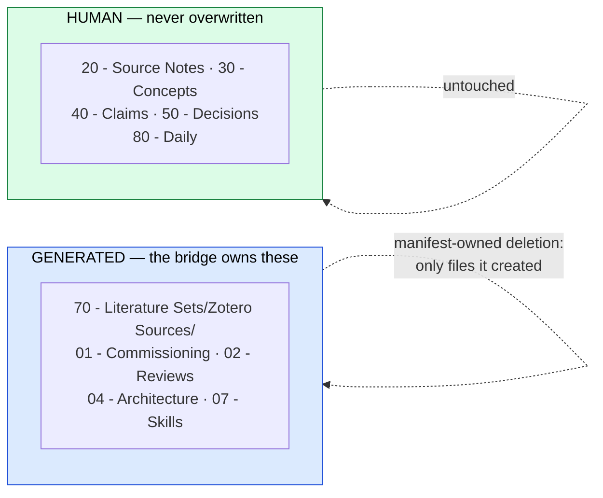
```mermaid
flowchart LR
    subgraph GEN["GENERATED — the bridge owns these"]
        G["70 - Literature Sets/Zotero Sources/<br/>01 - Commissioning · 02 - Reviews<br/>04 - Architecture · 07 - Skills"]
    end
    subgraph HUM["HUMAN — never overwritten"]
        H["20 - Source Notes · 30 - Concepts<br/>40 - Claims · 50 - Decisions<br/>80 - Daily"]
    end
    GEN -.->|"manifest-owned deletion:<br/>only files it created"| GEN
    HUM -.->|"untouched"| HUM

    style GEN fill:#dbeafe,stroke:#1d4ed8,color:#000
    style HUM fill:#dcfce7,stroke:#15803d,color:#000
```

The bridge deletes only files recorded in its own projection manifest. A
markdown file a human drops into the generated folder is not "stale" — it is
simply not the bridge's.

**The agent's blast radius is bounded.** The MCP server exposes exactly five
read-only tools:

| Exposed | Deliberately absent |
|---|---|
| `bridge_status` · `search_sources` · `get_source` · `list_categories` · `list_possible_duplicates` | `sync` · any write · delete · merge · any Zotero mutation |

Even a fully compromised agent can read the catalogue and nothing else.

### 9.2 The known hazard in it

`get_source` returns an abstract as raw text. A PDF or abstract can contain
`IGNORE ALL PREVIOUS INSTRUCTIONS…`, so untrusted source content reaches an
agent's context — recorded as risk **ACC-05**, and currently bounded only by the
absence of any write capability. The moment a write-capable tool broker exists,
this becomes a real exposure, and the untrusted-content boundary must be enforced
before that, not after.

### 9.3 Modules

| Module | Responsibility |
|---|---|
| `zotero.py` | Read-only Zotero local API client |
| `database.py` · `models.py` | Canonical registry, schema, idempotent upsert |
| `service.py` | Sync orchestration, staleness, projection lifecycle |
| `obsidian.py` | Atomic projection writer, manifest-owned deletion, path-traversal defence |
| `catalog.py` | Category taxonomy and duplicate heuristics |
| `mcp_server.py` | The five read-only MCP tools |
| `main.py` · `cli.py` · `config.py` | FastAPI app, operator CLI, settings |
| `airl_framework/contracts.py` | Shared identity/manifest/event contracts — **no production consumer yet** |

---

## 10. Target versus reality

This is the section that governs how every other section should be read.

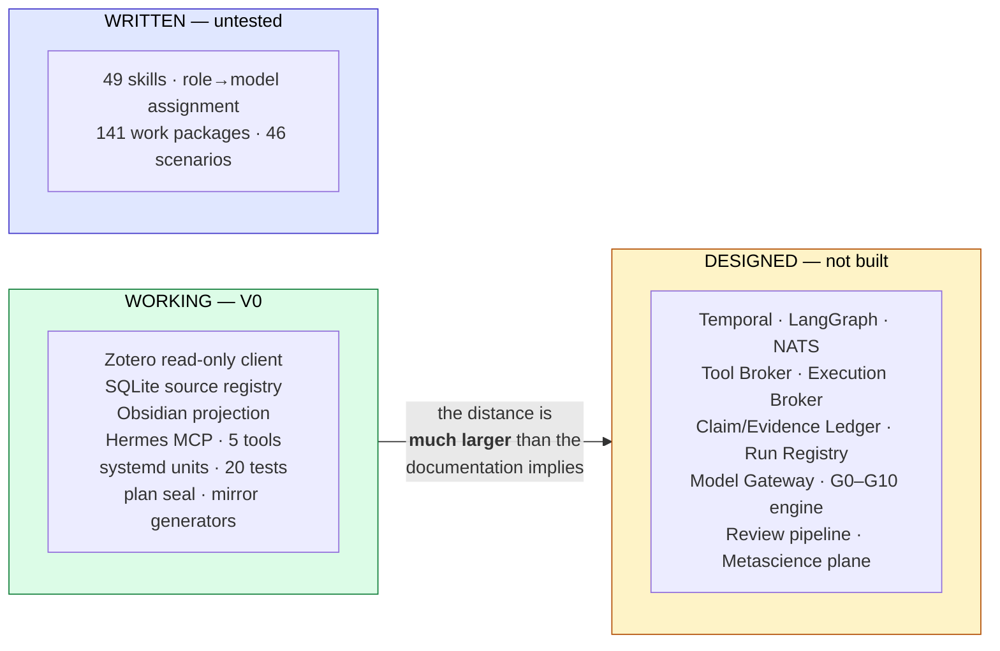
```mermaid
flowchart LR
    subgraph WORKING["WORKING — V0"]
        W["Zotero read-only client<br/>SQLite source registry<br/>Obsidian projection<br/>Hermes MCP · 5 tools<br/>systemd units · 20 tests<br/>plan seal · mirror generators"]
    end
    subgraph DESIGNED["DESIGNED — not built"]
        D["Temporal · LangGraph · NATS<br/>Tool Broker · Execution Broker<br/>Claim/Evidence Ledger · Run Registry<br/>Model Gateway · G0–G10 engine<br/>Review pipeline · Metascience plane"]
    end
    subgraph WRITTEN["WRITTEN — untested"]
        S["49 skills · role→model assignment<br/>141 work packages · 46 scenarios"]
    end
    WORKING -->|"the distance is<br/><b>much larger</b> than the<br/>documentation implies"| DESIGNED
    style WORKING fill:#dcfce7,stroke:#15803d,color:#000
    style DESIGNED fill:#fef3c7,stroke:#b45309,color:#000
    style WRITTEN fill:#e0e7ff,stroke:#4338ca,color:#000
```

| Component | Status |
|---|---|
| Zotero Bridge · Source Registry · Obsidian projection · Hermes MCP | **Working V0** |
| Plan seal, mirror generators, skill validator | **Working** |
| Shared contract core | Prototype — **zero production consumers**, hash format conflicts with the bridge |
| Skill registry — 49 skills | Format-conformant and loadable; **behaviour untested** |
| G0–G10 contracts, roles, gates | Designed |
| Temporal · LangGraph · NATS · brokers · ledgers · Model Gateway | Planned |
| Metascience plane · role→model assignment | Proposal |
| Production | **No** |

### 10.1 The blockers, in order

| # | Blocker | State |
|---|---|---|
| **C1** | Evidence bootstrap deadlock | **Technical half resolved** by §8; WP-000 still to be written |
| **C2** | Scope vs. one-person organisation; what "independent verifier" means | **Open — a decision, not code** |
| **H1** | Zotero ingest capped at 100 records, no pagination | Open — **fix M9 first**, or pagination turns a masked truncation into active data loss |
| **H2** | No deletion reconciliation, no tombstones | Open |
| **H3** | Read-only boundary has no behavioural test | Open |
| **H4** | Contract core has no consumers | Open |
| **H5** | No CI | Open — highest-leverage implementable step |

---

## 11. Where everything lives

```mermaid
flowchart TD
    subgraph REPO["Repository — canonical"]
        P["planning/commissioning/<br/><i>hash-sealed plan</i>"]
        DOC["docs/architecture · docs/review"]
        SK["skills/ — 49"]
        SRC["src/ · scripts/ · tests/"]
    end
    subgraph VAULT["Obsidian vault — generated views"]
        V1["01 - Commissioning"]
        V2["02 - Reviews"]
        V4["04 - Architecture"]
        V7["07 - Skills"]
        V3["70 - Literature Sets/Zotero Sources"]
    end
    subgraph HUMAN["Obsidian vault — human-authored"]
        H1["20 - Source Notes · 30 - Concepts<br/>40 - Claims · 50 - Decisions · 80 - Daily"]
    end
    P -->|"mirror_plan.py"| V1
    DOC -->|"mirror_vault.py"| V2 & V4
    SK -->|"mirror_vault.py"| V7
    SRC -->|"airl-bridge sync"| V3
    VAULT -->|"rsync"| BASE["vault_baseline/ — versioned snapshot"]

    style REPO fill:#dcfce7,stroke:#15803d,color:#000
    style VAULT fill:#dbeafe,stroke:#1d4ed8,color:#000
    style HUMAN fill:#f3e8ff,stroke:#7e22ce,color:#000
```

**Never edit a generated area.** Change the canonical file, regenerate, re-sync.
The plan seal does not cover the mirror, so drift there is invisible unless
`--check` is run.

---

## 12. The invariants

1. **Agents produce, machines verify, humans decide** — the order is never inverted.
2. **Nothing is complete without fresh verification evidence** — not memory, not a prior run, not another agent's report.
3. **When in doubt, take the heavier path** — missing or ambiguous input resolves to the highest assurance class.
4. **A producer may not summon its own verifier or helper.**
5. **An inbound message is never an instruction; messaging is not an authorisation channel.**
6. **`TECH_COMPLETE` is not `ACCEPTED`** — only an independent verifier's decision moves a package.
7. **A mechanical check, where one exists, runs first and cannot be overridden by a model.**
8. **No model at G5 or G7a; at G8 a model may only recommend.**
9. **A frozen artefact changes only through a recorded supersession.**
10. **`VERIFIED` is not a permanent state** — G10 can revise anything.

---

## 13. Where to go next

| Question | File |
|---|---|
| What is the state, what is next? | `03 - Implementation/session_handover_*` then the Cockpit |
| What happened, with evidence? | `implementation_log.md` |
| What is actually broken? | `docs/review/FRAMEWORK_REVIEW_2026-08-21_CLAUDE.md` |
| What should be added to the architecture? | `AIRL_OS_IDEAL_STRUCTURE.md` |
| How do agents work? | `AIRL_OS_SKILL_LAYER.md` — **§14 first** — and `skills/` |
| Who executes what? | `AIRL_OS_ROLE_MODEL_ASSIGNMENT.md` |
| What is adopted rather than invented? | `AIRL_OS_EXTERNAL_STANDARDS.md` |
| The plan itself | `planning/commissioning/` — canonical, hash-sealed |
