> [!info] Generated view
> This note is generated from `README.md` in the repository. Edit the
> canonical file and regenerate; edits made here are overwritten.

<p align="center">
  
</p>

<h1 align="center">AETHRION</h1>

<p align="center"><strong>Agentic Intelligence Research Layer</strong></p>

---

AETHRION — Agentic Intelligence Research Layer — is an evidence-centred,
auditable research system. Its central thesis: **agents produce, machines
verify, humans decide** — and those three roles are kept structurally separate.

`AIRL` is the abbreviation of the descriptor, and it survives inside the system
as a technical term: the G0–G10 control layer is the *Agentic Intelligence
Research Layer*, and the skill metadata namespace, the source-registry field and
the bridge service all carry the `airl` prefix. It is not the product name.
[`docs/branding.md`](04 - Architecture/aethrion_naming_and_terminology.md) records which is which.

**In one paragraph.** A capable model's characteristic failure is not
incompetence but plausibility: fluent, well-cited, confident output that is
wrong, and that no amount of further model capability detects from the inside.
AETHRION answers that by treating model output as a hypothesis which must survive
mechanical verification, independent review and a human decision before it
becomes a claim — with every claim traceable back to an exact source span and
forward to a signed attestation. This repository holds the target architecture
for that system, the execution discipline agents work under, and the one vertical
slice that actually runs today.

**The evidence-chain idea is not original to this project.** Google Research
published *Science One / ScientistOne* around the same principle —
**Chain-of-Evidence** — and, unlike this repository, measured it on 75 generated
papers. What differs here is scope: Science One asks whether an autonomous system
can produce verifiable papers; AETHRION asks under what governance a claim may be
believed at all, including its own. That is a broader question, harder to
demonstrate, and today **answered only on paper**. The comparison, and where
those systems are simply ahead, is in
[`AETHRION_RELATED_SYSTEMS.md`](04 - Architecture/aethrion_related_systems.md).

**A plan is not evidence of implementation**; the table below separates the two,
and every document here is written under [`docs/DOCUMENT_STANDARD.md`](04 - Architecture/aethrion_document_standard.md),
whose central rule is that distance from working software is stated rather than
implied.

| Area | Status | Location |
|---|---|---|
| Literature bridge V0 | ✅ **Working**, locally accepted | `src/airl_bridge/` |
| Zotero → Obsidian projection | ✅ Working, read-only at the Zotero boundary | `src/airl_bridge/obsidian.py` |
| Hermes MCP access | ✅ Working, five read-only tools | `src/airl_bridge/mcp_server.py` |
| Shared contract core | ⚠️ `TECH_COMPLETE` — no production consumer | `src/airl_framework/` |
| Skill registry (52 skills, two families) | ✅ Format-conformant · ⚠️ wired for Claude Code only · 📐 behaviour **not yet tested** | `skills/` |
| Obsidian information architecture | ✅ V0 ready | `vault_baseline/` |
| Target architecture and skill layer | 📐 Designed, awaiting decision | `docs/architecture/` |
| Commissioning programme — **baseline v1.3.1** | ⬜ Planned, not started; 160 package documents, 120 scenarios | `planning/commissioning/` |
| Interim evidence policy (WP-000) | ✅ `TECH_COMPLETE` — tooling implemented, specimen issued and verified | `scripts/evidence_manifest.py` · `delivery/WP-000/` |
| Verification on push (BVC-01) | 📐 Decided and written, **not yet active** — needs a workflow-scoped token | `deploy/bvc-01-verify.yml` |
| Human notification channels (ntfy · Telegram · Discord/Slack · WhatsApp) | ⬜ **Planned** — WP-132/135 specify a channel registry with a per-channel data-class ceiling; three skills written, **nothing connected, nothing sends** | `planning/commissioning/13_TOOLING_INTEGRATION/` |
| Document production (authoring + figures + reporting) | 📐 Skill and reference modules written; resolution checks run · **no renderer installed** | `skills/authoring-research-documents/` |
| Reference verification (CoE Audit check 1) | ✅ **Working and measured** — 81.8% of the registry corroborated | `scripts/verify_references.py` |
| Source monitoring (first slice of G10) | ✅ **Working** — positive control fires; 18 of 33 sources carry no DOI | `scripts/monitor_sources.py` |

## Layout

```
src/          Bridge component and the shared contract core
tests/        Test suite
skills/       52 skills — HOW agents work; engineering + scientific + shared
planning/     WP-000, WP-001..159, ACC-01..120 (hash-sealed canonical plan, baseline v1.3.1)
docs/         Architecture, review, branding and operations documents
docs/assets/  Branding assets — the logo, and the rules that keep it canonical
schemas/      Shared contract schemas
provenance/   Which mechanism came from which project, its licence, and what it may never decide
delivery/     Per-package evidence packages — signed manifests and anchors
deploy/       systemd unit files
scripts/      Acceptance, smoke, skill-validation, figure and mirror generation
docs/figures/ Publication figures — generated, never hand-edited
vault_baseline/  Versioned copy of the Obsidian vault
```

Three surfaces exist, and only one of them is authoritative:


*Figure 9 — Everything is authored in the repository. The Obsidian vault is
produced from it: **generated pages are replaced on every mirror run,
hand-authored pages are not.** A page whose frontmatter says `generated: false`
is refused rather than overwritten — so the failure mode of editing a generated
page is losing that edit, while your own notes are safe beside them. External
bibliographic services are read at verification time and their answers are
recorded, never assumed. Generated by `scripts/fig_topology.py`.*

## Starting work

V1 is the commissioning plan in full. Two generated pages carry the execution
state, and neither is inside the plan seal — progress is not specification, and
recording a day's work must not invalidate the integrity proof of the plan it
was work against.

```bash
python3 scripts/ready_queue.py     # docs/READY.md — what can be started today
python3 scripts/progress.py show WP-001
```

At t0: **one package ready** (WP-001, which authorises the programme), one
`TECH_COMPLETE` (WP-000), **none accepted**. The loop that moves a package
through those states, and the transitions it refuses, is
[`docs/EXECUTING_A_WORK_PACKAGE.md`](03 - Implementation/executing_a_work_package.md).

## Where to start

| Question | Document |
|---|---|
| **What is this system?** — explained and diagrammed | [`docs/architecture/AETHRION_ARCHITECTURE.md`](04 - Architecture/aethrion_architecture.md) |
| What actually exists today? | [`docs/review/2026-08-22_remediation_verification.md`](02 - Reviews/remediation_verification_2026-08-22.md) — current state against the frozen audit |
| **What** should be added to the target architecture? | [`docs/architecture/AETHRION_IDEAL_STRUCTURE.md`](04 - Architecture/aethrion_ideal_structure.md) |
| **How** should agents work? | [`docs/architecture/AETHRION_SKILL_LAYER.md`](04 - Architecture/aethrion_skill_layer.md) · [`skills/README.md`](skills/README.md) |
| **Who** performs each role — human, model or code? | [Roles](#6-roles--who-is-accountable-for-what) below · [`AETHRION_ROLES.md`](04 - Architecture/aethrion_roles.md) — definitions and authority flows · [`AETHRION_ROLE_MODEL_ASSIGNMENT.md`](04 - Architecture/aethrion_role_model_assignment.md) — which model |
| How are the figures produced? | [`docs/figures/README.md`](04 - Architecture/aethrion_figure_specification.md) — inventory and design specification |
| How are these documents written? | [`docs/DOCUMENT_STANDARD.md`](04 - Architecture/aethrion_document_standard.md) — structure, status vocabulary, honesty rules |
| What has been decided, and why? | [`ADR-001`](04 - Architecture/adr_001_solo_operator_independence.md) independence · [`ADR-002`](04 - Architecture/adr_002_bootstrap_verification_control.md) verification control · [`ADR-003`](04 - Architecture/adr_003_trusted_control_and_policy.md) trusted control and policy |
| Licensing and attribution | [`NOTICE`](NOTICE) |
| What is **adopted** rather than invented? | [`docs/architecture/AETHRION_EXTERNAL_STANDARDS.md`](04 - Architecture/aethrion_external_standards.md) |
| How does this compare to Science One, PaperQA2, AI Scientist? | [`docs/architecture/AETHRION_RELATED_SYSTEMS.md`](04 - Architecture/aethrion_related_systems.md) |
| Which mature components does it build on? | [`docs/architecture/AETHRION_COMPONENT_REUSE.md`](04 - Architecture/aethrion_component_reuse.md) |
| **What has actually been measured?** | [`delivery/measurements/`](delivery/measurements/) — one real result so far |
| Architecture of the working vertical slice | [`docs/ARCHITECTURE_V0.md`](04 - Architecture/aethrion_architecture_v0.md) |
| Day-to-day operation | [`docs/OPERATIONS.md`](03 - Implementation/operations_runbook.md) |
| The full programme plan | [`planning/commissioning/README.md`](planning/commissioning/README.md) |

---

# Architecture

Full reference with every diagram: [`docs/architecture/AETHRION_ARCHITECTURE.md`](04 - Architecture/aethrion_architecture.md).
What follows is the shape of the system in one page.

## 1. Why this is not an assistant

A normal AI research assistant is a pipeline from a question to an answer, and
whatever comes out is trusted because a capable model produced it:

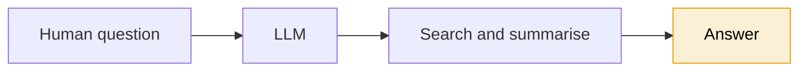

AETHRION starts from the opposite assumption: **a fluent, confident, well-cited,
entirely wrong result is the normal failure mode of a capable model**, and no
amount of model capability detects it from the inside. So model output is a
*hypothesis* that must survive mechanical verification, independent review and a
human decision before it becomes a claim.

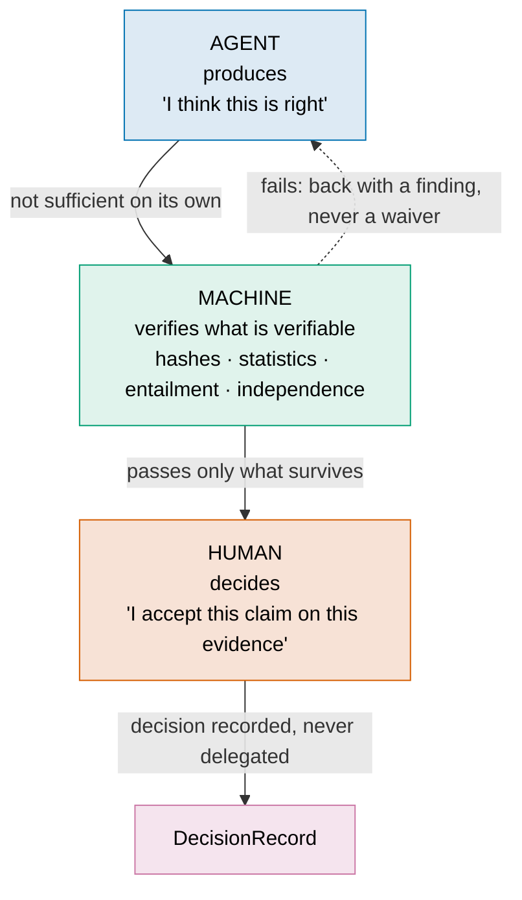

The failure mode being designed out is the ordinary multi-agent pattern —
*agent A produces, agent B reads it, agent B says "looks good", accepted*. Two
models from the same family share training lineage and therefore share errors;
agreement between them is correlation, not confirmation.

**The assignment rule that follows from this:**

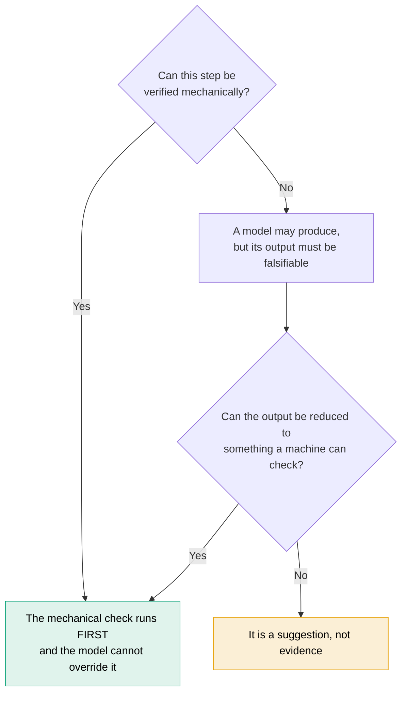

## 2. The evidence chain

Nothing becomes knowledge by being asserted. It becomes knowledge by surviving a
chain in which **every link is addressable**:


*Figure 2 — The chain, its revision loop, and the attestation that makes a link
admissible. Solid nodes are implemented and verified locally; hollow dashed nodes
are designed and not built. The figure carries the count, derived from the chain
itself — this caption used to carry it too, and drifted by one the day a second
link became working.*

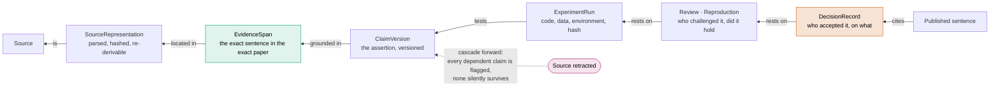

The figure above draws the chain forwards, as it is built. This diagram draws it
**backwards, as it is interrogated** — because that is the direction that matters
when someone asks *"why do you believe that?"* or when a source is retracted
three years later. A chain that only runs forwards is a provenance log; a chain
that runs both ways is an accountability structure.

And **the loop closes**: a claim is never permanently true, and `VERIFIED` is
explicitly not an irreversible state. Monitoring runs after publication precisely
so that the arrow above can be drawn years later.

### 2.1 Two links where a research system is most easily fooled

The chain above is drawn at the level of *kinds of thing*. Two of its links carry
the failures this project is actually built against, and both are specified in
`ADR-007` and `ADR-009`.

**A number.** A result in a paper is normally a string somebody typed, and a
string is exactly as convincing whether it was measured or invented. So a number
has a lineage: a candidate is executed against an evaluator the producer **cannot
reach**, the evaluator's raw output is stored immutably *before any agent
interprets it*, and the published figure is a `VerifiedValue` bound to that
output. A number the registry does not carry fails the build, regardless of how
good the prose around it is.

**A sentence.** Handing a model the results and asking it to write produces good
prose and an unfalsifiable document. So the document is a **projection** of the
claim graph and the compiler's job is to refuse: a factual sentence with no
`ClaimVersion`, a number with no `VerifiedValue`, a real citation that does not
support the sentence built on it.

The checks must **discriminate**, not merely block — headings and transitions
carry a `text_role` and pass, and a declared rounding of a registered value
passes and records its transform. A compiler that blocks all prose has
demonstrated nothing except that it can block.


*Figure 12 — Four verification classes. The line between V1 and V2 is the whole
argument: above it a check is certain, below it a check has an error rate, and
calling both "mechanical" lends the certainty of the first to the fallibility of
the second.*

### 2.2 What is remembered, and where

A separate question from what becomes knowledge is what the system *remembers*
along the way. The default answer — one long-term store, retrieved by similarity
— is wrong here for a reason unrelated to retrieval quality: a raw evaluator
output, a failed experiment, a debugging lesson and a working scientific
principle do not have the same standing.

There are **six** memories, and **only Evidence may support a claim.** Evidence
never decays, because a claim anchored to a retracted source has to stay
traversable *after* the retraction. Procedural memory must decay, because "this
library needs that flag" is true about a version on a date and goes stale
silently, with no error and no signal.

It is also an independence question: a reviewer who can query the producer's
search-experience memory inherits the producer's dead ends and framing, and the
review is anchored while the record still says independent.


*Figure 11 — The columns are the properties that decide authority. Six boxes in a
row would make six stores look like six of the same thing, which is the
misreading the figure exists to prevent.*

### 2.3 What an agent is shown, and what is kept from it


*Figure 19 — Context minimisation is normally told as an efficiency story, and
told that way it is uninteresting and slightly suspect: the system hides things
from its own agents to save money. **Two different reasons remove material from a
projection, and only one of them is about tokens.** A reviewer who can read the
producer's dead ends inherits the producer's framing, and the review is anchored
before it starts — a failure a larger context window makes *worse*, not better.
Beneath that, the mask lifecycle: a refuted conclusion is removed from the
reasoning context, stays queryable as history, and never returns as current on a
reload. Generated by `scripts/fig_context.py`.*

## 3. The G0–G10 research lifecycle

The spine of the system. Each gate has a frozen output that does not change
without a recorded supersession.


*Figure 1 — Reading down is time; reading across is who may act. At every gate
the mechanical check runs first and cannot be overridden, a model may produce but
never decide, and a human holds authority. The hatched cells at G5 and G7a are
the design, not an omission. Generated by `scripts/fig_lifecycle.py`.*

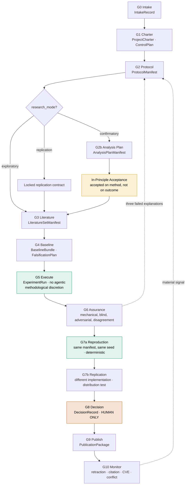

| Gate | The failure it exists to prevent |
|---|---|
| **G0** | Redoing work that already exists; unowned work |
| **G1** | A model inventing its own research objective |
| **G2** | Changing the method after seeing the result |
| **G2b** | Choosing the analysis that gives the nicest answer |
| **G3** | An evidence base that cannot be re-derived |
| **G4** | Only asking how to confirm, never how to refute |
| **G5** | Model bias entering the measurement itself |
| **G6** | "Looks good" counted as independent review |
| **G7a** | A result nobody can obtain twice |
| **G7b** | Confusing "same numbers" with "same conclusion" |
| **G8** | A model deciding what the laboratory believes |
| **G9** | A sentence claiming more than its evidence supports |
| **G10** | Treating a published claim as permanently true |

**G10 is where the lifecycle stops being a line.** The dashed edge back to G2 in
the diagram above says a material signal reopens the work; what it does not show
is the judgement in between, which is the part that decides whether a published
claim quietly stops being true:

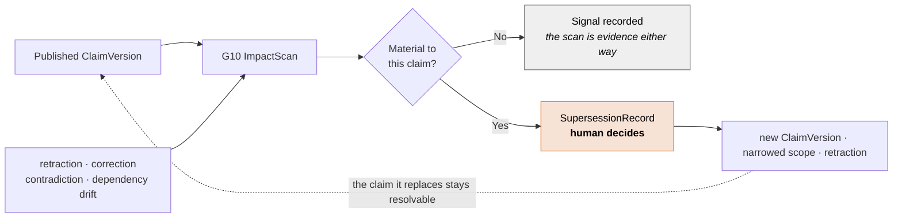

Two properties are doing the work. **A non-material signal is still recorded** —
a scan that finds nothing is evidence that the scan ran, and the alternative is a
monitoring system whose silence is indistinguishable from its absence. And **the
superseded claim stays resolvable**: a citation pointing at it must still land
somewhere that says what happened, because a reference that simply stops
resolving is the failure mode the evidence chain exists to prevent.

`monitor_sources.py` is the first slice of this and it runs today — with a
planted retracted DOI as its positive control, so a sweep that reports nothing
fails rather than passing.

**In-principle acceptance** sits in the flow for one reason: without a
commitment made *before* the result exists, publication bias survives every
other control — the protocol is frozen, the result comes back negative, and the
human simply declines to publish.

It is **conditional, not universal**: required for `confirmatory` work, a locked
replication contract for `replication`, and not required for `exploratory` work —
which in exchange may never label its claims confirmatory. Forcing Registered
Report ceremony onto exploration would only teach people to mislabel confirmatory
work as exploratory. The classification is fail-closed: absent or ambiguous, it
resolves to `confirmatory`.

**"No model at G5"** means no *agentic methodological discretion* during a frozen
execution. The subject of the experiment may itself be a model — a frozen model
under test, a preregistered inference pipeline. What is forbidden is an agent
changing a threshold or a stopping point mid-run because the result looks wrong.
The model may be the instrument; it may not be the methodologist.

**Inside G6**, the heaviest gate:

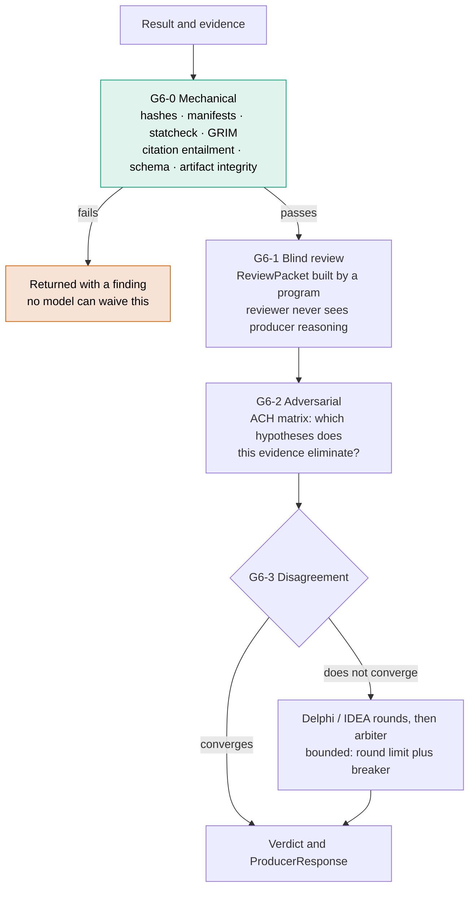

The `ReviewPacket` is built by a **deterministic program, not a prompt** — only
then can "what exactly did the reviewer see?" be answered afterwards. The
adversarial reviewer is scored on **the quality of its refutation**, not on
approval speed.

### 3.1 Inside G4 and G5 — the discovery search graph

Where G5 runs computational discovery, it is not an agent loop with a transcript.
Two distinctions in it are load-bearing, and both look like implementation
details until something goes wrong:

**Repairing an implementation is a different node state from changing a
mechanism.** A candidate that failed to compile has said nothing about the
hypothesis. Recorded as "tried a different approach", an implementation defect
becomes evidence about a scientific question, and afterwards the record cannot be
told apart from one where the idea genuinely failed.

**A search score is not a confidence.** Everything the graph computes — selection
scores, normalised ranks, tournament positions — is a priority for spending
compute. Writing one into a claim, a value or a gate is refused by schema and by
policy. A campaign that stops on budget produces a record that satisfies no gate:
running out of money demonstrates nothing.


*Figure 10 — Two things carry the figure. The **state panel is a branch, not a
row**: one question — did the parent execute? — selects `DEBUG` or `IMPROVE`, and
they are alternatives rather than successive stages, so a reader cannot come away
believing a candidate passes through every state in order. And the **vertical
boundary**: everything left of it belongs to the producer, and nothing left of it
can write a result. Generated by `scripts/fig_discovery.py`.*

## 4. The planes

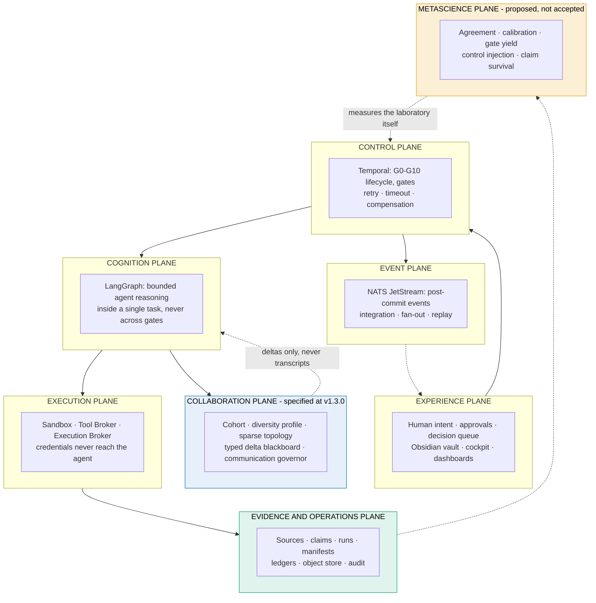

### 4.1 The collaboration plane — keep the cohort, prune the conversation

The cognition plane bounds what **one** agent may do. Baseline v1.3.0 adds the
plane that governs what happens when there is more than one, and it exists
because that situation has its own failure modes rather than more of the same
ones.


Four things live here, and the order matters:

**The cohort is fixed, and it is not a cost lever.** Substantial scientific
execution requires at least two epistemically independent contributions. That is
an epistemic requirement, so a cost argument is not an answer to it — and every
cost pressure a multi-agent system ever experiences argues for fewer agents.
`ADR-011` closes that door once, deliberately, so it does not have to be argued
per sprint. What gets optimised instead is everything below.

**Independence is a profile, not a count.** Five instances of one model on one
context are one contribution: they will agree, and the agreement carries no
information. A `CognitiveDiversityProfile` spans cognitive function, evidence
exposure, peer visibility, model profile and prompt perspective — and a cohort of
three differentiated actors passes where a cohort of five identical ones is
refused (ACC-081).

**Independent-first, and the seal is the mechanism.** Each actor writes its
position before it sees any peer's. The positions are sealed, and only then are
material deltas exposed. Anchoring is an effect rather than a preference: an
actor shown a confident prior answer converges on it, and the record afterwards
shows two agreeing actors — indistinguishable from two that independently agreed.
The seal is the only thing that can tell them apart later (ACC-082). A majority
cannot close an unanswered material challenge (ACC-090).

**A typed delta crosses an edge; a transcript never does.** Ten message types,
because a `CHALLENGE` can be tracked to resolution and a paragraph cannot. The
message carries the change and a digest; the content goes to the artifact store.
Delete the blackboard and no canonical science is lost — which is the test of
whether it was ever holding any (`ADR-013`, ACC-085). Passing a full reasoning
transcript between agents is refused for the unobvious reason as much as the
obvious one: it is the channel through which one agent's error becomes another's
premise.

#### 4.1.1 Where the cohort actually comes from


*Figure 18 — The property this closes is the one prose keeps inverting. "The
Task Compiler emits a cohort" reads as a configuration step; what it actually
does is **derive** one. Agent count is an output of the task's own properties —
its class, its phase, the roles in play, the evidence it depends on, the
independence it inherits, the budget — computed before anything runs. That
matters because a setting can be turned down under deadline and a derivation
cannot: reducing the cohort means changing what the task claims to be, which is
a scope decision made in the open by a human. And the output that is not a
cohort is drawn beside it — compilation **refuses** rather than quietly
producing one agent with a note. Generated by `scripts/fig_compiler.py`.*

#### 4.1.2 What budget pressure may degrade, and the floor it cannot cross

Communication verbosity degrades along a declared ladder — structured full,
compressed, pointer only, silence unless material. Beneath it is a floor:

> The cohort. The assurance route. Any non-waivable control. A `BLOCKER` or a
> safety message at any utility threshold. A task that cannot afford its required
> assurance is `BLOCKED_BUDGET` or asks for a scope reduction — **it does not
> proceed more cheaply** (ACC-088, ACC-099, ACC-101).

The optimisation is also anchored or it is not an optimisation: it is accepted
only when quality stays inside a declared tolerance and coordination cost falls
meaningfully, measured against the **runnable naive fully-connected cohort**. Not
against a single agent — comparing to one agent measures the cost of having a
cohort at all, a question already settled on other grounds. A quality regression
rolls the topology back automatically (ACC-086, ACC-087).

#### 4.1.3 Where authority stays while all of this happens

Adding actors adds places for state to live, which is how a system acquires two
truths.


Exactly one canonical owner per kind of state, and everything else is a
projection that can be destroyed and rebuilt losslessly. A cohort record does not
approve a gate. A blackboard entry is not evidence. An event announces a
transition and is never promoted to truth — the consumer re-reads the canonical
store. MLflow answers what the system *did*; an `EvidenceManifest` answers what
may be *believed*, and operational telemetry is not provenance (`ADR-014`).

Split brain is invisible in a healthy run and obvious only in a post-mortem, so
nothing short of causing one demonstrates it would be caught. That is why WP-159
carries an injection suite — kill the publisher after the DB commit, deliver the
same event twice, deliver events out of order, return a cancelled task's late
result, drop a projection and rebuild it — and why every injection must end with
canonical state correct and the projection agreeing, or with an explicit recorded
failure (ACC-119).

> **Status.** None of this is built. WP-148–159 specify it; there is no cohort
> record, no blackboard, no topology compiler, no communication governor and no
> baseline harness to measure any of it against. It is listed as a plane because
> that is where it belongs in the architecture, not because it runs.

### The trust boundary that cuts across all of them

The planes above answer *where* a thing runs. ADR-003 answers a different
question that no plane diagram can: *whose words are allowed to change what the
system does.*


*Figure 7 — The control plane holds the goal and every privilege. The data plane
holds everything an outsider can write, including whatever a PDF hides in
white-on-white. Content crosses; authority does not. Generated by
`scripts/fig_trust.py`.*

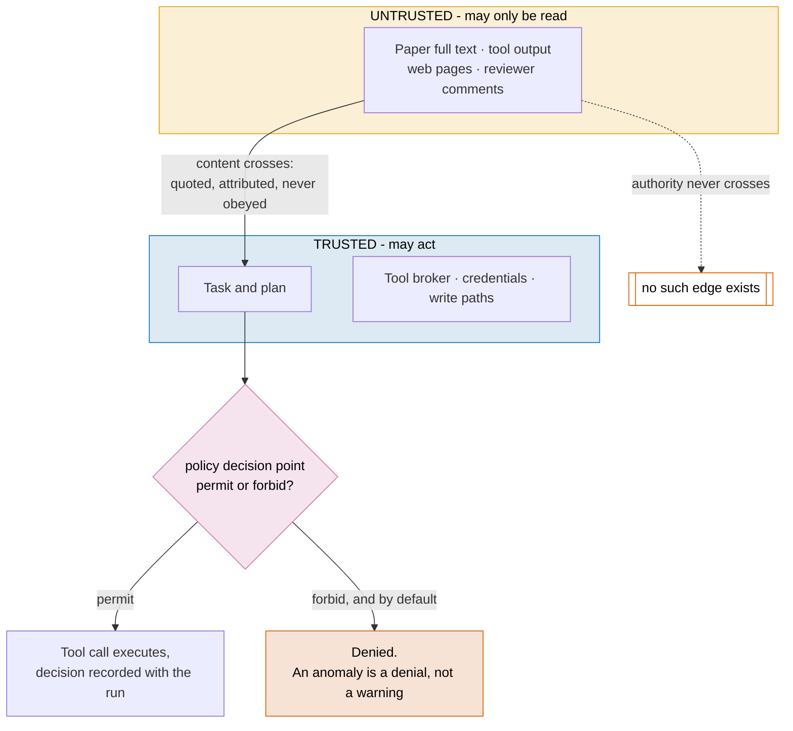

The design is borrowed rather than invented: it is the CaMeL pattern, adopted as
a `PATTERN` under the adoption taxonomy, with the policy decision point as the
commissioned interface — the engine behind it is deferred to a recorded bake-off
([`ADR-010`](04 - Architecture/adr_010_policy_backend.md)) — and AgentDojo named
as the `BENCHMARK` that would falsify it.
**None of it has been run here** — no policy set is authored in this repository.
The cut in Figure 7 is a decision on paper, and the figure says so.

**Temporal is the process authority; LangGraph is not.** A research project lives
for months and must survive process restarts, model changes and human absence —
an agent graph is the wrong place to keep that state. Conversely, Temporal is the
wrong place to reason. **NATS carries events, not authority**: if the entire
stream were deleted, gate state would still be recoverable from Temporal.

## 5. The skill layer — two families, one shared core

A `RoleContract` says **who** an agent is — purpose, tools, data classes, budget.
Every one of those is a *boundary*; none of them says **which procedure to
follow**. Skills close that gap.

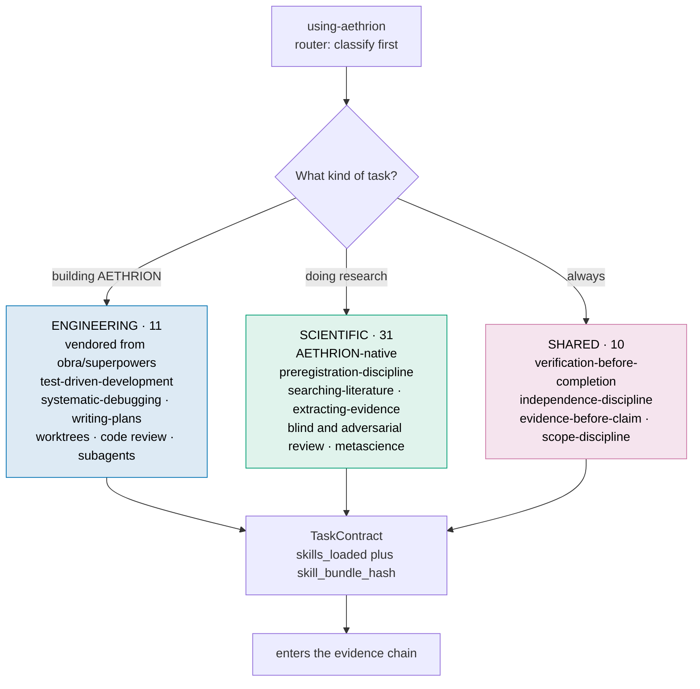

> **Research adaptations extend their engineering counterparts; they never
> replace them.** AETHRION is simultaneously a laboratory and a software platform,
> and it needs both disciplines at once.

| Software engineering | Scientific research | The shared rule |
|---|---|---|
| Test before code | Preregistration before result | You do not get to pick the criterion after seeing the outcome |
| Bug root-cause tracing | Anomaly root-cause tracing | Three failed explanations means the architecture is wrong, not the fix |
| Fresh-context implementer | Fresh-context analyst | Whoever produced it cannot be the one who checks it |
| Reviewer sees the diff, not the reasoning | Reviewer sees the packet, not the trace | Information asymmetry is what makes review independent |
| Verification before "done" | Verification before "claimed" | Memory is not evidence |

Skills conform to the [Agent Skills open standard](https://agentskills.io),
which Claude Code, Codex, OpenCode, Cursor, Copilot, Gemini CLI and Hermes Agent
all implement — so the registry is **format-compatible** with each of them.
**A skill that does not load governs nothing**, so conformance is checked
mechanically by `scripts/validate_skills.py`.

> Format compatibility is not behavioural compatibility. Whether a harness loads
> the right skill at the right moment, and keeps it across context compaction, is
> what ACC-42, ACC-44 and ACC-45 establish under WP-048 — and that is **not**
> established today. Only the Claude Code path is wired, via `.claude/skills`.
>
> What *is* established is **routing**: every skill is reachable from the router,
> each still contains its own core rule, and the four pairs below stay in
> different families with both halves routable —
> `scripts/check_skill_baseline.py`. Seventeen skills were reachable by no chain
> of references at all before that check existed.

### 5.1 The four pairs that get conflated


*Figure 15 — The table above pairs the disciplines; this figure says what breaks
when one is substituted for the other, which is the part a glossary cannot carry.
The sharpest pair is the first: `test-driven-development` and
`preregistration-discipline` both commit before an outcome, and swapping them
produces **a correct implementation of a compromised study** — work that passes
every check it was given and answers a question nobody asked. The pairs are read
from `skills/_baseline/routing.json`, so the figure and the control that enforces
them cannot drift apart. Generated by `scripts/fig_disciplines.py`.*

## 6. Roles — who is accountable for what

Fourteen **durable functions**. Not fourteen people: a role is a function, and
one person may legally hold several of them.


*Figure 3 — Authority tiers with the actor composition of each role (**X**
mechanical, **M** model, **H** human), and the constraint resolution that decides
whether one operator may hold two roles at once. Full definitions — mandate,
what each role decides, and what it may never do — are in
[`docs/architecture/AETHRION_ROLES.md`](04 - Architecture/aethrion_roles.md).*

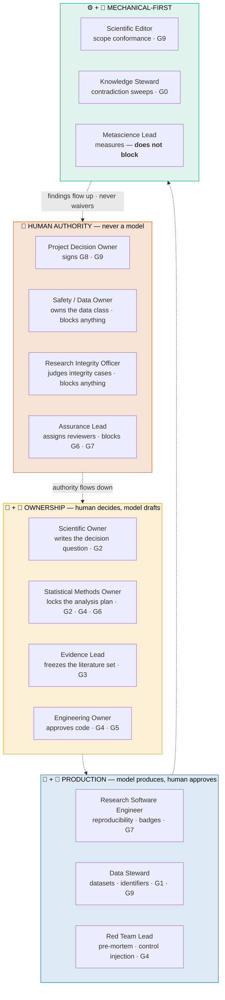

| Role | Actor | Can block | The one thing it must never delegate |
|---|---|---|---|
| Project Decision Owner | 👤 | G8, G9 | Deciding what the laboratory believes |
| Safety / Data Owner | 👤 | all | The data-class decision |
| Research Integrity Officer | 👤 + ⚙️ | all | The judgement on an integrity case |
| Assurance Lead | 👤 + ⚙️ | G6, G7 | Who reviews whom |
| Scientific Owner | 👤 + 🤖 draft | G2 | Writing the decision question |
| Statistical Methods Owner | 👤 + 🤖 | G2, G4, G6 | Locking the analysis plan |
| Evidence Lead | 👤 + 🤖 | G3 | The freeze decision |
| Engineering Owner | 🤖 + 👤 approval | G4, G5 | Approving what ships |
| Research Software Engineer | 🤖 + 👤 approval | G7 | Assigning the reproducibility badge |
| Data Steward | 🤖 + 👤 approval | G1, G9 | Publishing an identifier |
| Scientific Editor | ⚙️ + 🤖 | G9 | — scope conformance is mechanical |
| Red Team Lead | 🤖 + 👤 | G4 | — |
| Knowledge Steward | ⚙️ + 🤖 | G0 | — |
| Metascience Lead | 👤 + ⚙️ | **nothing** | Measuring without gatekeeping |

**Metascience Lead blocks nothing on purpose.** A function that both measures the
laboratory and can veto its work stops measuring honestly.

### How a gate actually resolves

Every gate runs the same three-stage resolution, and the order is the whole
design:

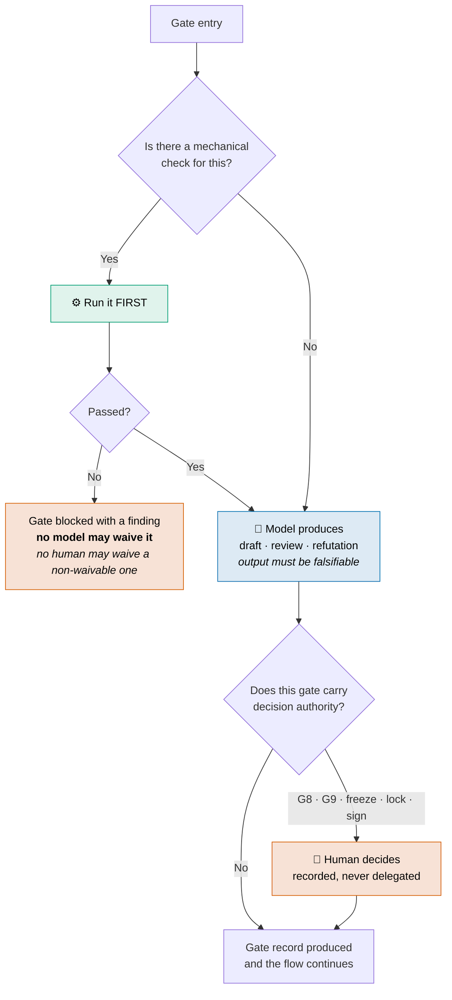

Applied gate by gate, that produces:

| Gate | ⚙️ Mechanical | 🤖 Model | 👤 Human |
|---|---|---|---|
| **G0** intake | duplicate search | triage | greenlight |
| **G1** charter | risk → assurance policy engine | charter draft | **writes the decision question** |
| **G2** protocol | template + placeholder sweep | protocol draft · pre-mortem · different-family review | Scientific + Statistical Owner **sign** |
| **G2b** analysis plan | — | plan draft · power analysis | Statistical Methods Owner **locks** |
| **G3** literature | GROBID · DOI · dedup · hashing | query plan · screening | Evidence Lead **freezes** |
| **G4** baseline | the baseline run | compute plan · pre-mortem | budget approval |
| **G5·D** discovery | candidate lineage recorded | **bounded** — search, fuse, debug proposals | — |
| **G5·E** execute | **the experiment itself** · immutable raw output | **no evaluator authority** — may be the subject, never the judge | — |
| **G6-0** mechanical | statcheck · GRIM · entailment · hashes | **none** | — |
| **G6-1** blind | `ReviewPacketBuilder`, a program | N reviewers, different family | — |
| **G6-2** adversarial | the ACH matrix | adversarial refutation | — |
| **G7a** reproduce | same manifest, same seed | **none** | — |
| **G7b** replicate | distribution test | — | RSE assigns the badge |
| **G8** decide | package completeness | **recommendation only** | **DECIDES — human only, under quota** |
| **G9** publish | **scope conformance** · RO-Crate · hashes | text draft | Decision Owner + Editor |
| **G10** monitor | Crossref · Retraction Watch · CVE | signal triage | decides on a material signal |

The empty model cells at **G5·E**, **G6-0** and **G7a** are the point, not an
omission: those are the layers that stay free of model bias. `G5·D` is
deliberately *not* empty — bounded discovery cognition runs there, and collapsing
the two into one row is what made "no model at G5" read as a ban on the discovery
engine.

### The G8 row is an ordering, not a checkbox


*Figure 16 — The table above says the human decides at G8. It cannot say **when
they were told what**, and that is the whole difficulty: a `DecisionRecord`
signed after reading a confident recommendation and one signed before it are
byte-identical. So the procedure carries what the record cannot — the
preliminary assessment is written and **sealed** before any recommendation is
reachable, and the `DecisionDelta` between them becomes measurable. A delta of
zero on every decision is not agreement; it is the signature of a ratification
process. Beneath that, friction symmetry: if accepting is one click and rejecting
is a form, the decision was not left to the human. Generated by
`scripts/fig_decision.py`.*

### A role is a function, not a person

This is what makes the catalogue survivable in a one-person laboratory. Roles
are **bound**, and independence is expressed as separation constraints rather
than headcount:

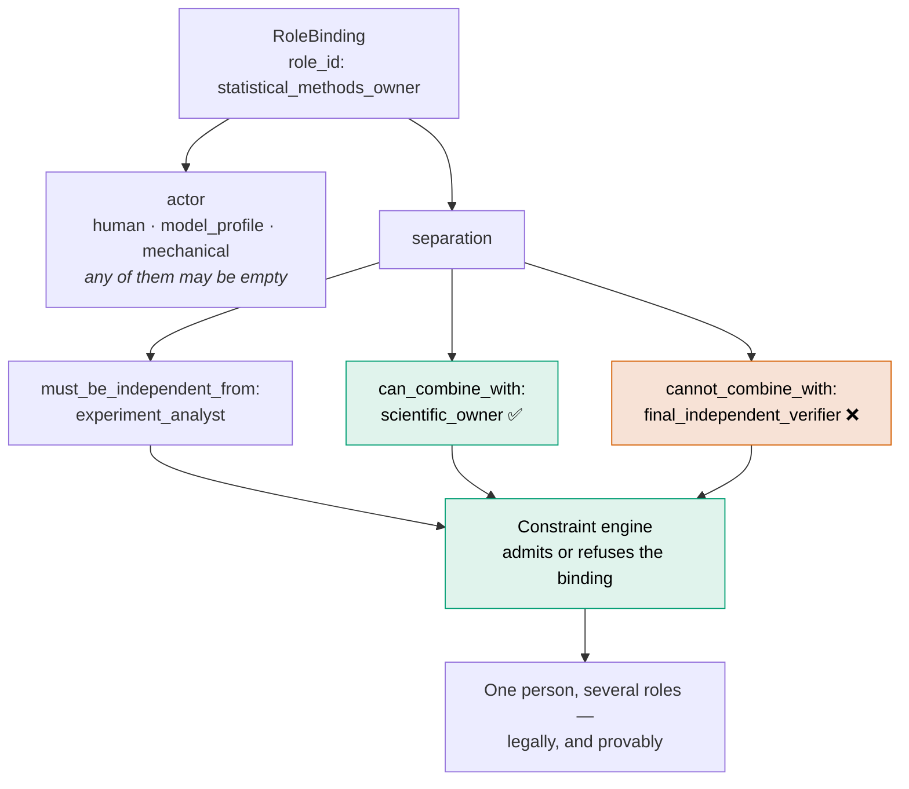

The question stops being *"where do I find 73 owners and 114 verifiers?"* and
becomes *"which combinations am I willing to declare independent, and which must
stay mechanical or external?"*

> **This is the shape of an answer to finding C2, not the answer.** Which
> combinations count as independent in a one-person operation is still an open
> decision, and until it is made no work package can reach `ACCEPTED`.

### Independence is measured, not asserted

Reviewer independence has a quota that scales with the assurance class:

| Assurance | Producer effort | Reviewer effort | Adversarial | Reviewer quota | Model policy |
|---|---|---|---|---|---|
| **R1** | `medium` | `high` | — | 1, any family | hosted OK |
| **R2** | `high` | `high` | `xhigh` | 2, **different provider family** | hosted + full I/O logging |
| **R3** | `xhigh` | `xhigh` | `max` | 3, **different family** | **local open-weight mandatory** |

R3 requires a local model because a hosted model has no pinnable snapshot, and
without one G7a reproduction is structurally impossible. That is a constraint,
not a preference.

And the family rule is itself only a **proxy**: what is permanent is the measured
pairwise error correlation ρ between reviewer profiles. When the calibration set
exists, the measurement replaces the rule. A laboratory that never measures its
own independence assumption is repeating an assumption and calling it
verification.

### 6.1 Where a reproduction can quietly stop being one


*Figure 17 — Independence is drawn as four zones because "producer" and
"reviewer" is two roles doing four jobs. The part worth looking at is
**underneath**: the dashed paths do not cross a boundary, because they never had
to. A shared cache makes a reproduction fast by never really running it; an
inherited credential lets the reproducer reach what only the producer should; a
warm container layer carries the producer's state forward. A sandbox-escape test
that only attacks the sandbox finds none of them, which is why ACC-113 plants
each one specifically. Reproduced status is refused by **environment digest
lineage**, not by declaration. Generated by `scripts/fig_reproduction.py`.*

## 7. How a document is produced

A document is a **projection of verified state**, not a generative act. The
pipeline runs evidence → claims → structure → prose → figures → QA → render, and
a renderer exiting zero decides nothing.


*Figure 5 — Formatting is downstream: stages 0–2 finish before a renderer is
chosen. The four packaging objects are distinct, and only the first exists here.
Every external tool in the authority band produces a signal; none of them
decides. Written up in [`authoring-research-documents`](skills/authoring-research-documents/SKILL.md).*

## 8. What this builds, and what it stands on

Almost every layer of the target system is a component someone else maintains
and tests. What this project owns is the control layer.


*Figure 4 — Adoption type is drawn rather than captioned, because "reuse" is not
one thing: a dependency, a standard, a pattern and a benchmark create entirely
different obligations. Solid borders mark the three cells that are implemented;
everything dashed is a decision, not a running component. Details and rationale
in [`AETHRION_COMPONENT_REUSE.md`](04 - Architecture/aethrion_component_reuse.md).*

> **AETHRION should not invent its own PDF parser, screening engine, policy
> language, sandbox, experiment tracker or scholarly identifier.** Its
> contribution is the layer above them: which evidence, having passed which
> gate, permits which claim to be accepted.

### 8.1 Mechanisms, taken without their architectures

The stack above is about components that are **installed and called**. A second
kind of reuse runs alongside it, and it needed its own rules: much of what a
research system does was solved somewhere else first, and the mechanism can be
taken without the project it came from.

The distinction is not pedantic. GROBID parses a PDF and the parsing happens *in*
GROBID. An assimilated mechanism runs as this system's own code — nothing to
install, nothing to call, and no runtime trace of where it came from. That is
exactly why it needs a register.

> **A mechanism may be taken; an architecture may not.** No external project
> appears here as a runtime module, a directory, a backend, a class name or a
> configuration key. What arrives is a mechanism re-expressed in this system's
> vocabulary — a candidate node becomes a `SearchNode` bound to an
> `ArtifactRecord`, a scalar score becomes a `VerifiedValue` bound to an
> immutable evaluator output, a budget counter becomes a stop record that
> explicitly satisfies no gate.

Every entry in [`provenance/README.md`](04 - Architecture/upstream_lineage_register.md) states its upstream,
its licence and the date that licence was read at the source, what was
deliberately **not** taken, and **what the mechanism may never decide**. That
last field is required, because the recurring failure of adoption is not a
component behaving badly — it is a component quietly acquiring authority.

Four entries record a capability being narrowed rather than copied: an automatic
need-fulfilment loop that would have started work without a gate; a model-decided
stopping rule that would have let a confirmatory campaign stop when the evidence
turned favourable; an `auto_proceed_on_timeout` flag, absent here rather than
defaulted off; and a search score whose reach would have extended into claim
confidence.

**Nothing has been taken yet.** Every entry is a decision on paper,
`pinned_commit` is `null` throughout, and `scripts/check_upstream_lineage.py`
starts demanding a pin, a file list and a characterisation suite the moment the
first line of code moves. Its `--self-test` injects a defect per rule and fails
if any rule stays silent — a checker that has never been observed to fail reports
"no findings" and "no detector" in identical words.

Rules: [`ADR-004`](04 - Architecture/adr_004_mechanism_assimilation.md). Which
mechanism came from where:
[`AETHRION_RELATED_SYSTEMS.md`](04 - Architecture/aethrion_related_systems.md) §5.1.

### 8.1 A decision reaches the package that executes it, or it reaches nobody

The register above answers *what may be taken and on what terms*. For two
baselines it did not answer the question an implementer actually asks, which is
**what do I do in this package** — because the decision lived in the architecture
corpus and the work lived in a package document, and nothing joined them.

The shape of that gap, in three specimens:

| | What the register said | What the package said |
|---|---|---|
| `WP-144` | AIDE is a `DIRECT_ADAPT` source for the DRAFT/DEBUG/IMPROVE candidate state machine | seven tasks specifying that state machine, and the word *AIDE* nowhere in the document |
| `WP-153` | BATS is a `DIRECT_ADAPT` source for budget-aware accounting | a nine-dimensional budget ledger, and the word *BATS* nowhere in the document |
| `WP-041` | *(nothing — no register knew LiteLLM existed)* | **LiteLLM Model Gateway Foundation**, in the title |

The first two invite an implementer to rewrite what was already decided to be
taken. The third is worse and is the reverse defect: a component adopted with no
version policy, no failure semantics and no statement of what it may never
decide.

Both directions are now closed. `provenance/components.json` makes the
runtime-component decisions machine-readable —
[`provenance/COMPONENTS.md`](provenance/COMPONENTS.md) is generated from it — and
every package card carries a generated **Implementation acquisition and
assimilation** block naming each bound source, its mode, what is taken, what
AETHRION still owns, what the source may never decide, and the obligation the
mode creates.

That last column is the load-bearing one. Printing *AIDE · DIRECT_ADAPT* and
stopping would read as permission to go and copy a file, which `ADR-004` refuses
until a pin, a file list and a characterisation suite exist — so the block prints
the obligation instead, in the words of the rule that creates it, and
`scripts/ready_queue.py` holds the package out of *Ready now* until it is met.
**`BUILD_NATIVE` is stated rather than left to silence**, because silence cannot
distinguish a package with no upstream from a package whose upstream nobody
recorded.

`scripts/check_wp_implementation_sources.py` refuses a registered decision absent
from its package, a watched third-party name in neither register, and a task list
that says *build* what a register recorded as *adopt*. Its `--self-test` injects a
defect per rule.

## 9. How evidence is signed

Acceptance requires a signed `EvidenceManifest` in an immutable store — and that
store is WP-026, far downstream, which deadlocked the entire programme
(finding **C1**). The deadlock existed only because the store was assumed to be
ours to build. It is not:

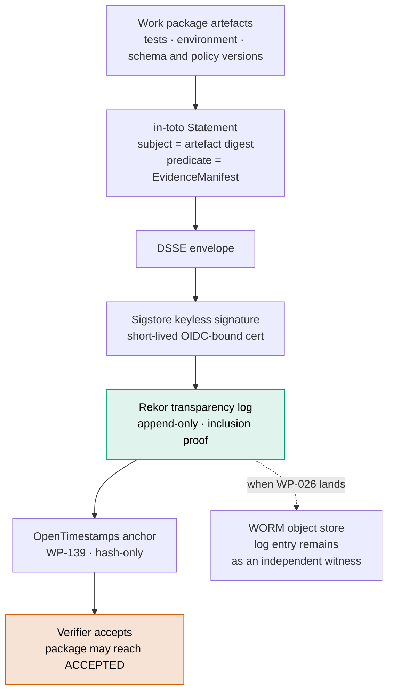

**Immutability is delegated, not deferred.** Rekor is a tamper-evident
transparency record **for signed metadata**, not an artifact store — WP-026 is
deferred behind it, not cancelled. And this resolves the *storage* half of C1
only: finding **C2**, who may act as an independent verifier in a one-person
operation, is a decision no standard makes. What the architecture now supplies is
its *shape* — independence expressed as `RoleBinding` separation constraints
rather than headcount, so one person holding several roles can be modelled
honestly. See
[`AETHRION_EXTERNAL_STANDARDS.md`](04 - Architecture/aethrion_external_standards.md).

## 10. Target versus reality

Everything above is the target. This section is the distance to it, and it is
the section to read first if you are deciding whether to trust anything else.

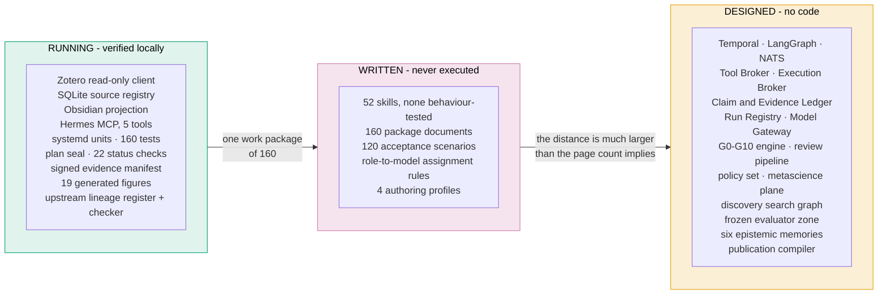


*Figure 6 — Waves are dependency order, not dates: the plan has none. Package
counts are counted from the plan directory when the figure is generated, so this
figure cannot disagree with the plan it describes. Generated by
`scripts/fig_waves.py`.*

**Where the blockers actually stand.** Two of the original five have been closed
by decisions rather than by code, which is progress of a specific and limited
kind — a decision removes an unknown, it does not remove work:

| | Blocker | State |
|---|---|---|
| **C1** | Storage split between SQLite and the plan's target stores | **Closed.** WP-000 executed; the bootstrap tooling runs and a specimen manifest verifies |
| **C2** | Reviewer independence under a solo operator | **Closed by ADR-001.** R1 solo, R2 declared-partial, R3 `BLOCKED` — the constraint is now enforced rather than argued about |
| **H1** | Zotero ingest capped at 100 records | **Open.** Fix M9 first: pagination would turn a masked truncation into active data loss |
| **H2** | No deletion reconciliation | **Open.** A record removed upstream persists downstream |
| **H3** | The read-only boundary has no behavioural test | **Open.** It is asserted in code and in prose, and never exercised |
| **H4** | The contract core has no consumers | **Open.** Written, imported by nothing |
| **H5** | No continuous integration | **Staged, not active.** The workflow exists at `deploy/bvc-01-verify.yml` and has never run; see ADR-002 |

The honest summary is one sentence: **the parts that are verified are small and
real, and the parts that are large are documents.**

---

## The working vertical slice: Literature Bridge V0

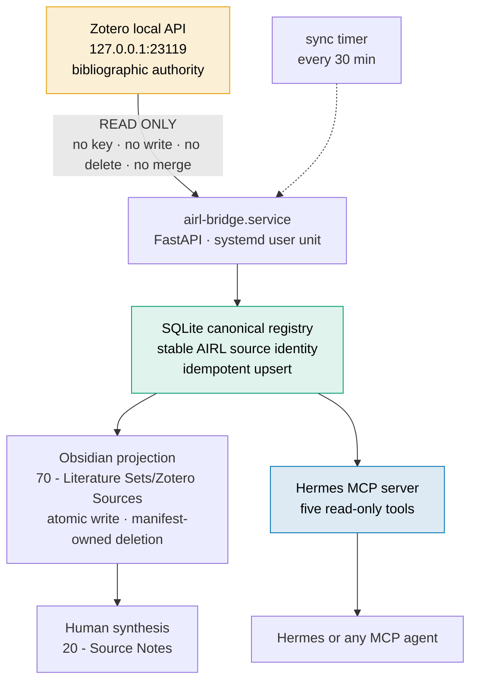

**Generated and human-authored content cannot collide.** The bridge deletes only
files recorded in its own projection manifest, so a markdown file a human drops
into the generated folder is not "stale" — it is simply not the bridge's.

The service listens on `127.0.0.1` only. It holds no Zotero API key, and the
codebase contains no Zotero write operation.

### Install

```bash
cd /home/otonom/Desktop/FH/AETHRION
uv sync --extra dev
cp .env.example .env      # then fill in your own paths
```

### Enable the Zotero Local API

1. Start Zotero
2. **Settings → Advanced → General**
3. Enable **Allow other applications on this computer to communicate with Zotero**
4. Keep port `23119` local — do not forward or expose it

```bash
uv run airl-bridge doctor
```

### Run

```bash
uv run airl-bridge serve

systemctl --user status airl-bridge.service
systemctl --user status airl-bridge-sync.timer
journalctl --user -u airl-bridge.service -n 50
```

A user timer runs the same local synchronisation every 30 minutes.

Local endpoints: [`/health`](http://127.0.0.1:8765/health) ·
[`/ready`](http://127.0.0.1:8765/ready) · [`/docs`](http://127.0.0.1:8765/docs)

### First synchronisation

```bash
curl -X POST 'http://127.0.0.1:8765/v1/sync?limit=100'
curl 'http://127.0.0.1:8765/v1/sources?limit=10'

# or without starting the server
uv run airl-bridge sync --limit 100
```

Repeated synchronisation is idempotent for the same Zotero library and item key.
Zotero-derived files live under the automatically managed `Zotero Sources`
branch and are regenerated from the canonical registry. Human synthesis stays in
`20 - Source Notes`; curated sets stay at the root of `70 - Literature Sets`.

> ⚠️ **Known limitation:** ingest is hard-capped at 100 records; there is no
> pagination and no `since=` incremental sync. Once the library exceeds 100
> sources — closed. `fetch_top_items` paginates and reports whether the walk
> reached the end. See the closed findings in the
> audit report.

### Verify

```bash
uv run pytest                          # 160 tests
uv run python scripts/mcp_smoke.py     # asserts the five-tool boundary; exits 1 on failure
uv run python scripts/acceptance_v0.py # data-independent structural acceptance
python3 scripts/validate_skills.py     # Agent Skills format + AIRL metadata contract
python3 scripts/make_figures.py --check # figures match generators, text fits its box
python3 scripts/validate_commissioning_plan.py  # the plan is internally consistent
python3 scripts/make_plan_indexes.py --check    # workstream indexes match their packages
python3 scripts/check_doc_consistency.py        # documents agree with the repository
python3 scripts/check_stale_claims.py          # no prose the repository has outgrown
uv run python scripts/write_status.py          # regenerate docs/STATUS.md
uv run python scripts/evidence_manifest.py verify \
    --manifest delivery/WP-000/evidence.dsse.json --tamper-demo
uv run python scripts/verify_references.py   # needs network; not part of BVC-01
uv run python scripts/monitor_sources.py     # G10 sweep; fails if its control stays silent
uv run python scripts/check_document.py delivery/specimen/aethrion-measurement-report.qmd
python3 scripts/check_reporting_registry.py  # adopted components remain auditable
(cd planning/commissioning && sha256sum -c 00_PROGRAM/SHA256SUMS.txt)
```

They run by hand today. The first six are **written** as a push-triggered
control — [`BVC-01`](deploy/bvc-01-verify.yml), a temporary measure under
[`ADR-002`](04 - Architecture/adr_002_bootstrap_verification_control.md) with a
named expiry and WP-024 as its retirement package — but it is **staged, not
active**: activating it needs a token with GitHub's `workflow` scope, and the
activation command is in ADR-002 §6.

**Neither the staged control nor its activation closes finding H5.** H5 is the absence of a CI *platform* — schema
validation, policy bundles, security scanning, provenance attestation,
integration testing — and that is WP-024, which hard-depends on three unbuilt
packages. What BVC-01 closes is narrower and worth naming precisely: the gap
between *the checks exist* and *the checks ran*. The Bridge-dependent checks and
the vault mirror checks stay manual, and their absence is recorded in the
workflow rather than hidden.

## Hermes MCP access

Hermes starts the `airl-bridge-mcp` server over stdio and sees exactly five
read-only tools: status, source search, source detail, category counts, and
possible-duplicate reporting. No synchronisation, write, delete or Zotero
mutation tool is exposed. The Hermes configuration pins an explicit five-tool
include list; MCP prompt and resource capabilities are disabled.

## Licensing and what this repository is for

This repository is **public to read and proprietary to use** — see
[`NOTICE`](NOTICE). That is a deliberate position and worth stating plainly,
because a framework arguing for open standards, reproducibility and external
verification while keeping its own implementation closed invites a fair
question.

The answer is that the two are different things. **The architecture is meant to
be read, argued with and reused as a reference**; the implementation is one
person's research infrastructure, not a product seeking adopters. Nothing here
asks anyone to depend on it, and if this ever becomes something a community is
expected to build on, the licence has to change first — a proprietary framework
cannot credibly ask for the interoperability it preaches.

Vendored third-party content keeps its own licence: the eleven engineering
skills are MIT from `obra/superpowers`, pinned by commit and attributed in
`NOTICE`.

## Status semantics

`WORKING` means a component has been verified locally.
`ACCEPTED` means an independent verifier accepted its evidence package.

**No work package is currently `ACCEPTED`.** That is not an oversight — the
mechanisms required to reach that state (signed evidence manifests, an immutable
store, an independent verifier) do not yet exist. See finding **C1** in the audit
report.

[**WP-000**](planning/commissioning/01_GOVERNANCE/WP-000_interim_evidence_policy.md)
removes the *storage* half of that blocker: the `EvidenceManifest` is a signed
in-toto attestation, issued and verified by `scripts/evidence_manifest.py`, and
tamper detection is exercised by tests rather than asserted. The implemented
profile is `airl-interim-v0.1` — local key, **no transparency log** — and each
manifest carries its own `limitations` list so it cannot be read as more than it
is.

The *independence* half — finding **C2** — is now **decided** in
[`ADR-001`](04 - Architecture/adr_001_solo_operator_independence.md): R1 solo;
R2 solo only under a declared partial-independence profile; **R3 `BLOCKED`
unless an external verifier is named.** So packages have an acceptance path, and
the laboratory does not claim independence it does not have.

## Verification


*Figure 8 — One command runs all twenty-two. Each row states the claim the check earns
and, beside it, the claim it does not — because a bundle that reports only green
teaches its reader to trust it for things it never examined. Generated by
`scripts/fig_verification.py`.*

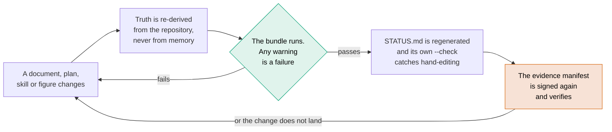

```
160/160 tests pass · plan seal 632/632 OK · plan semantics OK · service and timer active
WP-000 attestation: signature OK, 9 subject digests OK, tamper rejected
MCP smoke: 5 read-only tools, exits 1 when the Bridge is down
Acceptance: 11 structural checks pass, data-independent
Skills: 52/52 conform to the Agent Skills format and the AIRL metadata contract
Documents: declared counts match the repository; no decision record contradicts itself
References: 27/33 registry sources corroborated against Crossref, OpenAlex and arXiv
Monitoring: G10 sweep clean over 15 DOI-bearing sources; positive control fired
Figures: 19/19 match their generators; 0 text overflows out of their boxes
Mirror drift: 0 across the plan mirror and the vault mirror
Obsidian baseline and vault identical
```

Every check above is reproducible from a clean checkout with the Bridge running.
**None of them runs automatically** — the workflow that would run them is staged
at `deploy/bvc-01-verify.yml` and has never executed. Until it does, the guarantee
is "someone ran this", not "this cannot regress".

And all of it is internal consistency. The bundle can confirm that this
repository says the same thing everywhere and that its evidence verifies — and
every one of those statements would still hold for a corpus describing a system
that does not work. External truth enters through exactly two doors: reference
verification against Crossref, OpenAlex and arXiv, and the benchmarks named in
the adoption matrix, none of which has been run.
